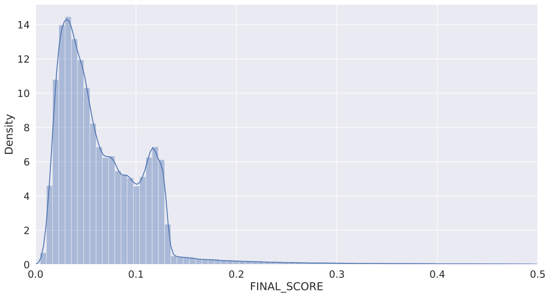

```python
import pandas as pd
import numpy as np
import matplotlib.pyplot as plt
import seaborn as sns

import random
random.seed(1234)
```

# Fraud Score Visualizations and Final Score Computation


```python
results_df = pd.merge(pc_to_keep_z, enc.drop(['PC1', 'PC2', 'PC3', 'PC4'],axis=1),
                      left_index=True, right_index=True)
```


```python
results_df['FINAL_SCORE'] = (results_df['SUM'] + results_df['REP_ERROR']) / 2
```


```python
results_df.sort_values('FINAL_SCORE')
```


<div>
<style scoped>
    .dataframe tbody tr th:only-of-type {
        vertical-align: middle;
    }

    .dataframe tbody tr th {
        vertical-align: top;
    }

    .dataframe thead th {
        text-align: right;
    }
</style>
<table border="1" class="dataframe">
  <thead>
    <tr style="text-align: right;">
      <th></th>
      <th>PC1</th>
      <th>PC2</th>
      <th>PC3</th>
      <th>PC4</th>
      <th>SUM</th>
      <th>REP_ERROR</th>
      <th>FINAL_SCORE</th>
    </tr>
  </thead>
  <tbody>
    <tr>
      <th>526472</th>
      <td>-0.000733</td>
      <td>0.002476</td>
      <td>0.002799</td>
      <td>-0.001892</td>
      <td>0.004253</td>
      <td>0.004981</td>
      <td>0.004617</td>
    </tr>
    <tr>
      <th>878367</th>
      <td>-0.003433</td>
      <td>-0.002527</td>
      <td>0.000428</td>
      <td>-0.001325</td>
      <td>0.004485</td>
      <td>0.005638</td>
      <td>0.005062</td>
    </tr>
    <tr>
      <th>947642</th>
      <td>-0.002586</td>
      <td>0.000897</td>
      <td>0.001408</td>
      <td>-0.002841</td>
      <td>0.004188</td>
      <td>0.006020</td>
      <td>0.005104</td>
    </tr>
    <tr>
      <th>290965</th>
      <td>0.003155</td>
      <td>-0.003250</td>
      <td>-0.002125</td>
      <td>-0.002606</td>
      <td>0.005641</td>
      <td>0.004822</td>
      <td>0.005232</td>
    </tr>
    <tr>
      <th>309111</th>
      <td>-0.002068</td>
      <td>-0.003422</td>
      <td>-0.000931</td>
      <td>-0.003094</td>
      <td>0.005141</td>
      <td>0.005358</td>
      <td>0.005250</td>
    </tr>
    <tr>
      <th>...</th>
      <td>...</td>
      <td>...</td>
      <td>...</td>
      <td>...</td>
      <td>...</td>
      <td>...</td>
      <td>...</td>
    </tr>
    <tr>
      <th>750815</th>
      <td>100.938732</td>
      <td>430.425074</td>
      <td>140.230377</td>
      <td>75.246884</td>
      <td>469.873413</td>
      <td>153.922861</td>
      <td>311.898137</td>
    </tr>
    <tr>
      <th>1067359</th>
      <td>93.216498</td>
      <td>425.863848</td>
      <td>178.071855</td>
      <td>104.286161</td>
      <td>482.322010</td>
      <td>171.006879</td>
      <td>326.664445</td>
    </tr>
    <tr>
      <th>565391</th>
      <td>628.196721</td>
      <td>204.355163</td>
      <td>-321.617378</td>
      <td>-190.571639</td>
      <td>759.043768</td>
      <td>395.325185</td>
      <td>577.184476</td>
    </tr>
    <tr>
      <th>632815</th>
      <td>476.815783</td>
      <td>-330.794514</td>
      <td>749.862877</td>
      <td>324.360216</td>
      <td>1002.138806</td>
      <td>581.844279</td>
      <td>791.991542</td>
    </tr>
    <tr>
      <th>917941</th>
      <td>328.647620</td>
      <td>-137.153049</td>
      <td>-475.275936</td>
      <td>679.059492</td>
      <td>902.124839</td>
      <td>848.961567</td>
      <td>875.543203</td>
    </tr>
  </tbody>
</table>
<p>1070994 rows × 7 columns</p>
</div>


```python
plt.rcParams["figure.figsize"] = [15,8]
sns.set(font_scale=1.5)
xhigh = 0.5
plt.xlim(0,xhigh)
temp = results_df[(results_df['FINAL_SCORE'] <= xhigh)]
sns.distplot(temp['FINAL_SCORE'], bins = 80, kde=True)
```


    <AxesSubplot:xlabel='FINAL_SCORE', ylabel='Density'>


    

    


## Binning method 1: Quantile Binning


```python
results_df_sorted = results_df.sort_values('FINAL_SCORE', ascending=True)
results_df_sorted['q_bins'] = pd.qcut(results_df_sorted['FINAL_SCORE'], q=20, labels=range(1, 21))
```


```python
results_df_sorted
```


<div>
<style scoped>
    .dataframe tbody tr th:only-of-type {
        vertical-align: middle;
    }

    .dataframe tbody tr th {
        vertical-align: top;
    }

    .dataframe thead th {
        text-align: right;
    }
</style>
<table border="1" class="dataframe">
  <thead>
    <tr style="text-align: right;">
      <th></th>
      <th>PC1</th>
      <th>PC2</th>
      <th>PC3</th>
      <th>PC4</th>
      <th>SUM</th>
      <th>REP_ERROR</th>
      <th>FINAL_SCORE</th>
      <th>q_bins</th>
    </tr>
  </thead>
  <tbody>
    <tr>
      <th>526472</th>
      <td>-0.000733</td>
      <td>0.002476</td>
      <td>0.002799</td>
      <td>-0.001892</td>
      <td>0.004253</td>
      <td>0.004981</td>
      <td>0.004617</td>
      <td>1</td>
    </tr>
    <tr>
      <th>878367</th>
      <td>-0.003433</td>
      <td>-0.002527</td>
      <td>0.000428</td>
      <td>-0.001325</td>
      <td>0.004485</td>
      <td>0.005638</td>
      <td>0.005062</td>
      <td>1</td>
    </tr>
    <tr>
      <th>947642</th>
      <td>-0.002586</td>
      <td>0.000897</td>
      <td>0.001408</td>
      <td>-0.002841</td>
      <td>0.004188</td>
      <td>0.006020</td>
      <td>0.005104</td>
      <td>1</td>
    </tr>
    <tr>
      <th>290965</th>
      <td>0.003155</td>
      <td>-0.003250</td>
      <td>-0.002125</td>
      <td>-0.002606</td>
      <td>0.005641</td>
      <td>0.004822</td>
      <td>0.005232</td>
      <td>1</td>
    </tr>
    <tr>
      <th>309111</th>
      <td>-0.002068</td>
      <td>-0.003422</td>
      <td>-0.000931</td>
      <td>-0.003094</td>
      <td>0.005141</td>
      <td>0.005358</td>
      <td>0.005250</td>
      <td>1</td>
    </tr>
    <tr>
      <th>...</th>
      <td>...</td>
      <td>...</td>
      <td>...</td>
      <td>...</td>
      <td>...</td>
      <td>...</td>
      <td>...</td>
      <td>...</td>
    </tr>
    <tr>
      <th>750815</th>
      <td>100.938732</td>
      <td>430.425074</td>
      <td>140.230377</td>
      <td>75.246884</td>
      <td>469.873413</td>
      <td>153.922861</td>
      <td>311.898137</td>
      <td>20</td>
    </tr>
    <tr>
      <th>1067359</th>
      <td>93.216498</td>
      <td>425.863848</td>
      <td>178.071855</td>
      <td>104.286161</td>
      <td>482.322010</td>
      <td>171.006879</td>
      <td>326.664445</td>
      <td>20</td>
    </tr>
    <tr>
      <th>565391</th>
      <td>628.196721</td>
      <td>204.355163</td>
      <td>-321.617378</td>
      <td>-190.571639</td>
      <td>759.043768</td>
      <td>395.325185</td>
      <td>577.184476</td>
      <td>20</td>
    </tr>
    <tr>
      <th>632815</th>
      <td>476.815783</td>
      <td>-330.794514</td>
      <td>749.862877</td>
      <td>324.360216</td>
      <td>1002.138806</td>
      <td>581.844279</td>
      <td>791.991542</td>
      <td>20</td>
    </tr>
    <tr>
      <th>917941</th>
      <td>328.647620</td>
      <td>-137.153049</td>
      <td>-475.275936</td>
      <td>679.059492</td>
      <td>902.124839</td>
      <td>848.961567</td>
      <td>875.543203</td>
      <td>20</td>
    </tr>
  </tbody>
</table>
<p>1070994 rows × 8 columns</p>
</div>


