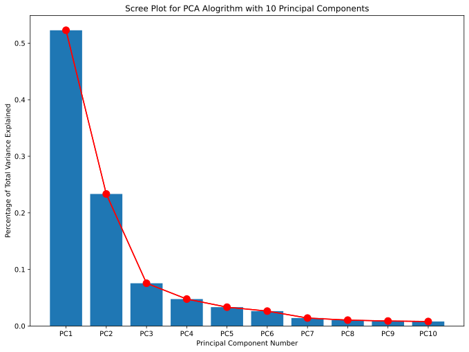
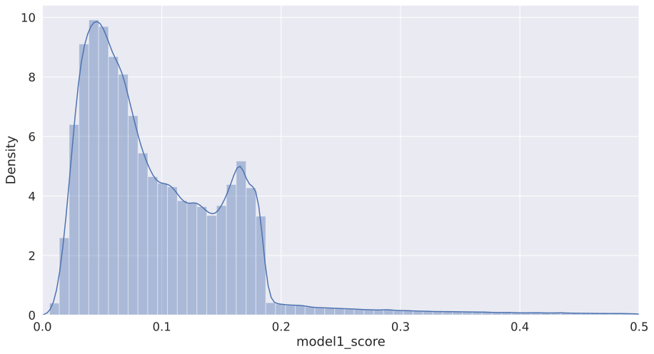

```python
import pandas as pd
import numpy as np
import matplotlib.pyplot as plt
import seaborn as sns

import random
random.seed(1234)

# Model 1
from sklearn.decomposition import PCA
from scipy import stats
from scipy.spatial import distance
```

# Model 1: Hueristic Z-Score Function

Extract relevant features from full data


```python
df = pd.read_csv('features.csv').loc[:, 'RECORD':]
```


```python
features = df.iloc[:, -45:]
```

For each record, calculate its z score


```python
for x in features.columns:
    colname = x+'_zscore'
    features[colname] = stats.zscore(features[x])
```


```python
features_z = features.iloc[:, -45:]
```

Create a PCA function with 10 components, fit it to z-scaled data


```python
n_components = 10
pca = PCA(n_components=n_components)

features_PCA = pca.fit_transform(features_z)
```

Create dataframe of principal components as well as the variance explained by each component


```python
PC = ['PC'] * n_components
range_l = [str(x) for x in range(1, n_components+1)]
cols = [i+j for i, j in zip(PC, range_l)]

var_ = pd.DataFrame({'var': pca.explained_variance_ratio_,
                     'PC': cols})
```

Scree plot


```python
plt.figure(figsize=(11.27,8.27))
plt.bar(x='PC', height='var', data=var_)
plt.plot(var_['PC'], var_['var'], color='red')
plt.plot(var_['PC'], var_['var'], marker='o', markersize=10, color='red')
plt.xlabel('Principal Component Number')
plt.ylabel('Percentage of Total Variance Explained')
plt.title('Scree Plot for PCA Alogrithm with 10 Principal Components')
plt.show()
```


    

    


Find all principal components to keep by looping through until we hit our target of 80%


```python
to_keep = []
count = 0
target = .85
while target >= 0:
    target = target - var_.iloc[count, 0]
    to_keep.append(var_.iloc[count, 1])
    count += 1
```


```python
pc_to_keep = pd.DataFrame([x[:len(to_keep)] for x in features_PCA], columns=['PC1', 'PC2', 'PC3', 'PC4'])
```

Z-scale principal componenets


```python
pc_to_keep_z = pc_to_keep.apply(stats.zscore)
```

Now that each record has a "score" in each dimension, create a function to sum those scores which will define each records fraud score


```python
def euc_sum(vals):
    return (np.abs(sum([x**2 for x in vals])))**(1/2)
```


```python
pc_to_keep_z['model1_score'] = pc_to_keep_z.apply(euc_sum, axis=1)
```


```python
pc_to_keep_z
```


<div>
<style scoped>
    .dataframe tbody tr th:only-of-type {
        vertical-align: middle;
    }

    .dataframe tbody tr th {
        vertical-align: top;
    }

    .dataframe thead th {
        text-align: right;
    }
</style>
<table border="1" class="dataframe">
  <thead>
    <tr style="text-align: right;">
      <th></th>
      <th>PC1</th>
      <th>PC2</th>
      <th>PC3</th>
      <th>PC4</th>
      <th>SUM</th>
      <th>model1_score</th>
    </tr>
  </thead>
  <tbody>
    <tr>
      <th>0</th>
      <td>0.000939</td>
      <td>-0.090230</td>
      <td>-0.081992</td>
      <td>-0.063785</td>
      <td>0.137599</td>
      <td>0.194594</td>
    </tr>
    <tr>
      <th>1</th>
      <td>4.199913</td>
      <td>16.128732</td>
      <td>5.241872</td>
      <td>1.222970</td>
      <td>17.514227</td>
      <td>24.768857</td>
    </tr>
    <tr>
      <th>2</th>
      <td>0.006287</td>
      <td>0.064573</td>
      <td>-0.043461</td>
      <td>0.010342</td>
      <td>0.078772</td>
      <td>0.111400</td>
    </tr>
    <tr>
      <th>3</th>
      <td>0.044381</td>
      <td>-0.074404</td>
      <td>-0.043499</td>
      <td>-0.079560</td>
      <td>0.125409</td>
      <td>0.177356</td>
    </tr>
    <tr>
      <th>4</th>
      <td>9.410793</td>
      <td>-4.801232</td>
      <td>2.740579</td>
      <td>-12.562188</td>
      <td>16.641340</td>
      <td>23.534408</td>
    </tr>
    <tr>
      <th>...</th>
      <td>...</td>
      <td>...</td>
      <td>...</td>
      <td>...</td>
      <td>...</td>
      <td>...</td>
    </tr>
    <tr>
      <th>1070989</th>
      <td>-0.031661</td>
      <td>-0.063996</td>
      <td>-0.027697</td>
      <td>0.015526</td>
      <td>0.078142</td>
      <td>0.110509</td>
    </tr>
    <tr>
      <th>1070990</th>
      <td>-0.035513</td>
      <td>-0.078378</td>
      <td>-0.031540</td>
      <td>-0.002969</td>
      <td>0.091695</td>
      <td>0.129676</td>
    </tr>
    <tr>
      <th>1070991</th>
      <td>-0.030828</td>
      <td>-0.080535</td>
      <td>-0.027994</td>
      <td>0.000618</td>
      <td>0.090666</td>
      <td>0.128221</td>
    </tr>
    <tr>
      <th>1070992</th>
      <td>-0.021493</td>
      <td>-0.065886</td>
      <td>-0.013105</td>
      <td>-0.014869</td>
      <td>0.072081</td>
      <td>0.101939</td>
    </tr>
    <tr>
      <th>1070993</th>
      <td>-0.021210</td>
      <td>-0.041528</td>
      <td>-0.009171</td>
      <td>0.007603</td>
      <td>0.048128</td>
      <td>0.068064</td>
    </tr>
  </tbody>
</table>
<p>1070994 rows × 6 columns</p>
</div>


```python
plt.rcParams["figure.figsize"] = [15,8]
sns.set(font_scale=1.5)
xhigh = 0.5
plt.xlim(0,xhigh)
temp = pc_to_keep_z[(pc_to_keep_z['model1_score'] <= xhigh)]
sns.distplot(temp.model1_score, bins = 60, kde=True)
```


    <AxesSubplot:xlabel='model1_score', ylabel='Density'>


    

    

