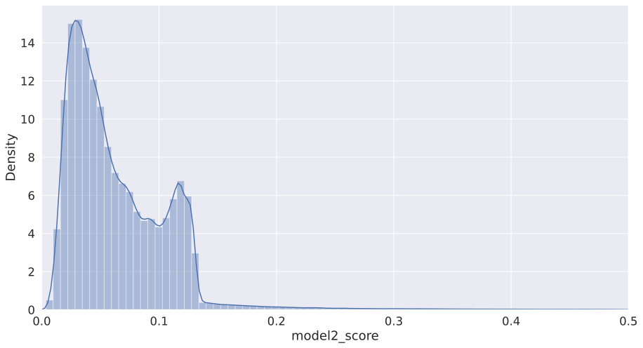

```python
import pandas as pd
import numpy as np
import matplotlib.pyplot as plt
import seaborn as sns

import random
random.seed(1234)

# Model 2
from keras.models import Model
from keras.layers import Input, Dense, Dropout
from keras.callbacks import EarlyStopping, ModelCheckpoint
from keras import regularizers
from sklearn.metrics import mean_squared_error as MSE
```

# Model 2: Autoencoder

Build autoencoder using z-scaled PCs from previous model


```python
enc = pc_to_keep_z.drop('SUM', axis=1)
```


```python
enc
```


<div>
<style scoped>
    .dataframe tbody tr th:only-of-type {
        vertical-align: middle;
    }

    .dataframe tbody tr th {
        vertical-align: top;
    }

    .dataframe thead th {
        text-align: right;
    }
</style>
<table border="1" class="dataframe">
  <thead>
    <tr style="text-align: right;">
      <th></th>
      <th>PC1</th>
      <th>PC2</th>
      <th>PC3</th>
      <th>PC4</th>
    </tr>
  </thead>
  <tbody>
    <tr>
      <th>0</th>
      <td>0.000939</td>
      <td>-0.090230</td>
      <td>-0.081992</td>
      <td>-0.063785</td>
    </tr>
    <tr>
      <th>1</th>
      <td>4.199913</td>
      <td>16.128732</td>
      <td>5.241872</td>
      <td>1.222970</td>
    </tr>
    <tr>
      <th>2</th>
      <td>0.006287</td>
      <td>0.064573</td>
      <td>-0.043461</td>
      <td>0.010342</td>
    </tr>
    <tr>
      <th>3</th>
      <td>0.044381</td>
      <td>-0.074404</td>
      <td>-0.043499</td>
      <td>-0.079560</td>
    </tr>
    <tr>
      <th>4</th>
      <td>9.410793</td>
      <td>-4.801232</td>
      <td>2.740579</td>
      <td>-12.562188</td>
    </tr>
    <tr>
      <th>...</th>
      <td>...</td>
      <td>...</td>
      <td>...</td>
      <td>...</td>
    </tr>
    <tr>
      <th>1070989</th>
      <td>-0.031661</td>
      <td>-0.063996</td>
      <td>-0.027697</td>
      <td>0.015526</td>
    </tr>
    <tr>
      <th>1070990</th>
      <td>-0.035513</td>
      <td>-0.078378</td>
      <td>-0.031540</td>
      <td>-0.002969</td>
    </tr>
    <tr>
      <th>1070991</th>
      <td>-0.030828</td>
      <td>-0.080535</td>
      <td>-0.027994</td>
      <td>0.000618</td>
    </tr>
    <tr>
      <th>1070992</th>
      <td>-0.021493</td>
      <td>-0.065886</td>
      <td>-0.013105</td>
      <td>-0.014869</td>
    </tr>
    <tr>
      <th>1070993</th>
      <td>-0.021210</td>
      <td>-0.041528</td>
      <td>-0.009171</td>
      <td>0.007603</td>
    </tr>
  </tbody>
</table>
<p>1070994 rows × 4 columns</p>
</div>


```python
inp = Input(shape=(enc.shape[1], ))
encode = Dense(20, input_shape=(enc.shape, ), activation='relu')(inp)
encode = Dense(10, activation='relu')(encode)
decode = Dense(20, activation='relu')(encode)
decode = Dense(enc.shape[1], activation='relu')(decode)
model = Model(inputs=inp, outputs=decode)
```


```python
callbacks = [EarlyStopping(patience=5, monitor='mean_squared_error', verbose=1),
             ModelCheckpoint('alex_best_model.h5', monitor='mean_squared_error', save_best_only=True, verbose=1)]
```


```python
model.compile(loss='mean_squared_error',
              optimizer='adam',
              metrics=['mean_squared_error'])

history = model.fit(enc, enc,
                    epochs=25,
                    callbacks=callbacks)
```

    Epoch 1/25
    33469/33469 [==============================] - 28s 815us/step - loss: 0.3303 - mean_squared_error: 0.3303
    
    Epoch 00001: mean_squared_error improved from inf to 0.46962, saving model to alex_best_model.h5
    Epoch 2/25
    33469/33469 [==============================] - 30s 906us/step - loss: 0.9448 - mean_squared_error: 0.9448
    
    Epoch 00002: mean_squared_error did not improve from 0.46962
    Epoch 3/25
    33469/33469 [==============================] - 37s 1ms/step - loss: 0.5936 - mean_squared_error: 0.5936
    
    Epoch 00003: mean_squared_error improved from 0.46962 to 0.44045, saving model to alex_best_model.h5
    Epoch 4/25
    33469/33469 [==============================] - 35s 1ms/step - loss: 0.5453 - mean_squared_error: 0.5453
    
    Epoch 00004: mean_squared_error did not improve from 0.44045
    Epoch 5/25
    33469/33469 [==============================] - 32s 965us/step - loss: 0.5509 - mean_squared_error: 0.5509
    
    Epoch 00005: mean_squared_error did not improve from 0.44045
    Epoch 6/25
    33469/33469 [==============================] - 28s 851us/step - loss: 0.7763 - mean_squared_error: 0.7763
    
    Epoch 00006: mean_squared_error improved from 0.44045 to 0.43120, saving model to alex_best_model.h5
    Epoch 7/25
    33469/33469 [==============================] - 29s 854us/step - loss: 0.5317 - mean_squared_error: 0.5317
    
    Epoch 00007: mean_squared_error did not improve from 0.43120
    Epoch 8/25
    33469/33469 [==============================] - 29s 860us/step - loss: 0.2878 - mean_squared_error: 0.2878
    
    Epoch 00008: mean_squared_error improved from 0.43120 to 0.42557, saving model to alex_best_model.h5
    Epoch 9/25
    33469/33469 [==============================] - 30s 884us/step - loss: 0.4009 - mean_squared_error: 0.4009
    
    Epoch 00009: mean_squared_error did not improve from 0.42557
    Epoch 10/25
    33469/33469 [==============================] - 26s 783us/step - loss: 0.4267 - mean_squared_error: 0.4267
    
    Epoch 00010: mean_squared_error did not improve from 0.42557
    Epoch 11/25
    33469/33469 [==============================] - 37s 1ms/step - loss: 0.8647 - mean_squared_error: 0.8647
    
    Epoch 00011: mean_squared_error did not improve from 0.42557
    Epoch 12/25
    33469/33469 [==============================] - 29s 858us/step - loss: 0.2946 - mean_squared_error: 0.2946
    
    Epoch 00012: mean_squared_error improved from 0.42557 to 0.42017, saving model to alex_best_model.h5
    Epoch 13/25
    33469/33469 [==============================] - 27s 820us/step - loss: 0.3733 - mean_squared_error: 0.3733
    
    Epoch 00013: mean_squared_error improved from 0.42017 to 0.41673, saving model to alex_best_model.h5
    Epoch 14/25
    33469/33469 [==============================] - 27s 819us/step - loss: 0.2764 - mean_squared_error: 0.2764
    
    Epoch 00014: mean_squared_error did not improve from 0.41673
    Epoch 15/25
    33469/33469 [==============================] - 25s 739us/step - loss: 0.2547 - mean_squared_error: 0.2547
    
    Epoch 00015: mean_squared_error did not improve from 0.41673
    Epoch 16/25
    33469/33469 [==============================] - 24s 728us/step - loss: 0.4442 - mean_squared_error: 0.4442
    
    Epoch 00016: mean_squared_error did not improve from 0.41673
    Epoch 17/25
    33469/33469 [==============================] - 24s 716us/step - loss: 0.2530 - mean_squared_error: 0.2530
    
    Epoch 00017: mean_squared_error improved from 0.41673 to 0.40938, saving model to alex_best_model.h5
    Epoch 18/25
    33469/33469 [==============================] - 24s 728us/step - loss: 0.1880 - mean_squared_error: 0.1880
    
    Epoch 00018: mean_squared_error did not improve from 0.40938
    Epoch 19/25
    33469/33469 [==============================] - 25s 754us/step - loss: 0.1927 - mean_squared_error: 0.1927
    
    Epoch 00019: mean_squared_error did not improve from 0.40938
    Epoch 20/25
    33469/33469 [==============================] - 25s 737us/step - loss: 0.6918 - mean_squared_error: 0.6918
    
    Epoch 00020: mean_squared_error did not improve from 0.40938
    Epoch 21/25
    33469/33469 [==============================] - 27s 818us/step - loss: 0.5669 - mean_squared_error: 0.5669
    
    Epoch 00021: mean_squared_error did not improve from 0.40938
    Epoch 22/25
    33469/33469 [==============================] - 35s 1ms/step - loss: 0.5376 - mean_squared_error: 0.5376
    
    Epoch 00022: mean_squared_error did not improve from 0.40938
    Epoch 00022: early stopping


```python
model.load_weights('alex_best_model.h5')
```


```python
preds = model.predict(enc)
enc_array = np.array(enc)
```


```python
def rep_error(z, z_):
    return (np.sum((np.abs(np.subtract(z, z_))**2)))**(1/2)

error_lambda = lambda x, y: rep_error(x, y)
```


```python
rep_error = list(map(error_lambda, enc_array, preds))
```


```python
enc['model2_score'] = rep_error
```


```python
enc
```


<div>
<style scoped>
    .dataframe tbody tr th:only-of-type {
        vertical-align: middle;
    }

    .dataframe tbody tr th {
        vertical-align: top;
    }

    .dataframe thead th {
        text-align: right;
    }
</style>
<table border="1" class="dataframe">
  <thead>
    <tr style="text-align: right;">
      <th></th>
      <th>PC1</th>
      <th>PC2</th>
      <th>PC3</th>
      <th>PC4</th>
      <th>REP_ERROR</th>
      <th>model2_score</th>
    </tr>
  </thead>
  <tbody>
    <tr>
      <th>0</th>
      <td>0.000939</td>
      <td>-0.090230</td>
      <td>-0.081992</td>
      <td>-0.063785</td>
      <td>0.138217</td>
      <td>0.138217</td>
    </tr>
    <tr>
      <th>1</th>
      <td>4.199913</td>
      <td>16.128732</td>
      <td>5.241872</td>
      <td>1.222970</td>
      <td>5.661178</td>
      <td>5.661178</td>
    </tr>
    <tr>
      <th>2</th>
      <td>0.006287</td>
      <td>0.064573</td>
      <td>-0.043461</td>
      <td>0.010342</td>
      <td>0.047679</td>
      <td>0.047679</td>
    </tr>
    <tr>
      <th>3</th>
      <td>0.044381</td>
      <td>-0.074404</td>
      <td>-0.043499</td>
      <td>-0.079560</td>
      <td>0.117366</td>
      <td>0.117366</td>
    </tr>
    <tr>
      <th>4</th>
      <td>9.410793</td>
      <td>-4.801232</td>
      <td>2.740579</td>
      <td>-12.562188</td>
      <td>13.739668</td>
      <td>13.739668</td>
    </tr>
    <tr>
      <th>...</th>
      <td>...</td>
      <td>...</td>
      <td>...</td>
      <td>...</td>
      <td>...</td>
      <td>...</td>
    </tr>
    <tr>
      <th>1070989</th>
      <td>-0.031661</td>
      <td>-0.063996</td>
      <td>-0.027697</td>
      <td>0.015526</td>
      <td>0.078142</td>
      <td>0.078142</td>
    </tr>
    <tr>
      <th>1070990</th>
      <td>-0.035513</td>
      <td>-0.078378</td>
      <td>-0.031540</td>
      <td>-0.002969</td>
      <td>0.091695</td>
      <td>0.091695</td>
    </tr>
    <tr>
      <th>1070991</th>
      <td>-0.030828</td>
      <td>-0.080535</td>
      <td>-0.027994</td>
      <td>0.000618</td>
      <td>0.090666</td>
      <td>0.090666</td>
    </tr>
    <tr>
      <th>1070992</th>
      <td>-0.021493</td>
      <td>-0.065886</td>
      <td>-0.013105</td>
      <td>-0.014869</td>
      <td>0.072081</td>
      <td>0.072081</td>
    </tr>
    <tr>
      <th>1070993</th>
      <td>-0.021210</td>
      <td>-0.041528</td>
      <td>-0.009171</td>
      <td>0.007603</td>
      <td>0.048128</td>
      <td>0.048128</td>
    </tr>
  </tbody>
</table>
<p>1070994 rows × 6 columns</p>
</div>


```python
plt.rcParams["figure.figsize"] = [15,8]
sns.set(font_scale=1.5)
xhigh = 0.5
plt.xlim(0,xhigh)
temp = enc[(enc['model2_score'] <= xhigh)]
sns.distplot(temp.model2_score, bins = 80, kde=True)
```


    <AxesSubplot:xlabel='model2_score', ylabel='Density'>


    

    

