# Project 2 - Fraud Detection algorithms developed for a dataset of credit card transactions

## File Directory

```
Project2
│   README.md
│
└───models
│   │   README.md
│   │   alex_nb.html
|   |   alex_nb.ipynb
│   │
│   └───alex_nb_files
│
└───variable_creation
│   │   README.md
│   │   cc_variable_creation.html
|   |   cc_variable_creation.ipynb
│   │
│   └───cc_variable_creation_files
│
└───variable_selection
│   │   README.md
│   │   credit_card_variable_selection.html
|   |   credit_card_variable_selection.ipynb
│   │
│   └───credit_card_variable_selection_files

```


## Background
The dataset for this fraud detection project was a dataset of real-world credit card transactions made in the year 2010. In total, 96,753 transactions were included with 9 columns. The final column identified whether or not the transaction was found to be fraudulent. Other columns included the transaction amount, geographic transaction identifiers such as State and Zip, as well as the transaction number. The goal of this fraud detection assignment is to build an optimal model for deployment as a real time fraud detection algorithm. This means, as transactions are happening in real time, a trained model should be able to detect fraudulent transactions and prevent them. An important feature of this dataset was the date of the transaction - since we are dealing with transactions that happened over a particular time period and the goal is to deploy a model that will work real time, we want to create three sets of data - training, test and out of time data. When we split the data, it is important that the model is only using data from the past to detect fraud. The final OOT dataset will consist of the last two months of data and will serve as the validation dataset. Since it is the most recent set of transactions, it will be the most important for determining which model will work best in the real time fraud detection solution.


## The Plan
In order to accurately catch anomalies in this dataset, the following plan was determined
1. Complete exploratory analysis of the dataset
2. Using the results of the exploratory analysis, determine data cleaning tasks that should be completed 
3. Create custom variables for statistical models 
4. Select a final feature set
5. Design a set of classification models that would be able to detect future fraudulent transactions in real time
6. Evaluate the optimal model in terms of FDR and money saved by detecting fraud

### Step 1 - Exploratory Analysis 

[Link to exploratory analysis code](variable_creation)


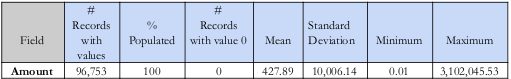
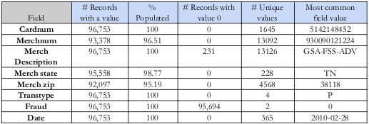

The two screenshots above show the results of a summary function applied to the dataset:
```
def get_summary(dat):

    dtypes_dict = dat.dtypes.apply(lambda x: x.name).to_dict

    numeric = [x for x in dtypes_dict.keys() if dtypes_dict[x] == 'float64' or dtypes_dict[x] == 'int64']
    chars = [x for x in dtypes_dict.keys() if dtypes_dict[x] == 'object']

    type_numeric = ['numeric'] * len(numeric)
    type_chars = ['char'] * len(chars)

    numeric_counts = dat.loc[:, numeric].count().to_dict()
    numeric_populated = list(numeric_counts.values())
    numeric_pct = [str((round(x / len(dat), 2)) * 100) + '%' for x in numeric_populated]
    numeric_zero = [sum(dat.loc[:, x] == 0) for x in numeric]

    numeric_s = pd.DataFrame(list(zip(numeric, type_numeric, numeric_populated, numeric_pct, numeric_zero)),
                             columns=['Name', 'Type', 'Non_NA_Values', 'Pct_Non_NA', 'Num_Zeros'])

    numeric_cols_df = pd.concat([numeric_s,
                                 dat.describe().transpose().reset_index().drop(['count', 'index'], axis=1)],
                                axis=1)

    char_counts = dat.loc[:, chars].count().to_dict()
    char_populated = list(char_counts.values())
    char_pct = [str((round(x / len(dat), 3)) * 100) + '%' for x in char_populated]
    char_zero = [sum(dat.loc[:, x] == 0) for x in chars]

    chars_unique = [len(dat.loc[:, x].unique()) for x in chars]
    chars_val_max = [dat.loc[:, x].value_counts().idxmax() for x in chars]

    chars_df = pd.DataFrame(
        list(zip(chars, type_chars, char_populated, char_pct, char_zero, chars_unique, chars_val_max)),
        columns=['Name', 'Type', 'Non_NA_Values', 'Pct_Non_NA', 'Num_Zeros', 'Unique', 'Most_Common'])

    return pd.concat([numeric_df, chars_df], ignore_index=True)
```

After creating the summary tables above, all the variables in the dataset were visualized using the 'seaborn' package. In the interest of document length, a count plot of the 'Merchstate' variable as well as a distribution of transaction amount are included below:

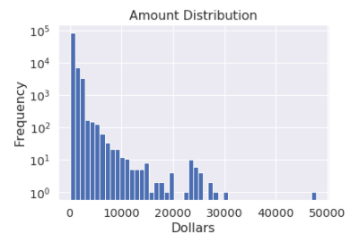
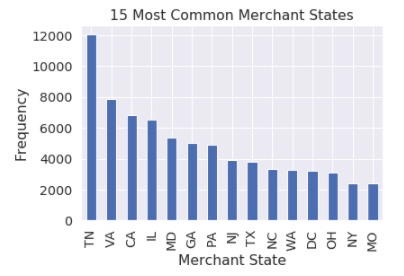

Additionally, the 'fraud' outcome variable was used to observe when and where fraud is more likely to occur. To accomplish this, 'Day of the Week' and 'State' were used to show where fraud occurred the most. This produced interesting results that would drive the rest of our analysis:

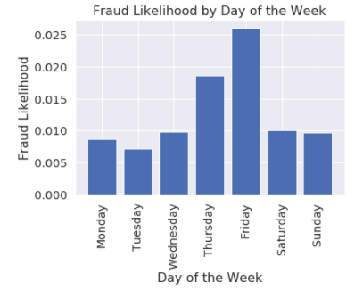
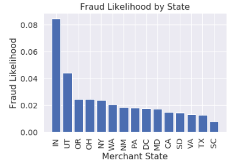

### Step 2 - Data Cleaning

[Link to data cleaning code](variable_creation)

Upon completion of an initial data exploration, it was found that three of the possible independent variables (transaction merchant identification number, state and zip) contained missing values. Since these variables are categorical, thinking outside of the box was required to fill in the missing values. 

The first variable filled in was merchant number. A three-phased approach was used so all missing values could be filled in - first, the column 'Merchant description' was aggregated and the most common matching merchant number for the missing record's merchant description was used. For the remaining missing values, the most common merchant numbers by State and by Zip were used in a similar fashion. 

To fill in merchant state and zip, other geographical identifiers could be used to replace missing values. For example, to fill in merchant state, each record was aggregated by State-Zip and the most common values were used to fill in missing values. Any remaining values were filled in by merchant description and merchant number. 

### Step 3 - Variable Creation

[Link to variable creation code](variable_creation)

After filling in missing values in the dataset, the next step was to create a set of candidate dependent variables that could be used in the model building process. Again, with not many variables available, creativity was needed for creation of a decently sized set of variables. Variables were created based on the following criteria:

* Variables related to a transaction's amount, i.e. Average/max/median/total transaction amount by this card/card at a particular merchant over the past 0/1/3/7 days
* Variables related to frequency of transactions by each entity, i.e. Number of transactions with this card over the past 0/1/3/7 days
* Variables related to the last time an entity made a purchase, i.e. the current date minus the date of the most recent transaction with the same card
* Transaction velociy variables - Number of transactions with the same card/merchant over the past 1 day divided by the average daily transactions with the same card/merchant over the past 7/14/30 days
* Transaction difference variables - Take the difference between the current transaction amount and the average/max/median transaction amount with the same card/merchant over the past 7/14/30 days

The total set of variables was now 399. Obviously, all of these variables would not be used in the final feature set, but this set of variables had potential to inlcude variables that would be better at detecting fraud, compared to the original set of 9 variables. 

### Step 4 - Feature Selection 

[variable selection](variable_selection)

In order to select a final set of features, two feature selection methods would be applied. The first method would be using statistical tests and Fraud Detection Rate and sorting by those two metrics to find variables that served as good predictors of fraud. 

The statistical test used was the Kolmogorov-Smirnov test, or the KS test for short. The KS test is a hypothesis test, with the null hypothesis being that two distributions are identical/the difference of their integrals is 0 and the alternative hypothesis is that the difference is not 0. With a binary classification task such as this one, for each possible dependent variable, two distributions would be created - one for fraudulent transactions and the other for non-fraudulent transactions. The KS test would then test to see if there was a statistically significant difference between the two distributions. If there is, the resulting KS score would be high, and it would tell us that the particular variable serves as a good predictor/differentiator between the two types of transactions. 

Fraud Detection Rate (FDR) is a filter method that looks at a variables ability to detect fraud within the first 3% of a particular population, in this case the sample of credit card transactions. 

After calculating both the KS score and FDR for each variable, the variables were sorted in a table with both scores in descending order. In order to come to a final feature set, the second feature selection method used was Recursive Feature Elimination (RFE). RFE uses a simple classification algorithm (in our case, logistic regression) to find the optimal subset in terms of a particular classification metric (we chose ROC-AUC). The algorithm starts with the full subset of training features and repeatedly removes features. We can then create a plot that graphs the # of features against the classification error metric to give us an idea of which subset of features is most optimal:

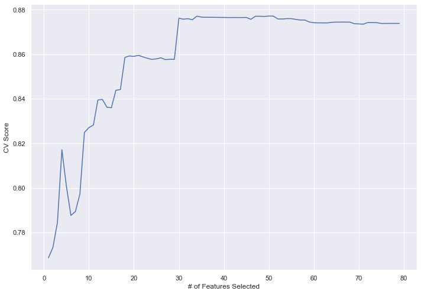

Additionally, Sklearn's RFECV function returns a "rferanking" variable that gives a ranking from 1 to the number of subsets tried. This makes it easy to chose our optimal feature subset. This feature selection algorithm was run on top 80 features and again with top 50 features, from which we chose our final 30 features. 


### Step 5 - Models

[Link to modeling code](models)

Once a final set of optimal features was selected, we could actually begin to create classification models. The goal of the models would be to correctly identify as many fraudulent transaction as possible, and to do so in real time. The set of models chosen was:

* Logistic Regression
* Support Vector Machine
* Random Forest
* XGBoost
* Neural Network

The reason we chose such a wide range of models to test is due to the differences in their complexity. While a neural network could be used to solve most machine learning tasks, its complexity, long compilation times and difficult interpretability. If a problem can be solved using a less complex model, there is no reason to use such a complicated model. For this reason, we started with one of the most simple classification models (logistic regression) and moved up in complexity until we reached neural networks. 

With each model, 5/10 fold (depending on the model/hyperparameters) Cross Validation was used to test different sets of hyperparameters. The tables below will show the different hyperparameter sets that were tried, as well as the classification metric achieved with each subset. Since this is a fraud detection problem, we went with Fraud Detection Rate at 3% of the population. We also divided our data into three subsets - Training, Testing and OOT, and the tables below will show the FDR each susbet of hyperparameters achieved in the three subsets of data. As mentioned above, the OOT data contains the last 2 months of data when sorted chronologically, this will be the most important dataset to determining the optimal model. The optimal model is highlighted in yellow.

#### Logistic Regression

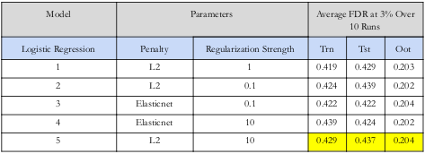

For the logistic regression model, the two hyperparameters chosen for tuning were the regularization parameter as well as the regularization strength. Between the two regularization types (ridge and lasso), we chose ridge or L2 regularization. While both of these hyperparameters aim to reduce the complexity of our feature set, the main difference between the two kinds of regularization lies in the solution function used to solve the linear regression/sum of least squares equation. The solution plane for a regression using Lasso regularization is shaped in such a way that more of our coefficients are likely to reach 0. In this way, Lasso/L1 will give us a sparse solution to our linear regression. However, Ridge regularization gives us a larger set since less of the coefficients are likely to be zeroed out. We can see this in play in the below graphs, which show the solution sets for L1 and L2 regularization, respectively.


In the case of these graphs, the solution set is where the line intersects with the plane. As we can see in the L1 regularization graph, the solution only intersects in corners of the plane, meaning that some of our coefficients will be zero. 

Elasticnet was also tested, as it combined L1 and L2 regularization (although it is rarely used).

#### SVM

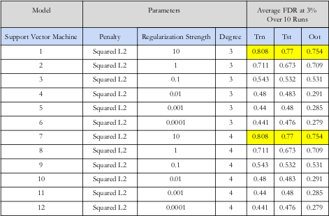

SVM hyperparameters were the regularization type, regularization strength, as well as the degree the decision boundary is modeled in. The degree of the solution kernel tells us to what dimension degree the SVM model will attempt to fit our data i.e. a 3rd degree means that the SVM used a kernel function to fit our data in a 3-Dimensional space.

#### Random Forest and XGBoost 

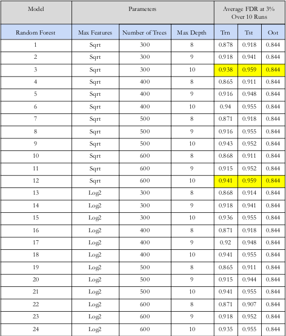

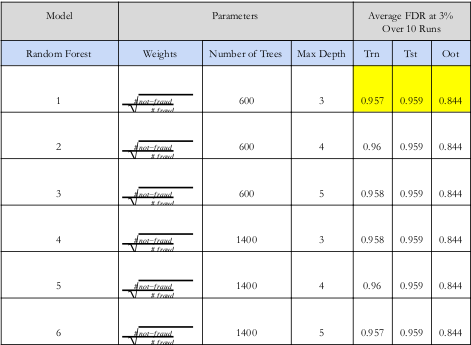
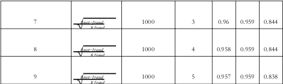

The next two models were tree based - Random Forest and XGBoost. The main difference between RFs and Xgboost lies in the way these models fit the data and form an optimal solution. While both are ensemble learning models (meaning that they combine a collection of models, decision trees, to make a classification decision), RFs use the bagging approach to learning while XGBoost uses the boosting approach (as suggested by the name). 

A random forest model uses a collection of decision trees, with each tree taking a random sample of features and a random sample of training data. The reason bagging is used is to reduce the variance of the model and prevent overfitting - ensemble models are notorious for being overcomplex. The three hyperparameters chosen were 'max features' (a function that determines the amount of features used for training), the number of trees in the ensemble, and the maximum depth of each tree.

A XGBoost model starts with a 'weak learner' (a simple and small decision tree) and builds subsequent weak learners by learning from the errors of the previous tree. The final learner in the ensemble model will have learned from all the susbequent trees. The hyperparameters chosen were weights, number of trees, and the maximum depth of each tree. 

#### Neural Network

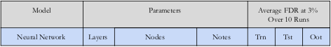
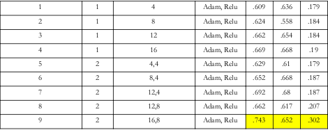

The final model tested was a neural network. The hyperparameters chosen were layers and nodes. All models were trained using the ReLU activiation function and the number of nodes. 

After comparing the results of these models, it was found that the XGBoost model provides the optimal results. 

### Step 6 - XGBoost model evaluation

Since our data is ordered chronologically and we hope to deploy this model to detect fraud in real time, the XGBoost model underwent a final evaluation using the Out of Time dataset created using the final 2 months of data. In that subset, there were 179 total fraudulent transactions out of 12427. In the OOT dataset, the XGBoost model was able to pick up 57% of all fraudulent transactions in the first 20% of that subset's population. In order to give a result, the fraud detection rate was quantified in terms of money saved by detecting fraud. 

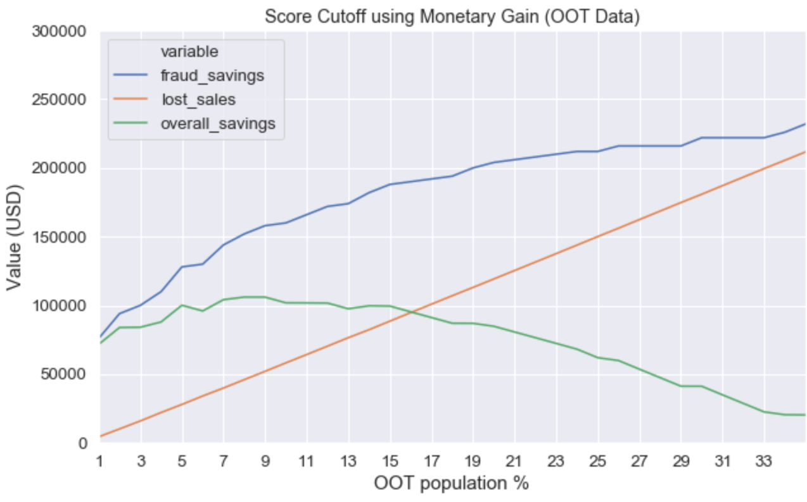

For each fraud caught, it was assumed the $2,000 would be saved and $50 would be lost of every 'false positive' transaction. Using the FDR in the OOT dataset, the savings were calculated over time by subtracting loses for false positives from the total savings from detecting fraud. The plot above shows fraud savings as the blue line, with the orange line showing how many false positives were detected. The green line shows the overall savings as the difference described above. The final result would be presented as a cutoff point for percentage of a fraudulent transactions to detect. The reason we're picking a cutoff is that at some point it becomes more risky to try and detect fraudulent transactions, as that naturally increases the cumulative sum of losses accrued for falsely identifying a fraudulent transaction, and also runs the risk of losing customers who are frustrated with getting accused of posting fraudulent transactions. Using the graph above, the cutoff was set at 5% of the population. This provides us the best margin and balance between false positives and fraud savings. 

