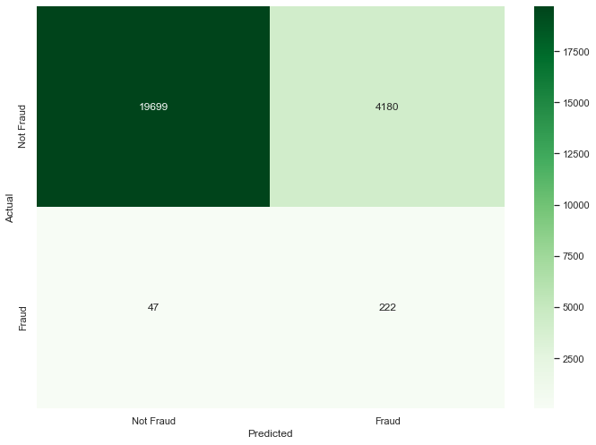
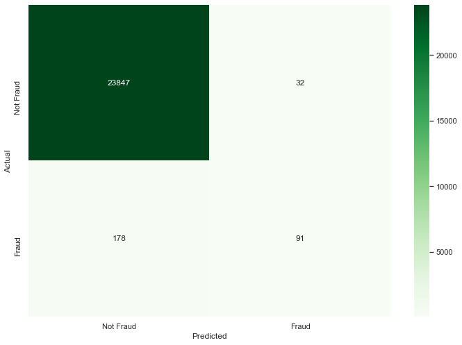
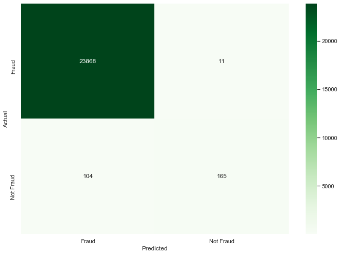
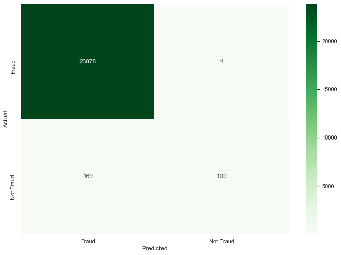

```python
import matplotlib.pyplot as plt
import seaborn as sns
import pandas as pd 
import numpy as np
np.random.seed(1234)
sns.set(rc={'figure.figsize': (11.7, 8.27)})

import xgboost as xgb
from sklearn.model_selection import train_test_split, cross_validate
from sklearn.linear_model import LogisticRegression, SGDClassifier
from sklearn.svm import SVC
from sklearn.ensemble import RandomForestClassifier
from sklearn.utils.class_weight import compute_sample_weight, compute_class_weight
from sklearn.metrics import (roc_auc_score, roc_curve, confusion_matrix,
                             accuracy_score, precision_score, recall_score,
                             f1_score, make_scorer) 
```


```python
def metric_table(actual:pd.Series, model_names: list=None, *args)->pd.DataFrame:
    metrics = {
        'Fraud Detection Rate @ 3%': [],
        'False Negative Rate': [],
        'Accuracy': [],
        'AUC': [],
        'F1': [],
        'Precision': [],
        'Recall': []
    }
    
    for preds in args:
        arg = np.sort(np.array([x[0]-x[1] for x in preds]))[:int(0.03*len(actual))]
        arg = np.where(arg<=0, 1, 0)
        metrics['Fraud Detection Rate @ 3%'].append(sum(arg)/sum(actual))
                    
        preds = [np.argmax(x) for x in preds]
        
        temp = pd.DataFrame(preds, actual.values).reset_index()
        temp.columns = ['actual', 'preds']
        metrics['False Negative Rate'].append(len(temp[(temp['preds']==1)&(temp['actual']==0)])/\
                                                 (len(temp[(temp['preds']==1)&(temp['actual']==0)])+len(temp[(temp['preds']==0)&(temp['actual']==0)])))
        metrics['Accuracy'].append(accuracy_score(actual, preds))
        metrics['AUC'].append(roc_auc_score(actual, preds))
        metrics['Precision'].append(precision_score(actual, preds))
        metrics['Recall'].append(recall_score(actual, preds))
        metrics['F1'].append(f1_score(actual, preds))
    
    res = pd.DataFrame.from_dict(metrics)
    if model_names is not None:
        res.index = model_names
    
    return res
```

### Load Data


```python
train = pd.read_csv('train.csv')

oot = pd.read_csv('oot.csv')
```

### Split into train/test


```python
X = train.iloc[:, 1:25]
y = train.iloc[:, 0]

X_train, X_test, y_train, y_test = train_test_split(X, y, 
                                                    test_size=.30)
```


```python
X_oot = oot.iloc[:, 1:25]
y_oot = oot.iloc[:, 0]
```

### Logistic Regression (No Weights)


```python
lr = LogisticRegression(max_iter=1000)
lr.fit(X_train, y_train)
```


    LogisticRegression(max_iter=1000)


```python
lr_preds = lr.predict_proba(X_test)

cm = confusion_matrix(y_test, [np.argmax(x) for x in lr_preds])

ax = plt.subplot()
sns.heatmap(cm, 
            annot=True, fmt='g', cmap='Greens',
            ax=ax)

ax.set_xlabel('Predicted')
ax.set_ylabel('Actual')
ax.xaxis.set_ticklabels(['Not Fraud', 'Fraud'])
ax.yaxis.set_ticklabels(['Not Fraud', 'Fraud'])
plt.show()
```


    

    


### Logistic Regression with Weights - Use Sklearn Class


```python
weights = compute_sample_weight('balanced', y=y_train)

lr = LogisticRegression(max_iter=1000)
lr.fit(X_train, y_train, sample_weight=weights)
```


    LogisticRegression(max_iter=1000)


```python
lr_preds_weight = lr.predict_proba(X_test)

cm_lr_weights = confusion_matrix(y_test, [np.argmax(x) for x in lr_preds_weight])

ax = plt.subplot()
sns.heatmap(cm_lr_weights, 
            annot=True, fmt='g', cmap='Greens',
            ax=ax)

ax.set_xlabel('Predicted')
ax.set_ylabel('Actual')
ax.xaxis.set_ticklabels(['Not Fraud', 'Fraud'])
ax.yaxis.set_ticklabels(['Not Fraud', 'Fraud'])
plt.show()
```


    

    


```python
sum([np.argmax(x) for x in lr_preds_weight])
```


    4402


### Logistic Regression with Weights - Use Custom Weights


```python
weights = {1: 1.,
           0: 10.}

sgd = SGDClassifier(loss='log', class_weight=weights)
sgd.fit(X_train, y_train)
```


    SGDClassifier(class_weight={0: 10.0, 1: 1.0}, loss='log')


```python
sgd_preds = sgd.predict_proba(X_test)

cm_sgd = confusion_matrix(y_test, [np.argmax(x) for x in sgd_preds])

ax = plt.subplot()
sns.heatmap(cm_sgd, 
            annot=True, fmt='g', cmap='Greens',
            ax=ax)

ax.set_xlabel('Predicted')
ax.set_ylabel('Actual')
ax.xaxis.set_ticklabels(['Not Fraud', 'Fraud'])
ax.yaxis.set_ticklabels(['Not Fraud', 'Fraud'])
plt.show()
```


    

    


```python
cw = compute_class_weight('balanced', y_train.unique(), y_train)
weights = {1: cw.flat[0],
           0: cw.flat[1]}

sgd = SGDClassifier(loss='log', class_weight=weights)
sgd.fit(X_train, y_train)
```


    SGDClassifier(class_weight={0: 47.11120401337793, 1: 0.5053635173193176},
                  loss='log')


```python
sgd_preds_sk = sgd.predict_proba(X_test)

cm_sgd_sk = confusion_matrix(y_test, [np.argmax(x) for x in sgd_preds_sk])

ax = plt.subplot()
sns.heatmap(cm_sgd_sk, 
            annot=True, fmt='g', cmap='Greens',
            ax=ax)

ax.set_xlabel('Predicted')
ax.set_ylabel('Actual')
ax.xaxis.set_ticklabels(['Not Fraud', 'Fraud'])
ax.yaxis.set_ticklabels(['Not Fraud', 'Fraud'])
plt.show()
```


    

    


### From the Results above, the SGD classifier using weights 1:10 and the base logistic regression provide the best results. Some more metrics can be shown below


```python
tab = metric_table(y_test, ['Logistic Regression', 'Logistic Regression Weights', 'SGD', 'SGD Weights'],
                   lr_preds, lr_preds_weight, sgd_preds, sgd_preds_sk)
tab.style.set_caption('Logistic Regression and SGD Results on Test Set')
```

    C:\Users\Alex\AppData\Local\Programs\Python\Python38\lib\site-packages\sklearn\metrics\_classification.py:1221: UndefinedMetricWarning: Precision is ill-defined and being set to 0.0 due to no predicted samples. Use `zero_division` parameter to control this behavior.
      _warn_prf(average, modifier, msg_start, len(result))
    C:\Users\Alex\AppData\Local\Programs\Python\Python38\lib\site-packages\sklearn\metrics\_classification.py:1221: UndefinedMetricWarning: Precision is ill-defined and being set to 0.0 due to no predicted samples. Use `zero_division` parameter to control this behavior.
      _warn_prf(average, modifier, msg_start, len(result))


<style  type="text/css" >
</style><table id="T_110f2a54_a9c0_11ea_85d9_00d861a4bcf8" ><caption>Logistic Regression and SGD Results on Test Set</caption><thead>    <tr>        <th class="blank level0" ></th>        <th class="col_heading level0 col0" >Fraud Detection Rate @ 3%</th>        <th class="col_heading level0 col1" >False Negative Rate</th>        <th class="col_heading level0 col2" >Accuracy</th>        <th class="col_heading level0 col3" >AUC</th>        <th class="col_heading level0 col4" >F1</th>        <th class="col_heading level0 col5" >Precision</th>        <th class="col_heading level0 col6" >Recall</th>    </tr></thead><tbody>
                <tr>
                        <th id="T_110f2a54_a9c0_11ea_85d9_00d861a4bcf8level0_row0" class="row_heading level0 row0" >Logistic Regression</th>
                        <td id="T_110f2a54_a9c0_11ea_85d9_00d861a4bcf8row0_col0" class="data row0 col0" >0.152416</td>
                        <td id="T_110f2a54_a9c0_11ea_85d9_00d861a4bcf8row0_col1" class="data row0 col1" >0.000251</td>
                        <td id="T_110f2a54_a9c0_11ea_85d9_00d861a4bcf8row0_col2" class="data row0 col2" >0.990061</td>
                        <td id="T_110f2a54_a9c0_11ea_85d9_00d861a4bcf8row0_col3" class="data row0 col3" >0.564930</td>
                        <td id="T_110f2a54_a9c0_11ea_85d9_00d861a4bcf8row0_col4" class="data row0 col4" >0.225806</td>
                        <td id="T_110f2a54_a9c0_11ea_85d9_00d861a4bcf8row0_col5" class="data row0 col5" >0.853659</td>
                        <td id="T_110f2a54_a9c0_11ea_85d9_00d861a4bcf8row0_col6" class="data row0 col6" >0.130112</td>
            </tr>
            <tr>
                        <th id="T_110f2a54_a9c0_11ea_85d9_00d861a4bcf8level0_row1" class="row_heading level0 row1" >Logistic Regression Weights</th>
                        <td id="T_110f2a54_a9c0_11ea_85d9_00d861a4bcf8row1_col0" class="data row1 col0" >2.691450</td>
                        <td id="T_110f2a54_a9c0_11ea_85d9_00d861a4bcf8row1_col1" class="data row1 col1" >0.175049</td>
                        <td id="T_110f2a54_a9c0_11ea_85d9_00d861a4bcf8row1_col2" class="data row1 col2" >0.824954</td>
                        <td id="T_110f2a54_a9c0_11ea_85d9_00d861a4bcf8row1_col3" class="data row1 col3" >0.825115</td>
                        <td id="T_110f2a54_a9c0_11ea_85d9_00d861a4bcf8row1_col4" class="data row1 col4" >0.095055</td>
                        <td id="T_110f2a54_a9c0_11ea_85d9_00d861a4bcf8row1_col5" class="data row1 col5" >0.050432</td>
                        <td id="T_110f2a54_a9c0_11ea_85d9_00d861a4bcf8row1_col6" class="data row1 col6" >0.825279</td>
            </tr>
            <tr>
                        <th id="T_110f2a54_a9c0_11ea_85d9_00d861a4bcf8level0_row2" class="row_heading level0 row2" >SGD</th>
                        <td id="T_110f2a54_a9c0_11ea_85d9_00d861a4bcf8row2_col0" class="data row2 col0" >0.000000</td>
                        <td id="T_110f2a54_a9c0_11ea_85d9_00d861a4bcf8row2_col1" class="data row2 col1" >0.000000</td>
                        <td id="T_110f2a54_a9c0_11ea_85d9_00d861a4bcf8row2_col2" class="data row2 col2" >0.988860</td>
                        <td id="T_110f2a54_a9c0_11ea_85d9_00d861a4bcf8row2_col3" class="data row2 col3" >0.500000</td>
                        <td id="T_110f2a54_a9c0_11ea_85d9_00d861a4bcf8row2_col4" class="data row2 col4" >0.000000</td>
                        <td id="T_110f2a54_a9c0_11ea_85d9_00d861a4bcf8row2_col5" class="data row2 col5" >0.000000</td>
                        <td id="T_110f2a54_a9c0_11ea_85d9_00d861a4bcf8row2_col6" class="data row2 col6" >0.000000</td>
            </tr>
            <tr>
                        <th id="T_110f2a54_a9c0_11ea_85d9_00d861a4bcf8level0_row3" class="row_heading level0 row3" >SGD Weights</th>
                        <td id="T_110f2a54_a9c0_11ea_85d9_00d861a4bcf8row3_col0" class="data row3 col0" >0.000000</td>
                        <td id="T_110f2a54_a9c0_11ea_85d9_00d861a4bcf8row3_col1" class="data row3 col1" >0.000000</td>
                        <td id="T_110f2a54_a9c0_11ea_85d9_00d861a4bcf8row3_col2" class="data row3 col2" >0.988860</td>
                        <td id="T_110f2a54_a9c0_11ea_85d9_00d861a4bcf8row3_col3" class="data row3 col3" >0.500000</td>
                        <td id="T_110f2a54_a9c0_11ea_85d9_00d861a4bcf8row3_col4" class="data row3 col4" >0.000000</td>
                        <td id="T_110f2a54_a9c0_11ea_85d9_00d861a4bcf8row3_col5" class="data row3 col5" >0.000000</td>
                        <td id="T_110f2a54_a9c0_11ea_85d9_00d861a4bcf8row3_col6" class="data row3 col6" >0.000000</td>
            </tr>
    </tbody></table>


From the table above, the SGD achieves a significantly higher AUC score, so we will move forward with that model

### SVM


```python
svm = SVC(probability=True)

svm.fit(X_train, y_train)
```


    SVC(probability=True)


```python
svm_preds = svm.predict_proba(X_test)

svm_cm = confusion_matrix(y_test, [np.argmax(x) for x in svm_preds])

ax = plt.subplot()
sns.heatmap(svm_cm,  
            annot=True, fmt='g', cmap='Greens',
            ax=ax)

ax.set_xlabel('Predicted')
ax.set_ylabel('Actual')
ax.xaxis.set_ticklabels(['Not Fraud', 'Fraud'])
ax.yaxis.set_ticklabels(['Not Fraud', 'Fraud'])
plt.show()
```


    

    


### SVM - Weights


```python
weights = {0: 1.,
           1: 10.}

svm = SVC(class_weight=weights, probability=True)

svm.fit(X_train, y_train)
```


    SVC(class_weight={0: 1.0, 1: 10.0}, probability=True)


```python
svm_preds_w = svm.predict_proba(X_test)

svm_cm_w = confusion_matrix(y_test, [np.argmax(x) for x in svm_preds_w])

ax = plt.subplot()
sns.heatmap(svm_cm_w,  
            annot=True, fmt='g', cmap='Greens',
            ax=ax)

ax.set_xlabel('Predicted')
ax.set_ylabel('Actual')
ax.xaxis.set_ticklabels(['Not Fraud', 'Fraud'])
ax.yaxis.set_ticklabels(['Not Fraud', 'Fraud'])
plt.show()
```


    

    


```python
tab = metric_table(y_test, ['Logistic Regression', 'SGD', 'SVM No Weights', 'SVM Weights'], 
                   lr_preds, sgd_preds, svm_preds, svm_preds_w)
tab.style.set_caption('Logistic Regression and SVM Results on Test Set')
```

    C:\Users\Alex\AppData\Local\Programs\Python\Python38\lib\site-packages\sklearn\metrics\_classification.py:1221: UndefinedMetricWarning: Precision is ill-defined and being set to 0.0 due to no predicted samples. Use `zero_division` parameter to control this behavior.
      _warn_prf(average, modifier, msg_start, len(result))


<style  type="text/css" >
</style><table id="T_a0dbd35d_a9c0_11ea_b7bc_00d861a4bcf8" ><caption>Logistic Regression and SVM Results on Test Set</caption><thead>    <tr>        <th class="blank level0" ></th>        <th class="col_heading level0 col0" >Fraud Detection Rate @ 3%</th>        <th class="col_heading level0 col1" >False Negative Rate</th>        <th class="col_heading level0 col2" >Accuracy</th>        <th class="col_heading level0 col3" >AUC</th>        <th class="col_heading level0 col4" >F1</th>        <th class="col_heading level0 col5" >Precision</th>        <th class="col_heading level0 col6" >Recall</th>    </tr></thead><tbody>
                <tr>
                        <th id="T_a0dbd35d_a9c0_11ea_b7bc_00d861a4bcf8level0_row0" class="row_heading level0 row0" >Logistic Regression</th>
                        <td id="T_a0dbd35d_a9c0_11ea_b7bc_00d861a4bcf8row0_col0" class="data row0 col0" >0.152416</td>
                        <td id="T_a0dbd35d_a9c0_11ea_b7bc_00d861a4bcf8row0_col1" class="data row0 col1" >0.000251</td>
                        <td id="T_a0dbd35d_a9c0_11ea_b7bc_00d861a4bcf8row0_col2" class="data row0 col2" >0.990061</td>
                        <td id="T_a0dbd35d_a9c0_11ea_b7bc_00d861a4bcf8row0_col3" class="data row0 col3" >0.564930</td>
                        <td id="T_a0dbd35d_a9c0_11ea_b7bc_00d861a4bcf8row0_col4" class="data row0 col4" >0.225806</td>
                        <td id="T_a0dbd35d_a9c0_11ea_b7bc_00d861a4bcf8row0_col5" class="data row0 col5" >0.853659</td>
                        <td id="T_a0dbd35d_a9c0_11ea_b7bc_00d861a4bcf8row0_col6" class="data row0 col6" >0.130112</td>
            </tr>
            <tr>
                        <th id="T_a0dbd35d_a9c0_11ea_b7bc_00d861a4bcf8level0_row1" class="row_heading level0 row1" >SGD</th>
                        <td id="T_a0dbd35d_a9c0_11ea_b7bc_00d861a4bcf8row1_col0" class="data row1 col0" >0.000000</td>
                        <td id="T_a0dbd35d_a9c0_11ea_b7bc_00d861a4bcf8row1_col1" class="data row1 col1" >0.000000</td>
                        <td id="T_a0dbd35d_a9c0_11ea_b7bc_00d861a4bcf8row1_col2" class="data row1 col2" >0.988860</td>
                        <td id="T_a0dbd35d_a9c0_11ea_b7bc_00d861a4bcf8row1_col3" class="data row1 col3" >0.500000</td>
                        <td id="T_a0dbd35d_a9c0_11ea_b7bc_00d861a4bcf8row1_col4" class="data row1 col4" >0.000000</td>
                        <td id="T_a0dbd35d_a9c0_11ea_b7bc_00d861a4bcf8row1_col5" class="data row1 col5" >0.000000</td>
                        <td id="T_a0dbd35d_a9c0_11ea_b7bc_00d861a4bcf8row1_col6" class="data row1 col6" >0.000000</td>
            </tr>
            <tr>
                        <th id="T_a0dbd35d_a9c0_11ea_b7bc_00d861a4bcf8level0_row2" class="row_heading level0 row2" >SVM No Weights</th>
                        <td id="T_a0dbd35d_a9c0_11ea_b7bc_00d861a4bcf8row2_col0" class="data row2 col0" >0.230483</td>
                        <td id="T_a0dbd35d_a9c0_11ea_b7bc_00d861a4bcf8row2_col1" class="data row2 col1" >0.000461</td>
                        <td id="T_a0dbd35d_a9c0_11ea_b7bc_00d861a4bcf8row2_col2" class="data row2 col2" >0.990517</td>
                        <td id="T_a0dbd35d_a9c0_11ea_b7bc_00d861a4bcf8row2_col3" class="data row2 col3" >0.594565</td>
                        <td id="T_a0dbd35d_a9c0_11ea_b7bc_00d861a4bcf8row2_col4" class="data row2 col4" >0.308157</td>
                        <td id="T_a0dbd35d_a9c0_11ea_b7bc_00d861a4bcf8row2_col5" class="data row2 col5" >0.822581</td>
                        <td id="T_a0dbd35d_a9c0_11ea_b7bc_00d861a4bcf8row2_col6" class="data row2 col6" >0.189591</td>
            </tr>
            <tr>
                        <th id="T_a0dbd35d_a9c0_11ea_b7bc_00d861a4bcf8level0_row3" class="row_heading level0 row3" >SVM Weights</th>
                        <td id="T_a0dbd35d_a9c0_11ea_b7bc_00d861a4bcf8row3_col0" class="data row3 col0" >0.468401</td>
                        <td id="T_a0dbd35d_a9c0_11ea_b7bc_00d861a4bcf8row3_col1" class="data row3 col1" >0.001340</td>
                        <td id="T_a0dbd35d_a9c0_11ea_b7bc_00d861a4bcf8row3_col2" class="data row3 col2" >0.991304</td>
                        <td id="T_a0dbd35d_a9c0_11ea_b7bc_00d861a4bcf8row3_col3" class="data row3 col3" >0.668475</td>
                        <td id="T_a0dbd35d_a9c0_11ea_b7bc_00d861a4bcf8row3_col4" class="data row3 col4" >0.464286</td>
                        <td id="T_a0dbd35d_a9c0_11ea_b7bc_00d861a4bcf8row3_col5" class="data row3 col5" >0.739837</td>
                        <td id="T_a0dbd35d_a9c0_11ea_b7bc_00d861a4bcf8row3_col6" class="data row3 col6" >0.338290</td>
            </tr>
    </tbody></table>


This iteration of training tells us that SVM performs the best

### XGBoost


```python
model = xgb.XGBClassifier(scale_pos_weight=np.sqrt((y_train==0).sum()/(y_train==1).sum()),
                          objective='binary:logistic', 
                          n_estimators=1000, 
                          max_depth=4,
                          base_score=0.5)

model.fit(X_train, y_train)
```


    ---------------------------------------------------------------------------

    KeyError                                  Traceback (most recent call last)

    ~\AppData\Local\Programs\Python\Python38\lib\site-packages\IPython\core\formatters.py in __call__(self, obj, include, exclude)
        968 
        969             if method is not None:
    --> 970                 return method(include=include, exclude=exclude)
        971             return None
        972         else:


    ~\AppData\Local\Programs\Python\Python38\lib\site-packages\sklearn\base.py in _repr_mimebundle_(self, **kwargs)
        461     def _repr_mimebundle_(self, **kwargs):
        462         """Mime bundle used by jupyter kernels to display estimator"""
    --> 463         output = {"text/plain": repr(self)}
        464         if get_config()["display"] == 'diagram':
        465             output["text/html"] = estimator_html_repr(self)


    ~\AppData\Local\Programs\Python\Python38\lib\site-packages\sklearn\base.py in __repr__(self, N_CHAR_MAX)
        277             n_max_elements_to_show=N_MAX_ELEMENTS_TO_SHOW)
        278 
    --> 279         repr_ = pp.pformat(self)
        280 
        281         # Use bruteforce ellipsis when there are a lot of non-blank characters


    ~\AppData\Local\Programs\Python\Python38\lib\pprint.py in pformat(self, object)
        151     def pformat(self, object):
        152         sio = _StringIO()
    --> 153         self._format(object, sio, 0, 0, {}, 0)
        154         return sio.getvalue()
        155 


    ~\AppData\Local\Programs\Python\Python38\lib\pprint.py in _format(self, object, stream, indent, allowance, context, level)
        168             self._readable = False
        169             return
    --> 170         rep = self._repr(object, context, level)
        171         max_width = self._width - indent - allowance
        172         if len(rep) > max_width:


    ~\AppData\Local\Programs\Python\Python38\lib\pprint.py in _repr(self, object, context, level)
        402 
        403     def _repr(self, object, context, level):
    --> 404         repr, readable, recursive = self.format(object, context.copy(),
        405                                                 self._depth, level)
        406         if not readable:


    ~\AppData\Local\Programs\Python\Python38\lib\site-packages\sklearn\utils\_pprint.py in format(self, object, context, maxlevels, level)
        167 
        168     def format(self, object, context, maxlevels, level):
    --> 169         return _safe_repr(object, context, maxlevels, level,
        170                           changed_only=self._changed_only)
        171 


    ~\AppData\Local\Programs\Python\Python38\lib\site-packages\sklearn\utils\_pprint.py in _safe_repr(object, context, maxlevels, level, changed_only)
        412         recursive = False
        413         if changed_only:
    --> 414             params = _changed_params(object)
        415         else:
        416             params = object.get_params(deep=False)


    ~\AppData\Local\Programs\Python\Python38\lib\site-packages\sklearn\utils\_pprint.py in _changed_params(estimator)
         96     init_params = {name: param.default for name, param in init_params.items()}
         97     for k, v in params.items():
    ---> 98         if (repr(v) != repr(init_params[k]) and
         99                 not (is_scalar_nan(init_params[k]) and is_scalar_nan(v))):
        100             filtered_params[k] = v


    KeyError: 'base_score'


    ---------------------------------------------------------------------------

    KeyError                                  Traceback (most recent call last)

    ~\AppData\Local\Programs\Python\Python38\lib\site-packages\IPython\core\formatters.py in __call__(self, obj)
        700                 type_pprinters=self.type_printers,
        701                 deferred_pprinters=self.deferred_printers)
    --> 702             printer.pretty(obj)
        703             printer.flush()
        704             return stream.getvalue()


    ~\AppData\Local\Programs\Python\Python38\lib\site-packages\IPython\lib\pretty.py in pretty(self, obj)
        403                         if cls is not object \
        404                                 and callable(cls.__dict__.get('__repr__')):
    --> 405                             return _repr_pprint(obj, self, cycle)
        406 
        407             return _default_pprint(obj, self, cycle)


    ~\AppData\Local\Programs\Python\Python38\lib\site-packages\IPython\lib\pretty.py in _repr_pprint(obj, p, cycle)
        693     """A pprint that just redirects to the normal repr function."""
        694     # Find newlines and replace them with p.break_()
    --> 695     output = repr(obj)
        696     lines = output.splitlines()
        697     with p.group():


    ~\AppData\Local\Programs\Python\Python38\lib\site-packages\sklearn\base.py in __repr__(self, N_CHAR_MAX)
        277             n_max_elements_to_show=N_MAX_ELEMENTS_TO_SHOW)
        278 
    --> 279         repr_ = pp.pformat(self)
        280 
        281         # Use bruteforce ellipsis when there are a lot of non-blank characters


    ~\AppData\Local\Programs\Python\Python38\lib\pprint.py in pformat(self, object)
        151     def pformat(self, object):
        152         sio = _StringIO()
    --> 153         self._format(object, sio, 0, 0, {}, 0)
        154         return sio.getvalue()
        155 


    ~\AppData\Local\Programs\Python\Python38\lib\pprint.py in _format(self, object, stream, indent, allowance, context, level)
        168             self._readable = False
        169             return
    --> 170         rep = self._repr(object, context, level)
        171         max_width = self._width - indent - allowance
        172         if len(rep) > max_width:


    ~\AppData\Local\Programs\Python\Python38\lib\pprint.py in _repr(self, object, context, level)
        402 
        403     def _repr(self, object, context, level):
    --> 404         repr, readable, recursive = self.format(object, context.copy(),
        405                                                 self._depth, level)
        406         if not readable:


    ~\AppData\Local\Programs\Python\Python38\lib\site-packages\sklearn\utils\_pprint.py in format(self, object, context, maxlevels, level)
        167 
        168     def format(self, object, context, maxlevels, level):
    --> 169         return _safe_repr(object, context, maxlevels, level,
        170                           changed_only=self._changed_only)
        171 


    ~\AppData\Local\Programs\Python\Python38\lib\site-packages\sklearn\utils\_pprint.py in _safe_repr(object, context, maxlevels, level, changed_only)
        412         recursive = False
        413         if changed_only:
    --> 414             params = _changed_params(object)
        415         else:
        416             params = object.get_params(deep=False)


    ~\AppData\Local\Programs\Python\Python38\lib\site-packages\sklearn\utils\_pprint.py in _changed_params(estimator)
         96     init_params = {name: param.default for name, param in init_params.items()}
         97     for k, v in params.items():
    ---> 98         if (repr(v) != repr(init_params[k]) and
         99                 not (is_scalar_nan(init_params[k]) and is_scalar_nan(v))):
        100             filtered_params[k] = v


    KeyError: 'base_score'


```python
xgb_preds = model.predict_proba(X_test)

xgb_cm = confusion_matrix(y_test, [np.argmax(x) for x in xgb_preds])

ax = plt.subplot()
sns.heatmap(xgb_cm,  
            annot=True, fmt='g', cmap='Greens',
            ax=ax)

ax.set_xlabel('Predicted')
ax.set_ylabel('Actual')
ax.xaxis.set_ticklabels(['Fraud', 'Not Fraud'])
ax.yaxis.set_ticklabels(['Fraud', 'Not Fraud'])
plt.show()
```


    

    


```python
tab = metric_table(y_test, ['SGD', 'SVM Weights', 'XGB'], 
                   sgd_preds, svm_preds_w, xgb_preds)
tab.style.set_caption('SVM and XGB Results on Test Set')
```

    C:\Users\Alex\AppData\Local\Programs\Python\Python38\lib\site-packages\sklearn\metrics\_classification.py:1221: UndefinedMetricWarning: Precision is ill-defined and being set to 0.0 due to no predicted samples. Use `zero_division` parameter to control this behavior.
      _warn_prf(average, modifier, msg_start, len(result))


<style  type="text/css" >
</style><table id="T_a8dded70_a9c0_11ea_9bd4_00d861a4bcf8" ><caption>SVM and XGB Results on Test Set</caption><thead>    <tr>        <th class="blank level0" ></th>        <th class="col_heading level0 col0" >Fraud Detection Rate @ 3%</th>        <th class="col_heading level0 col1" >False Negative Rate</th>        <th class="col_heading level0 col2" >Accuracy</th>        <th class="col_heading level0 col3" >AUC</th>        <th class="col_heading level0 col4" >F1</th>        <th class="col_heading level0 col5" >Precision</th>        <th class="col_heading level0 col6" >Recall</th>    </tr></thead><tbody>
                <tr>
                        <th id="T_a8dded70_a9c0_11ea_9bd4_00d861a4bcf8level0_row0" class="row_heading level0 row0" >SGD</th>
                        <td id="T_a8dded70_a9c0_11ea_9bd4_00d861a4bcf8row0_col0" class="data row0 col0" >0.000000</td>
                        <td id="T_a8dded70_a9c0_11ea_9bd4_00d861a4bcf8row0_col1" class="data row0 col1" >0.000000</td>
                        <td id="T_a8dded70_a9c0_11ea_9bd4_00d861a4bcf8row0_col2" class="data row0 col2" >0.988860</td>
                        <td id="T_a8dded70_a9c0_11ea_9bd4_00d861a4bcf8row0_col3" class="data row0 col3" >0.500000</td>
                        <td id="T_a8dded70_a9c0_11ea_9bd4_00d861a4bcf8row0_col4" class="data row0 col4" >0.000000</td>
                        <td id="T_a8dded70_a9c0_11ea_9bd4_00d861a4bcf8row0_col5" class="data row0 col5" >0.000000</td>
                        <td id="T_a8dded70_a9c0_11ea_9bd4_00d861a4bcf8row0_col6" class="data row0 col6" >0.000000</td>
            </tr>
            <tr>
                        <th id="T_a8dded70_a9c0_11ea_9bd4_00d861a4bcf8level0_row1" class="row_heading level0 row1" >SVM Weights</th>
                        <td id="T_a8dded70_a9c0_11ea_9bd4_00d861a4bcf8row1_col0" class="data row1 col0" >0.468401</td>
                        <td id="T_a8dded70_a9c0_11ea_9bd4_00d861a4bcf8row1_col1" class="data row1 col1" >0.001340</td>
                        <td id="T_a8dded70_a9c0_11ea_9bd4_00d861a4bcf8row1_col2" class="data row1 col2" >0.991304</td>
                        <td id="T_a8dded70_a9c0_11ea_9bd4_00d861a4bcf8row1_col3" class="data row1 col3" >0.668475</td>
                        <td id="T_a8dded70_a9c0_11ea_9bd4_00d861a4bcf8row1_col4" class="data row1 col4" >0.464286</td>
                        <td id="T_a8dded70_a9c0_11ea_9bd4_00d861a4bcf8row1_col5" class="data row1 col5" >0.739837</td>
                        <td id="T_a8dded70_a9c0_11ea_9bd4_00d861a4bcf8row1_col6" class="data row1 col6" >0.338290</td>
            </tr>
            <tr>
                        <th id="T_a8dded70_a9c0_11ea_9bd4_00d861a4bcf8level0_row2" class="row_heading level0 row2" >XGB</th>
                        <td id="T_a8dded70_a9c0_11ea_9bd4_00d861a4bcf8row2_col0" class="data row2 col0" >0.654275</td>
                        <td id="T_a8dded70_a9c0_11ea_9bd4_00d861a4bcf8row2_col1" class="data row2 col1" >0.000461</td>
                        <td id="T_a8dded70_a9c0_11ea_9bd4_00d861a4bcf8row2_col2" class="data row2 col2" >0.995238</td>
                        <td id="T_a8dded70_a9c0_11ea_9bd4_00d861a4bcf8row2_col3" class="data row2 col3" >0.806461</td>
                        <td id="T_a8dded70_a9c0_11ea_9bd4_00d861a4bcf8row2_col4" class="data row2 col4" >0.741573</td>
                        <td id="T_a8dded70_a9c0_11ea_9bd4_00d861a4bcf8row2_col5" class="data row2 col5" >0.937500</td>
                        <td id="T_a8dded70_a9c0_11ea_9bd4_00d861a4bcf8row2_col6" class="data row2 col6" >0.613383</td>
            </tr>
    </tbody></table>


### Random Forest - no weights


```python
rf = RandomForestClassifier(max_depth=10)

rf.fit(X_train, y_train)
```


    RandomForestClassifier(max_depth=10)


```python
rf_preds = rf.predict_proba(X_test)

rf_cm = confusion_matrix(y_test, [np.argmax(x) for x in rf_preds])

ax = plt.subplot()
sns.heatmap(rf_cm,  
            annot=True, fmt='g', cmap='Greens',
            ax=ax)

ax.set_xlabel('Predicted')
ax.set_ylabel('Actual')
ax.xaxis.set_ticklabels(['Fraud', 'Not Fraud'])
ax.yaxis.set_ticklabels(['Fraud', 'Not Fraud'])
plt.show()
```


    

    


```python
tab = metric_table(y_test, ['Logistic Regression', 'SVM Weights', 'XGB', 'RF'], 
                   lr_preds, svm_preds_w, xgb_preds, rf_preds)
tab.style.set_caption('LR, SVM, XGB and RF Results on Test Set')
```


<style  type="text/css" >
</style><table id="T_bac02f81_a9c0_11ea_8a28_00d861a4bcf8" ><caption>LR, SVM, XGB and RF Results on Test Set</caption><thead>    <tr>        <th class="blank level0" ></th>        <th class="col_heading level0 col0" >Fraud Detection Rate @ 3%</th>        <th class="col_heading level0 col1" >False Negative Rate</th>        <th class="col_heading level0 col2" >Accuracy</th>        <th class="col_heading level0 col3" >AUC</th>        <th class="col_heading level0 col4" >F1</th>        <th class="col_heading level0 col5" >Precision</th>        <th class="col_heading level0 col6" >Recall</th>    </tr></thead><tbody>
                <tr>
                        <th id="T_bac02f81_a9c0_11ea_8a28_00d861a4bcf8level0_row0" class="row_heading level0 row0" >Logistic Regression</th>
                        <td id="T_bac02f81_a9c0_11ea_8a28_00d861a4bcf8row0_col0" class="data row0 col0" >0.152416</td>
                        <td id="T_bac02f81_a9c0_11ea_8a28_00d861a4bcf8row0_col1" class="data row0 col1" >0.000251</td>
                        <td id="T_bac02f81_a9c0_11ea_8a28_00d861a4bcf8row0_col2" class="data row0 col2" >0.990061</td>
                        <td id="T_bac02f81_a9c0_11ea_8a28_00d861a4bcf8row0_col3" class="data row0 col3" >0.564930</td>
                        <td id="T_bac02f81_a9c0_11ea_8a28_00d861a4bcf8row0_col4" class="data row0 col4" >0.225806</td>
                        <td id="T_bac02f81_a9c0_11ea_8a28_00d861a4bcf8row0_col5" class="data row0 col5" >0.853659</td>
                        <td id="T_bac02f81_a9c0_11ea_8a28_00d861a4bcf8row0_col6" class="data row0 col6" >0.130112</td>
            </tr>
            <tr>
                        <th id="T_bac02f81_a9c0_11ea_8a28_00d861a4bcf8level0_row1" class="row_heading level0 row1" >SVM Weights</th>
                        <td id="T_bac02f81_a9c0_11ea_8a28_00d861a4bcf8row1_col0" class="data row1 col0" >0.468401</td>
                        <td id="T_bac02f81_a9c0_11ea_8a28_00d861a4bcf8row1_col1" class="data row1 col1" >0.001340</td>
                        <td id="T_bac02f81_a9c0_11ea_8a28_00d861a4bcf8row1_col2" class="data row1 col2" >0.991304</td>
                        <td id="T_bac02f81_a9c0_11ea_8a28_00d861a4bcf8row1_col3" class="data row1 col3" >0.668475</td>
                        <td id="T_bac02f81_a9c0_11ea_8a28_00d861a4bcf8row1_col4" class="data row1 col4" >0.464286</td>
                        <td id="T_bac02f81_a9c0_11ea_8a28_00d861a4bcf8row1_col5" class="data row1 col5" >0.739837</td>
                        <td id="T_bac02f81_a9c0_11ea_8a28_00d861a4bcf8row1_col6" class="data row1 col6" >0.338290</td>
            </tr>
            <tr>
                        <th id="T_bac02f81_a9c0_11ea_8a28_00d861a4bcf8level0_row2" class="row_heading level0 row2" >XGB</th>
                        <td id="T_bac02f81_a9c0_11ea_8a28_00d861a4bcf8row2_col0" class="data row2 col0" >0.654275</td>
                        <td id="T_bac02f81_a9c0_11ea_8a28_00d861a4bcf8row2_col1" class="data row2 col1" >0.000461</td>
                        <td id="T_bac02f81_a9c0_11ea_8a28_00d861a4bcf8row2_col2" class="data row2 col2" >0.995238</td>
                        <td id="T_bac02f81_a9c0_11ea_8a28_00d861a4bcf8row2_col3" class="data row2 col3" >0.806461</td>
                        <td id="T_bac02f81_a9c0_11ea_8a28_00d861a4bcf8row2_col4" class="data row2 col4" >0.741573</td>
                        <td id="T_bac02f81_a9c0_11ea_8a28_00d861a4bcf8row2_col5" class="data row2 col5" >0.937500</td>
                        <td id="T_bac02f81_a9c0_11ea_8a28_00d861a4bcf8row2_col6" class="data row2 col6" >0.613383</td>
            </tr>
            <tr>
                        <th id="T_bac02f81_a9c0_11ea_8a28_00d861a4bcf8level0_row3" class="row_heading level0 row3" >RF</th>
                        <td id="T_bac02f81_a9c0_11ea_8a28_00d861a4bcf8row3_col0" class="data row3 col0" >0.375465</td>
                        <td id="T_bac02f81_a9c0_11ea_8a28_00d861a4bcf8row3_col1" class="data row3 col1" >0.000042</td>
                        <td id="T_bac02f81_a9c0_11ea_8a28_00d861a4bcf8row3_col2" class="data row3 col2" >0.992960</td>
                        <td id="T_bac02f81_a9c0_11ea_8a28_00d861a4bcf8row3_col3" class="data row3 col3" >0.685853</td>
                        <td id="T_bac02f81_a9c0_11ea_8a28_00d861a4bcf8row3_col4" class="data row3 col4" >0.540541</td>
                        <td id="T_bac02f81_a9c0_11ea_8a28_00d861a4bcf8row3_col5" class="data row3 col5" >0.990099</td>
                        <td id="T_bac02f81_a9c0_11ea_8a28_00d861a4bcf8row3_col6" class="data row3 col6" >0.371747</td>
            </tr>
    </tbody></table>


# CV

## Take 4 models above, perform 10 fold CV on them


```python
def fdr_score(y_true, y_pred):
    # arg = np.sort(np.array([x.flat[0]-x.flat[1] for x in y_pred]))[:int(0.03*len(y_pred))]
    # arg = np.where(arg<=0, 1, 0)
    
    # return sum(arg)/sum(y_true)
    res_df = pd.DataFrame(list(zip(y_true.values, [x.flat[1] for x in y_pred])), columns=['Fraud Actual', 'Fraud Score'])
    res_df = res_df.sort_values('Fraud Score',ascending=False)
    total_bads = sum(y_true)
    pop_3perc = int(round(len(res_df)*0.03))
    temp = res_df.head(pop_3perc)
    return round(sum(temp['Fraud Actual'])/total_bads,3)
```


```python
def fdr_cross_val(model, X, y, scoring=scoring, cv=10):
    scores = cross_validate(model, X, y, return_estimator=True, n_jobs=-1)
    return fdr_score(y, scores['estimator'][0].predict_proba(X))
```

### Logistic Regression - 1


```python
lr_cv_res = {
    'train': [],
    'test': [],
    'oot': []
}
```


```python
for x in [10, 1, 0.1, 0.01, 0.001, 0.0001]:
    lr = LogisticRegression(max_iter=1000, C=x)
    
    lr_cv_res['train'].append(fdr_cross_val(lr1, X_train, y_train))
    lr_cv_res['test'].append(fdr_cross_val(lr1, X_test, y_test))
    lr_cv_res['oot'].append(fdr_cross_val(lr1, X_oot, y_oot))
```


```python
lr_cv_res
```


    {'train': [0.457, 0.457, 0.457, 0.457, 0.457, 0.457],
     'test': [0.498, 0.498, 0.498, 0.498, 0.498, 0.498],
     'oot': [0.385, 0.385, 0.385, 0.385, 0.385, 0.385]}


### SVM


```python
svm_cv_res = {
    'train': [],
    'test': [],
    'oot': []
}
```


```python
weights = {0: 1.,
           1: 10.}

for d in [3, 4]:
    for x in [10, 1, 0.1, 0.01, 0.001, 0.0001]:
        svm = SVC(C=x, degree=d, 
                  class_weight=weights, probability=True)

        svm_cv_res['train'].append(fdr_cross_val(svm, X_train, y_train))
        svm_cv_res['test'].append(fdr_cross_val(svm, X_test, y_test))
        svm_cv_res['oot'].append(fdr_cross_val(svm, X_oot, y_oot))
```


```python
svm_cv_res
```


    {'train': [0.808,
      0.711,
      0.543,
      0.48,
      0.44,
      0.441,
      0.808,
      0.711,
      0.543,
      0.48,
      0.44,
      0.441],
     'test': [0.77,
      0.673,
      0.532,
      0.483,
      0.48,
      0.476,
      0.77,
      0.673,
      0.532,
      0.483,
      0.48,
      0.476],
     'oot': [0.754,
      0.709,
      0.531,
      0.291,
      0.285,
      0.279,
      0.754,
      0.709,
      0.531,
      0.291,
      0.285,
      0.279]}


### XGB


```python
xgb_cv_res = {
    'train': [],
    'test': [],
    'oot': []
}
```


```python
for e in [600, 1000, 1400]:
    for d in [3, 4, 5]:
        xgb1 = xgb.XGBClassifier(scale_pos_weight=np.sqrt((y_train==0).sum()/(y_train==1).sum()),
                                    objective='binary:logistic', 
                                    n_estimators=e, 
                                    max_depth=d,
                                    base_score=0.5)
        
        xgb_cv_res['train'].append(fdr_cross_val(xgb1, X_train, y_train))
        xgb_cv_res['test'].append(fdr_cross_val(xgb1, X_test, y_test))
        xgb_cv_res['oot'].append(fdr_cross_val(xgb1, X_oot, y_oot))
```


```python
xgb_cv_res
```


    {'train': [0.957, 0.96, 0.958, 0.958, 0.96, 0.957, 0.96, 0.958, 0.957],
     'test': [0.959, 0.959, 0.959, 0.959, 0.959, 0.959, 0.959, 0.959, 0.959],
     'oot': [0.844, 0.844, 0.838, 0.844, 0.844, 0.838, 0.844, 0.844, 0.838]}


### RF


```python
rf_cv_res = {
    'train': [],
    'test': [],
    'oot': []
}
```


```python
weights = {0: 1.,
           1: 10.}

for m in ['sqrt', 'log2']:
    for e in [300, 400, 500, 600]:
        for d in [8, 9, 10]:
            rf = RandomForestClassifier(max_features=m,
                                        n_estimators=e,
                                        max_depth=d, 
                                        class_weight=weights)

            rf_cv_res['train'].append(fdr_cross_val(rf, X_train, y_train))
            rf_cv_res['test'].append(fdr_cross_val(rf, X_test, y_test))
            rf_cv_res['oot'].append(fdr_cross_val(rf, X_oot, y_oot))
```


```python
rf_cv_res
```


    {'train': [0.878,
      0.918,
      0.938,
      0.865,
      0.916,
      0.94,
      0.871,
      0.916,
      0.943,
      0.868,
      0.915,
      0.941,
      0.868,
      0.918,
      0.936,
      0.871,
      0.92,
      0.941,
      0.865,
      0.915,
      0.941,
      0.871,
      0.918,
      0.935],
     'test': [0.918,
      0.941,
      0.959,
      0.911,
      0.948,
      0.955,
      0.918,
      0.955,
      0.952,
      0.911,
      0.952,
      0.959,
      0.914,
      0.941,
      0.955,
      0.918,
      0.948,
      0.955,
      0.911,
      0.944,
      0.955,
      0.907,
      0.952,
      0.955],
     'oot': [0.844,
      0.844,
      0.844,
      0.844,
      0.844,
      0.844,
      0.844,
      0.844,
      0.844,
      0.844,
      0.844,
      0.844,
      0.844,
      0.844,
      0.844,
      0.844,
      0.844,
      0.844,
      0.844,
      0.844,
      0.844,
      0.844,
      0.844,
      0.844]}


```python

```
