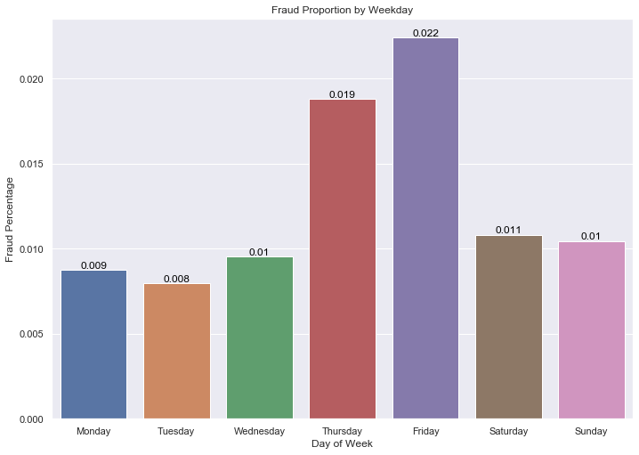
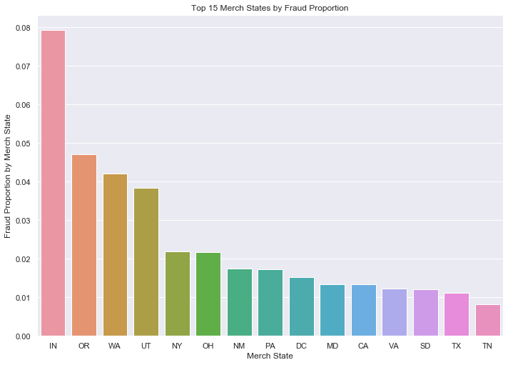

```python
import pandas as pd
import numpy as np 
import seaborn as sns
import matplotlib.pyplot as plt
import stats
from datetime import datetime

import warnings
warnings.filterwarnings('ignore')
sns.set(rc={'figure.figsize':(11.7,8.27)})
```


```python
def get_summary(dat):

    dtypes_dict = dat.dtypes.apply(lambda x: x.name).to_dict()

    numeric = [x for x in dtypes_dict.keys() if dtypes_dict[x] == 'float64' or dtypes_dict[x] == 'int64']
    chars = [x for x in dtypes_dict.keys() if dtypes_dict[x] == 'object']

    type_numeric = ['numeric'] * len(numeric)
    type_chars = ['char'] * len(chars)

    numeric_counts = dat.loc[:, numeric].count().to_dict()
    numeric_populated = list(numeric_counts.values())
    numeric_pct = [str((round(x / len(dat), 2)) * 100) + '%' for x in numeric_populated]
    numeric_zero = [sum(dat.loc[:, x] == 0) for x in numeric]

    numeric_s = pd.DataFrame(list(zip(numeric, numeric_populated, numeric_pct, numeric_zero)),
                             columns=['Name', 'Non_NA_Values', 'Pct_Non_NA', 'Num_Zeros'])

    numeric_cols_df = pd.concat([numeric_s,
                                 dat.describe().transpose().reset_index().drop(['count', 'index'], axis=1)],
                                axis=1)

    char_counts = dat.loc[:, chars].count().to_dict()
    char_populated = list(char_counts.values())
    char_pct = [str((round(x / len(dat), 3)) * 100) + '%' for x in char_populated]
    char_zero = [sum(dat.loc[:, x] == 0) for x in chars]

    chars_unique = [len(dat.loc[:, x].unique()) for x in chars]
    chars_val_max = [dat.loc[:, x].value_counts().idxmax() for x in chars]

    chars_df = pd.DataFrame(
        list(zip(chars, char_populated, char_pct, char_zero, chars_unique, chars_val_max)),
        columns=['Name', 'Non_NA_Values', 'Pct_Non_NA', 'Num_Zeros', 'Unique', 'Most_Common'])

    which = input('Would you like a table of numeric or char columns? (N/C)')
    if which == 'N':
        return numeric_cols_df
    elif which == 'C':
        return chars_df
```


```python
dat = pd.read_excel('../data/card transactions.xlsx')
```


```python
dat
```


<div>
<style scoped>
    .dataframe tbody tr th:only-of-type {
        vertical-align: middle;
    }

    .dataframe tbody tr th {
        vertical-align: top;
    }

    .dataframe thead th {
        text-align: right;
    }
</style>
<table border="1" class="dataframe">
  <thead>
    <tr style="text-align: right;">
      <th></th>
      <th>Recnum</th>
      <th>Cardnum</th>
      <th>Date</th>
      <th>Merchnum</th>
      <th>Merch description</th>
      <th>Merch state</th>
      <th>Merch zip</th>
      <th>Transtype</th>
      <th>Amount</th>
      <th>Fraud</th>
    </tr>
  </thead>
  <tbody>
    <tr>
      <th>0</th>
      <td>1</td>
      <td>5142190439</td>
      <td>2010-01-01</td>
      <td>5509006296254</td>
      <td>FEDEX SHP 12/23/09 AB#</td>
      <td>TN</td>
      <td>38118.0</td>
      <td>P</td>
      <td>3.62</td>
      <td>0</td>
    </tr>
    <tr>
      <th>1</th>
      <td>2</td>
      <td>5142183973</td>
      <td>2010-01-01</td>
      <td>61003026333</td>
      <td>SERVICE MERCHANDISE #81</td>
      <td>MA</td>
      <td>1803.0</td>
      <td>P</td>
      <td>31.42</td>
      <td>0</td>
    </tr>
    <tr>
      <th>2</th>
      <td>3</td>
      <td>5142131721</td>
      <td>2010-01-01</td>
      <td>4503082993600</td>
      <td>OFFICE DEPOT #191</td>
      <td>MD</td>
      <td>20706.0</td>
      <td>P</td>
      <td>178.49</td>
      <td>0</td>
    </tr>
    <tr>
      <th>3</th>
      <td>4</td>
      <td>5142148452</td>
      <td>2010-01-01</td>
      <td>5509006296254</td>
      <td>FEDEX SHP 12/28/09 AB#</td>
      <td>TN</td>
      <td>38118.0</td>
      <td>P</td>
      <td>3.62</td>
      <td>0</td>
    </tr>
    <tr>
      <th>4</th>
      <td>5</td>
      <td>5142190439</td>
      <td>2010-01-01</td>
      <td>5509006296254</td>
      <td>FEDEX SHP 12/23/09 AB#</td>
      <td>TN</td>
      <td>38118.0</td>
      <td>P</td>
      <td>3.62</td>
      <td>0</td>
    </tr>
    <tr>
      <th>...</th>
      <td>...</td>
      <td>...</td>
      <td>...</td>
      <td>...</td>
      <td>...</td>
      <td>...</td>
      <td>...</td>
      <td>...</td>
      <td>...</td>
      <td>...</td>
    </tr>
    <tr>
      <th>96748</th>
      <td>96749</td>
      <td>5142276053</td>
      <td>2010-12-31</td>
      <td>3500000006160</td>
      <td>BEST BUY      00001610</td>
      <td>KY</td>
      <td>41042.0</td>
      <td>P</td>
      <td>84.79</td>
      <td>0</td>
    </tr>
    <tr>
      <th>96749</th>
      <td>96750</td>
      <td>5142225701</td>
      <td>2010-12-31</td>
      <td>8090710030950</td>
      <td>MARKUS OFFICE SUPPLIES</td>
      <td>OH</td>
      <td>45248.0</td>
      <td>P</td>
      <td>118.75</td>
      <td>0</td>
    </tr>
    <tr>
      <th>96750</th>
      <td>96751</td>
      <td>5142226486</td>
      <td>2010-12-31</td>
      <td>4503057341100</td>
      <td>TECH PAC, INC</td>
      <td>OH</td>
      <td>45150.0</td>
      <td>P</td>
      <td>363.56</td>
      <td>0</td>
    </tr>
    <tr>
      <th>96751</th>
      <td>96752</td>
      <td>5142244619</td>
      <td>2010-12-31</td>
      <td>8834000695412</td>
      <td>BUY.COM</td>
      <td>CA</td>
      <td>92656.0</td>
      <td>P</td>
      <td>2202.03</td>
      <td>0</td>
    </tr>
    <tr>
      <th>96752</th>
      <td>96753</td>
      <td>5142243247</td>
      <td>2010-12-31</td>
      <td>9108347680006</td>
      <td>STAPLES NATIONAL #471</td>
      <td>NJ</td>
      <td>7606.0</td>
      <td>P</td>
      <td>554.64</td>
      <td>0</td>
    </tr>
  </tbody>
</table>
<p>96753 rows × 10 columns</p>
</div>


```python
get_summary(dat)
```

    Would you like a table of numeric or char columns? (N/C)N


<div>
<style scoped>
    .dataframe tbody tr th:only-of-type {
        vertical-align: middle;
    }

    .dataframe tbody tr th {
        vertical-align: top;
    }

    .dataframe thead th {
        text-align: right;
    }
</style>
<table border="1" class="dataframe">
  <thead>
    <tr style="text-align: right;">
      <th></th>
      <th>Name</th>
      <th>Non_NA_Values</th>
      <th>Pct_Non_NA</th>
      <th>Num_Zeros</th>
      <th>mean</th>
      <th>std</th>
      <th>min</th>
      <th>25%</th>
      <th>50%</th>
      <th>75%</th>
      <th>max</th>
    </tr>
  </thead>
  <tbody>
    <tr>
      <th>0</th>
      <td>Recnum</td>
      <td>96753</td>
      <td>100.0%</td>
      <td>0</td>
      <td>4.837700e+04</td>
      <td>27930.329635</td>
      <td>1.000000e+00</td>
      <td>2.418900e+04</td>
      <td>4.837700e+04</td>
      <td>7.256500e+04</td>
      <td>9.675300e+04</td>
    </tr>
    <tr>
      <th>1</th>
      <td>Cardnum</td>
      <td>96753</td>
      <td>100.0%</td>
      <td>0</td>
      <td>5.142202e+09</td>
      <td>55670.837531</td>
      <td>5.142110e+09</td>
      <td>5.142152e+09</td>
      <td>5.142196e+09</td>
      <td>5.142246e+09</td>
      <td>5.142847e+09</td>
    </tr>
    <tr>
      <th>2</th>
      <td>Merch zip</td>
      <td>92097</td>
      <td>95.0%</td>
      <td>0</td>
      <td>4.470660e+04</td>
      <td>28369.537945</td>
      <td>1.000000e+00</td>
      <td>2.085500e+04</td>
      <td>3.811800e+04</td>
      <td>6.310300e+04</td>
      <td>9.999900e+04</td>
    </tr>
    <tr>
      <th>3</th>
      <td>Amount</td>
      <td>96753</td>
      <td>100.0%</td>
      <td>0</td>
      <td>4.278857e+02</td>
      <td>10006.140302</td>
      <td>1.000000e-02</td>
      <td>3.348000e+01</td>
      <td>1.379800e+02</td>
      <td>4.282000e+02</td>
      <td>3.102046e+06</td>
    </tr>
    <tr>
      <th>4</th>
      <td>Fraud</td>
      <td>96753</td>
      <td>100.0%</td>
      <td>95694</td>
      <td>1.094540e-02</td>
      <td>0.104047</td>
      <td>0.000000e+00</td>
      <td>0.000000e+00</td>
      <td>0.000000e+00</td>
      <td>0.000000e+00</td>
      <td>1.000000e+00</td>
    </tr>
  </tbody>
</table>
</div>


```python
get_summary(dat)
```

    Would you like a table of numeric or char columns? (N/C)C


<div>
<style scoped>
    .dataframe tbody tr th:only-of-type {
        vertical-align: middle;
    }

    .dataframe tbody tr th {
        vertical-align: top;
    }

    .dataframe thead th {
        text-align: right;
    }
</style>
<table border="1" class="dataframe">
  <thead>
    <tr style="text-align: right;">
      <th></th>
      <th>Name</th>
      <th>Non_NA_Values</th>
      <th>Pct_Non_NA</th>
      <th>Num_Zeros</th>
      <th>Unique</th>
      <th>Most_Common</th>
    </tr>
  </thead>
  <tbody>
    <tr>
      <th>0</th>
      <td>Merchnum</td>
      <td>93378</td>
      <td>96.5%</td>
      <td>0</td>
      <td>13092</td>
      <td>930090121224</td>
    </tr>
    <tr>
      <th>1</th>
      <td>Merch description</td>
      <td>96753</td>
      <td>100.0%</td>
      <td>0</td>
      <td>13126</td>
      <td>GSA-FSS-ADV</td>
    </tr>
    <tr>
      <th>2</th>
      <td>Merch state</td>
      <td>95558</td>
      <td>98.8%</td>
      <td>0</td>
      <td>228</td>
      <td>TN</td>
    </tr>
    <tr>
      <th>3</th>
      <td>Transtype</td>
      <td>96753</td>
      <td>100.0%</td>
      <td>0</td>
      <td>4</td>
      <td>P</td>
    </tr>
  </tbody>
</table>
</div>


### Removing outliers

Single large transaction outlier and keep only P type transactions


```python
dat = dat[(dat['Amount']!=dat['Amount'].max()) & (dat['Transtype']=='P')]
```

### Filling in missing values 

#### Merchnum


```python
dat['Merchnum'].isna().sum()
```


    3198


```python
fill_merchnum = dat[dat['Merchnum'].isna()]
keep_merchnum = dat[dat['Merchnum'].notna()]
```


```python
merch_description_modes = dat.loc[:, ['Merch description', 'Merchnum']].groupby(['Merch description'])['Merchnum'].agg(pd.Series.mode)
```


```python
mdm_dict = merch_description_modes.to_dict()
```


```python
for idx, row in fill_merchnum.iterrows():
    if pd.isnull(fill_merchnum.loc[idx, 'Merchnum']):
        fill_value = mdm_dict[fill_merchnum.loc[idx, 'Merch description']]
        if isinstance(fill_value, (np.ndarray, np.generic)) and fill_value.size == 0:
            continue
        elif isinstance(fill_value, (np.ndarray, np.generic)) and fill_value.size > 1:
            fill_merchnum.loc[idx, 'Merchnum'] = fill_value.flat[0]
        else:
            fill_merchnum.loc[idx, 'Merchnum'] = fill_value
```


```python
zip_modes = dat.loc[:, ['Merch zip', 'Merchnum']].groupby(['Merch zip'])['Merchnum'].agg(pd.Series.mode)
```


```python
zip_dict = zip_modes.to_dict()
```


```python
for idx, row in fill_merchnum.iterrows():
    if pd.isnull(fill_merchnum.loc[idx, 'Merchnum']):
        if not pd.isnull(fill_merchnum.loc[idx, 'Merch zip']):
            fill_value = zip_dict[fill_merchnum.loc[idx, 'Merch zip']]
            if isinstance(fill_value, (np.ndarray, np.generic)) and fill_value.size == 0:
                continue
            elif isinstance(fill_value, (np.ndarray, np.generic)) and fill_value.size > 1:
                fill_merchnum.loc[idx, 'Merchnum'] = fill_value.flat[0]
            else:
                fill_merchnum.loc[idx, 'Merchnum'] = fill_value
        else:
            continue
```


```python
state_modes = dat.loc[:, ['Merch state', 'Merchnum']].groupby(['Merch state'])['Merchnum'].apply(lambda x: x.mode())
```


```python
state_dict = pd.DataFrame(state_modes).reset_index().drop('level_1', axis=1).set_index('Merch state').to_dict()['Merchnum']
```


```python
for idx, row in fill_merchnum.iterrows():
    if pd.isnull(fill_merchnum.loc[idx, 'Merchnum']):
        if not pd.isnull(fill_merchnum.loc[idx, 'Merch state']):
            if fill_merchnum.loc[idx, 'Merch state'] in state_dict:
                fill_value = state_dict[fill_merchnum.loc[idx, 'Merch state']]
                if isinstance(fill_value, (np.ndarray, np.generic)) and fill_value.size == 0:
                    continue
                elif isinstance(fill_value, (np.ndarray, np.generic)) and fill_value.size > 1:
                    fill_merchnum.loc[idx, 'Merchnum'] = fill_value.flat[0]
                else:
                    fill_merchnum.loc[idx, 'Merchnum'] = fill_value
        else:
            continue
```


```python
fill_merchnum['Merchnum'] = fill_merchnum['Merchnum'].fillna(fill_merchnum['Merchnum'].mode()[0])
```


```python
dat = pd.concat([fill_merchnum, keep_merchnum], ignore_index=True).sort_values('Recnum')
```

#### Merch state


```python
dat['Merch state'].isna().sum()
```


    1020


```python
fill_merchstate = dat[dat['Merch state'].isna()]
keep_merchstate = dat[dat['Merch state'].notna()]
```


```python
merch_zip_modes = dat.loc[:, ['Merch zip', 'Merch state']].groupby(['Merch zip'])['Merch state'].agg(pd.Series.mode)
```


```python
mzip_dict = merch_zip_modes.to_dict()
```


```python
for idx, row in fill_merchstate.iterrows():
    if pd.isnull(fill_merchstate.loc[idx, 'Merch state']):
        if not pd.isnull(fill_merchstate.loc[idx, 'Merch zip']):
            fill_value = mzip_dict[fill_merchstate.loc[idx, 'Merch zip']]
            if isinstance(fill_value, (np.ndarray, np.generic)) and fill_value.size == 0:
                continue
            elif isinstance(fill_value, (np.ndarray, np.generic)) and fill_value.size > 1:
                fill_merchstate.loc[idx, 'Merch state'] = fill_value.flat[0]
            else:
                fill_merchstate.loc[idx, 'Merch state'] = fill_value
```


```python
merchnum_modes = dat.loc[:, ['Merchnum', 'Merch state']].groupby(['Merchnum'])['Merch state'].agg(pd.Series.mode)
```


```python
merchnum_dict = merchnum_modes.to_dict()
```


```python
for idx, row in fill_merchstate.iterrows():
    if pd.isnull(fill_merchstate.loc[idx, 'Merch state']):
        if not pd.isnull(fill_merchstate.loc[idx, 'Merchnum']):
            fill_value = merchnum_dict[fill_merchstate.loc[idx, 'Merchnum']]
            if isinstance(fill_value, (np.ndarray, np.generic)) and fill_value.size == 0:
                continue
            elif isinstance(fill_value, (np.ndarray, np.generic)) and fill_value.size > 1:
                fill_merchstate.loc[idx, 'Merch state'] = fill_value.flat[0]
            else:
                fill_merchstate.loc[idx, 'Merch state'] = fill_value
```


```python
merch_desc_modes = dat.loc[:, ['Merch description', 'Merch state']].groupby(['Merch description'])['Merch state'].agg(pd.Series.mode)
```


```python
mdesc_dict = merch_desc_modes.to_dict()
```


```python
for idx, row in fill_merchstate.iterrows():
    if pd.isnull(fill_merchstate.loc[idx, 'Merch state']):
        if not pd.isnull(fill_merchstate.loc[idx, 'Merch description']):
            fill_value = mdesc_dict[fill_merchstate.loc[idx, 'Merch description']]
            if isinstance(fill_value, (np.ndarray, np.generic)) and fill_value.size == 0:
                continue
            elif isinstance(fill_value, (np.ndarray, np.generic)) and fill_value.size > 1:
                fill_merchstate.loc[idx, 'Merch state'] = fill_value.flat[0]
            else:
                fill_merchstate.loc[idx, 'Merch state'] = fill_value
```


```python
for idx, row in fill_merchstate.iterrows():
    if pd.isnull(fill_merchstate.loc[idx, 'Merch state']):
        fill_merchstate.loc[idx, 'Merch state'] = 'TN'
```


```python
dat = pd.concat([fill_merchstate, keep_merchstate], ignore_index=True).sort_values('Recnum')
```

#### Merch zip


```python
dat['Merch zip'].isna().sum()
```


    4300


```python
fill_merchzip = dat[dat['Merch zip'].isna()]
keep_merchzip = dat[dat['Merch zip'].notna()]
```


```python
merch_statenum_modes = dat.loc[:, ['Merch state', 'Merch description', 'Merch zip']].groupby(['Merch state', 'Merch description'])['Merch zip'].apply(lambda x: x.mode())
```


```python
msn_dict = merch_statenum_modes.to_dict()
```


```python
for idx, row in fill_merchzip.iterrows():
    if pd.isnull(fill_merchzip.loc[idx, 'Merch zip']):
        if (fill_merchzip.loc[idx, 'Merch state'], fill_merchzip.loc[idx, 'Merch description'], 0) in msn_dict:
            fill_value = msn_dict[(fill_merchzip.loc[idx, 'Merch state'], fill_merchzip.loc[idx, 'Merch description'], 0)]
            if isinstance(fill_value, (np.ndarray, np.generic)) and fill_value.size == 0:
                continue
            elif isinstance(fill_value, (np.ndarray, np.generic)) and fill_value.size > 1:
                fill_merchzip.loc[idx, 'Merch zip'] = fill_value.flat[0]
            else:
                fill_merchzip.loc[idx, 'Merch zip'] = fill_value
```


```python
merch_statenum_modes = dat.loc[:, ['Merch state', 'Merchnum', 'Merch zip']].groupby(['Merch state', 'Merchnum'])['Merch zip'].apply(lambda x: x.mode())
```


```python
msn_dict = merch_statenum_modes.to_dict()
```


```python
for idx, row in fill_merchzip.iterrows():
    if pd.isnull(fill_merchzip.loc[idx, 'Merch zip']):
        if (fill_merchzip.loc[idx, 'Merch state'], fill_merchzip.loc[idx, 'Merchnum'], 0) in msn_dict:
            fill_value = msn_dict[(fill_merchzip.loc[idx, 'Merch state'], fill_merchzip.loc[idx, 'Merchnum'], 0)]
            if isinstance(fill_value, (np.ndarray, np.generic)) and fill_value.size == 0:
                continue
            elif isinstance(fill_value, (np.ndarray, np.generic)) and fill_value.size > 1:
                fill_merchzip.loc[idx, 'Merch zip'] = fill_value.flat[0]
            else:
                fill_merchzip.loc[idx, 'Merch zip'] = fill_value
```


```python
for idx, row in fill_merchzip.iterrows():
    if pd.isnull(fill_merchzip.loc[idx, 'Merch zip']):
        fill_merchzip.loc[idx, 'Merch zip'] = '38118.0'
```


```python
dat = pd.concat([fill_merchzip, keep_merchzip], ignore_index=True).sort_values('Recnum')
```


```python
dat
```


<div>
<style scoped>
    .dataframe tbody tr th:only-of-type {
        vertical-align: middle;
    }

    .dataframe tbody tr th {
        vertical-align: top;
    }

    .dataframe thead th {
        text-align: right;
    }
</style>
<table border="1" class="dataframe">
  <thead>
    <tr style="text-align: right;">
      <th></th>
      <th>Recnum</th>
      <th>Cardnum</th>
      <th>Date</th>
      <th>Merchnum</th>
      <th>Merch description</th>
      <th>Merch state</th>
      <th>Merch zip</th>
      <th>Transtype</th>
      <th>Amount</th>
      <th>Fraud</th>
    </tr>
  </thead>
  <tbody>
    <tr>
      <th>4300</th>
      <td>1</td>
      <td>5142190439</td>
      <td>2010-01-01</td>
      <td>5509006296254</td>
      <td>FEDEX SHP 12/23/09 AB#</td>
      <td>TN</td>
      <td>38118</td>
      <td>P</td>
      <td>3.62</td>
      <td>0</td>
    </tr>
    <tr>
      <th>4301</th>
      <td>2</td>
      <td>5142183973</td>
      <td>2010-01-01</td>
      <td>61003026333</td>
      <td>SERVICE MERCHANDISE #81</td>
      <td>MA</td>
      <td>1803</td>
      <td>P</td>
      <td>31.42</td>
      <td>0</td>
    </tr>
    <tr>
      <th>4302</th>
      <td>3</td>
      <td>5142131721</td>
      <td>2010-01-01</td>
      <td>4503082993600</td>
      <td>OFFICE DEPOT #191</td>
      <td>MD</td>
      <td>20706</td>
      <td>P</td>
      <td>178.49</td>
      <td>0</td>
    </tr>
    <tr>
      <th>4303</th>
      <td>4</td>
      <td>5142148452</td>
      <td>2010-01-01</td>
      <td>5509006296254</td>
      <td>FEDEX SHP 12/28/09 AB#</td>
      <td>TN</td>
      <td>38118</td>
      <td>P</td>
      <td>3.62</td>
      <td>0</td>
    </tr>
    <tr>
      <th>4304</th>
      <td>5</td>
      <td>5142190439</td>
      <td>2010-01-01</td>
      <td>5509006296254</td>
      <td>FEDEX SHP 12/23/09 AB#</td>
      <td>TN</td>
      <td>38118</td>
      <td>P</td>
      <td>3.62</td>
      <td>0</td>
    </tr>
    <tr>
      <th>...</th>
      <td>...</td>
      <td>...</td>
      <td>...</td>
      <td>...</td>
      <td>...</td>
      <td>...</td>
      <td>...</td>
      <td>...</td>
      <td>...</td>
      <td>...</td>
    </tr>
    <tr>
      <th>96392</th>
      <td>96749</td>
      <td>5142276053</td>
      <td>2010-12-31</td>
      <td>3500000006160</td>
      <td>BEST BUY      00001610</td>
      <td>KY</td>
      <td>41042</td>
      <td>P</td>
      <td>84.79</td>
      <td>0</td>
    </tr>
    <tr>
      <th>96393</th>
      <td>96750</td>
      <td>5142225701</td>
      <td>2010-12-31</td>
      <td>8090710030950</td>
      <td>MARKUS OFFICE SUPPLIES</td>
      <td>OH</td>
      <td>45248</td>
      <td>P</td>
      <td>118.75</td>
      <td>0</td>
    </tr>
    <tr>
      <th>96394</th>
      <td>96751</td>
      <td>5142226486</td>
      <td>2010-12-31</td>
      <td>4503057341100</td>
      <td>TECH PAC, INC</td>
      <td>OH</td>
      <td>45150</td>
      <td>P</td>
      <td>363.56</td>
      <td>0</td>
    </tr>
    <tr>
      <th>96395</th>
      <td>96752</td>
      <td>5142244619</td>
      <td>2010-12-31</td>
      <td>8834000695412</td>
      <td>BUY.COM</td>
      <td>CA</td>
      <td>92656</td>
      <td>P</td>
      <td>2202.03</td>
      <td>0</td>
    </tr>
    <tr>
      <th>96396</th>
      <td>96753</td>
      <td>5142243247</td>
      <td>2010-12-31</td>
      <td>9108347680006</td>
      <td>STAPLES NATIONAL #471</td>
      <td>NJ</td>
      <td>7606</td>
      <td>P</td>
      <td>554.64</td>
      <td>0</td>
    </tr>
  </tbody>
</table>
<p>96397 rows × 10 columns</p>
</div>


```python
get_summary(dat)
```

    Would you like a table of numeric or char columns? (N/C)N


<div>
<style scoped>
    .dataframe tbody tr th:only-of-type {
        vertical-align: middle;
    }

    .dataframe tbody tr th {
        vertical-align: top;
    }

    .dataframe thead th {
        text-align: right;
    }
</style>
<table border="1" class="dataframe">
  <thead>
    <tr style="text-align: right;">
      <th></th>
      <th>Name</th>
      <th>Non_NA_Values</th>
      <th>Pct_Non_NA</th>
      <th>Num_Zeros</th>
      <th>mean</th>
      <th>std</th>
      <th>min</th>
      <th>25%</th>
      <th>50%</th>
      <th>75%</th>
      <th>max</th>
    </tr>
  </thead>
  <tbody>
    <tr>
      <th>0</th>
      <td>Recnum</td>
      <td>96397</td>
      <td>100.0%</td>
      <td>0</td>
      <td>4.836548e+04</td>
      <td>27945.003883</td>
      <td>1.000000e+00</td>
      <td>2.415400e+04</td>
      <td>4.836500e+04</td>
      <td>7.257800e+04</td>
      <td>9.675300e+04</td>
    </tr>
    <tr>
      <th>1</th>
      <td>Cardnum</td>
      <td>96397</td>
      <td>100.0%</td>
      <td>0</td>
      <td>5.142202e+09</td>
      <td>55658.254252</td>
      <td>5.142110e+09</td>
      <td>5.142152e+09</td>
      <td>5.142196e+09</td>
      <td>5.142245e+09</td>
      <td>5.142847e+09</td>
    </tr>
    <tr>
      <th>2</th>
      <td>Amount</td>
      <td>96397</td>
      <td>100.0%</td>
      <td>0</td>
      <td>3.958585e+02</td>
      <td>832.330197</td>
      <td>1.000000e-02</td>
      <td>3.346000e+01</td>
      <td>1.379800e+02</td>
      <td>4.282500e+02</td>
      <td>4.790000e+04</td>
    </tr>
    <tr>
      <th>3</th>
      <td>Fraud</td>
      <td>96397</td>
      <td>100.0%</td>
      <td>95338</td>
      <td>1.098582e-02</td>
      <td>0.104236</td>
      <td>0.000000e+00</td>
      <td>0.000000e+00</td>
      <td>0.000000e+00</td>
      <td>0.000000e+00</td>
      <td>1.000000e+00</td>
    </tr>
  </tbody>
</table>
</div>


```python
get_summary(dat)
```

    Would you like a table of numeric or char columns? (N/C)C


<div>
<style scoped>
    .dataframe tbody tr th:only-of-type {
        vertical-align: middle;
    }

    .dataframe tbody tr th {
        vertical-align: top;
    }

    .dataframe thead th {
        text-align: right;
    }
</style>
<table border="1" class="dataframe">
  <thead>
    <tr style="text-align: right;">
      <th></th>
      <th>Name</th>
      <th>Non_NA_Values</th>
      <th>Pct_Non_NA</th>
      <th>Num_Zeros</th>
      <th>Unique</th>
      <th>Most_Common</th>
    </tr>
  </thead>
  <tbody>
    <tr>
      <th>0</th>
      <td>Merchnum</td>
      <td>96397</td>
      <td>100.0%</td>
      <td>0</td>
      <td>13090</td>
      <td>930090121224</td>
    </tr>
    <tr>
      <th>1</th>
      <td>Merch description</td>
      <td>96397</td>
      <td>100.0%</td>
      <td>0</td>
      <td>12966</td>
      <td>GSA-FSS-ADV</td>
    </tr>
    <tr>
      <th>2</th>
      <td>Merch state</td>
      <td>96397</td>
      <td>100.0%</td>
      <td>0</td>
      <td>59</td>
      <td>TN</td>
    </tr>
    <tr>
      <th>3</th>
      <td>Merch zip</td>
      <td>96397</td>
      <td>100.0%</td>
      <td>0</td>
      <td>4568</td>
      <td>38118</td>
    </tr>
    <tr>
      <th>4</th>
      <td>Transtype</td>
      <td>96397</td>
      <td>100.0%</td>
      <td>0</td>
      <td>1</td>
      <td>P</td>
    </tr>
  </tbody>
</table>
</div>


```python
dat.to_csv('../data/card_transactions_nona.csv', index=False)
```


```python
dat = pd.read_csv('../data/card_transactions_nona.csv')
```

### Creating features

#### Frequency Variables


```python
for idx, row in dat.iterrows():
    for col in ['Cardnum', 'Merchnum', 'Cardnum_Merchnum', 'Cardnum_Merch zip', 'Cardnum_Merch state']:
        for time in [0, 1, 3, 7, 14, 30]:
            split = col.split('_')
            if len(split) == 1:
                split = split[0]
                if time == 1:
                    offset = pd.offsets.Day(time)
                s = pd.Series(pd.date_range(pd.Timestamp(dat.loc[idx, 'Date'])-pd.Timedelta(days=time), periods=time+1))
                filt = list(s.map(lambda x: x.strftime('%Y-%m-%d')))
                keep = dat[(dat['Date'].isin(filt))&(dat[col]==dat.loc[idx, col])]
                dat.loc[idx, 'avg_'+col+'_amount_over_'+str(time)+'days'] = round(keep['Amount'].mean(), 5)
                dat.loc[idx, 'max_'+col+'_amount_over_'+str(time)+'days'] = round(keep['Amount'].max(), 5)
                dat.loc[idx, 'median_'+col+'_amount_over_'+str(time)+'days'] = round(keep['Amount'].median(), 5)
                dat.loc[idx, 'total_'+col+'_amount_over_'+str(time)+'days'] = round(keep['Amount'].sum(), 5)

                dat.loc[idx, 'actual_norm_'+col+'_amount_over_'+str(time)+'days'] = round(dat.loc[idx, 'Amount']/keep['Amount'].mean(), 5)
                dat.loc[idx, 'actual_max_'+col+'_amount_over_'+str(time)+'days'] = round(dat.loc[idx, 'Amount']/keep['Amount'].max(), 5)
                dat.loc[idx, 'actual_median_'+col+'_amount_over_'+str(time)+'days'] = round(dat.loc[idx, 'Amount']/keep['Amount'].median(), 5)
                dat.loc[idx, 'actual_total_'+col+'_amount_over_'+str(time)+'days'] = round(dat.loc[idx, 'Amount']/keep['Amount'].sum(), 5)
                
            else:
                split1, split2 = split
                s = pd.Series(pd.date_range(pd.Timestamp(dat.loc[idx, 'Date'])-pd.offsets.Day(time), periods=time+1))
                filt = list(s.map(lambda x: x.strftime('%Y-%m-%d')))
                keep = dat[(dat['Date'].isin(filt))&(dat[split1]==dat.loc[idx, split1])&(dat[split2]==dat.loc[idx, split2])]
                dat.loc[idx, 'avg_'+col+'_amount_over_'+str(time)+'days'] = round(keep['Amount'].mean(), 5)
                dat.loc[idx, 'max_'+col+'_amount_over_'+str(time)+'days'] = round(keep['Amount'].max(), 5)
                dat.loc[idx, 'median_'+col+'_amount_over_'+str(time)+'days'] = round(keep['Amount'].median(), 5)
                dat.loc[idx, 'total_'+col+'_amount_over_'+str(time)+'days'] = round(keep['Amount'].sum(), 5)

                dat.loc[idx, 'actual_norm_'+col+'_amount_over_'+str(time)+'days'] = round(dat.loc[idx, 'Amount']/keep['Amount'].mean(), 5)
                dat.loc[idx, 'actual_max_'+col+'_amount_over_'+str(time)+'days'] = round(dat.loc[idx, 'Amount']/keep['Amount'].max(), 5)
                dat.loc[idx, 'actual_median_'+col+'_amount_over_'+str(time)+'days'] = round(dat.loc[idx, 'Amount']/keep['Amount'].median(), 5)
                dat.loc[idx, 'actual_total_'+col+'_amount_over_'+str(time)+'days'] = round(dat.loc[idx, 'Amount']/keep['Amount'].sum(), 5)
```


```python
for idx, row in dat.iterrows():
    for col in ['Cardnum', 'Merchnum', 'Cardnum_Merchnum', 'Cardnum_Merch zip', 'Cardnum_Merch state']:
        for time in [0, 1, 3, 7, 14, 30]:
                split = col.split('_')
                if len(split) == 1:
                    split = split[0]
                    s = pd.Series(pd.date_range(pd.Timestamp(dat.loc[idx, 'Date'])-pd.Timedelta(days=time), periods=time+1))
                    filt = list(s.map(lambda x: x.strftime('%Y-%m-%d')))
                    keep = dat[(dat['Date'].isin(filt))&(dat[col]==dat.loc[idx, col])]
                    dat.loc[idx, 'freq_by_'+col+'over_'+str(time)+'_days'] = len(keep)
                else:
                    split1, split2 = split
                    s = pd.Series(pd.date_range(pd.Timestamp(dat.loc[idx, 'Date'])-pd.Timedelta(days=time), periods=time+1))
                    filt = list(s.map(lambda x: x.strftime('%Y-%m-%d')))
                    keep = dat[(dat['Date'].isin(filt))&(dat[split1]==dat.loc[idx, split1])&(dat[split2]==dat.loc[idx, split2])]
                    dat.loc[idx, 'freq_by_'+col+'over_'+str(time)+'_days'] = len(keep)
```


```python
for idx, row in dat.iterrows():
    for col in ['Cardnum', 'Merchnum', 'Cardnum_Merchnum', 'Cardnum_Merch zip', 'Cardnum_Merch state']:
        split = col.split('_')
        if len(split) == 1:
            split = split[0]
            keep = dat[(dat[split]==dat.loc[idx, split])&(dat['Date']<dat.loc[idx, 'Date'])].sort_values('Date', ascending=False)
            if len(keep) == 0:
                dat.loc[idx, 'days_since_last_with_'+col] = 0
            else:
                dat.loc[idx, 'days_since_last_with_'+col] = (pd.Timestamp(dat.loc[idx, 'Date']) - pd.Timestamp(keep.iloc[0]['Date'])).days
        else:
            split1, split2 = split
            keep = dat[(dat[split1]==dat.loc[idx, split1])&(dat[split2]==dat.loc[idx, split2])&(dat['Date']<dat.loc[idx, 'Date'])].sort_values('Date', ascending=False)
            if len(keep) == 0:
                dat.loc[idx, 'days_since_last_with_'+col] = 0
            else:
                dat.loc[idx, 'days_since_last_with_'+col] = (pd.Timestamp(dat.loc[idx, 'Date']) - pd.Timestamp(keep.iloc[0]['Date'])).days
```


```python
for idx, row in dat.iterrows():
    for col in ['Cardnum', 'Merchnum']:
        for time_num in [0, 1]:
            for time_denom in [7, 14, 30]:
                s_num = pd.Series(pd.date_range(pd.Timestamp(dat.loc[idx, 'Date'])-pd.Timedelta(days=time_num), periods=time_num+1))
                filt_num = list(s_num.map(lambda x: x.strftime('%Y-%m-%d')))
                keep_num = dat[(dat['Date'].isin(filt_num))&(dat[col]==dat.loc[idx, col])]
                
                s_denom = pd.Series(pd.date_range(pd.Timestamp(dat.loc[idx, 'Date'])-pd.Timedelta(days=time_denom), periods=time_denom+1))
                filt_denom = list(s_denom.map(lambda x: x.strftime('%Y-%m-%d')))
                keep_denom = dat[(dat['Date'].isin(filt_denom))&(dat[col]==dat.loc[idx, col])]
                
                dat.loc[idx, 'trans_amount_with_'+col+'_over_'+str(time_num)+'_norm_by_'+str(time_denom)] = round(len(keep_num)/keep_denom.groupby('Date').count()['Recnum'].mean(), 5)
                dat.loc[idx, 'avg_trans_amount_with_'+col+'_over_'+str(time_num)+'_norm_by_'+str(time_denom)] = round(keep_num['Amount'].sum()/keep_denom.groupby('Date').mean()['Amount'][0], 5)
```


```python
for idx, row in dat.iterrows():
    for col in ['Cardnum', 'Merchnum', 'Cardnum_Merchnum', 'Cardnum_Merch zip', 'Cardnum_Merch state']:
        for time in [0, 1, 3, 7, 14, 30]:
            dat.loc[idx, 'trans_amount_minus_avg_'+col+str(time)] = round(dat.loc[idx, 'Amount']-dat.loc[idx, 'avg_'+col+'_amount_over_'+str(time)+'days'], 5)
            dat.loc[idx, 'trans_amount_minus_max_'+col+str(time)] = round(dat.loc[idx, 'Amount']-dat.loc[idx, 'max_'+col+'_amount_over_'+str(time)+'days'], 5)
            dat.loc[idx, 'trans_amount_minus_median_'+col+str(time)] = round(dat.loc[idx, 'Amount']-dat.loc[idx, 'median_'+col+'_amount_over_'+str(time)+'days'], 5)
```


```python
for idx, row in dat.iterrows():
    for col in ['Cardnum', 'Merchnum', 'Cardnum_Merchnum', 'Cardnum_Merch zip', 'Cardnum_Merch state']:
        split = col.split('_')
        if len(split)==1:
            split = split[0]
            keep = dat[(dat[split]==dat.loc[idx, split])&(dat['Date']<dat.loc[idx, 'Date'])].sort_values('Date', ascending=False)
            if len(keep)==0:
                dat.loc[idx, 'trans_amount_minus_last_with_'+col] = round(dat.loc[idx, 'Amount'], 5)
            else:
                dat.loc[idx, 'trans_amount_minus_last_with_'+col] = round(dat.loc[idx, 'Amount'] - keep.iloc[0]['Amount'], 5)
        else:
            split1, split2 = split
            keep = dat[(dat[split1]==dat.loc[idx, split1])&(dat[split2]==dat.loc[idx, split2])&(dat['Date']<dat.loc[idx, 'Date'])].sort_values('Date', ascending=False)
            if len(keep) == 0:
                dat.loc[idx, 'trans_amount_minus_last_with_'+col] = round(dat.loc[idx, 'Amount'], 5)
            else:
                dat.loc[idx, 'trans_amount_minus_last_with_'+col] = round(dat.loc[idx, 'Amount'] - keep.iloc[0]['Amount'], 5)
```


```python
dat.to_csv('../data/card_transactions_features.csv', index=False)
```

# Variable Creation Above

######################################################################################


```python
dat = pd.read_csv('../data/card_transactions_features.csv')
```


```python
dat
```


<div>
<style scoped>
    .dataframe tbody tr th:only-of-type {
        vertical-align: middle;
    }

    .dataframe tbody tr th {
        vertical-align: top;
    }

    .dataframe thead th {
        text-align: right;
    }
</style>
<table border="1" class="dataframe">
  <thead>
    <tr style="text-align: right;">
      <th></th>
      <th>Recnum</th>
      <th>Cardnum</th>
      <th>Date</th>
      <th>Merchnum</th>
      <th>Merch description</th>
      <th>Merch state</th>
      <th>Merch zip</th>
      <th>Transtype</th>
      <th>Amount</th>
      <th>Fraud</th>
      <th>...</th>
      <th>trans_amount_minus_median_Cardnum_Merch state3</th>
      <th>trans_amount_minus_avg_Cardnum_Merch state7</th>
      <th>trans_amount_minus_max_Cardnum_Merch state7</th>
      <th>trans_amount_minus_median_Cardnum_Merch state7</th>
      <th>trans_amount_minus_avg_Cardnum_Merch state14</th>
      <th>trans_amount_minus_max_Cardnum_Merch state14</th>
      <th>trans_amount_minus_median_Cardnum_Merch state14</th>
      <th>trans_amount_minus_avg_Cardnum_Merch state30</th>
      <th>trans_amount_minus_max_Cardnum_Merch state30</th>
      <th>trans_amount_minus_median_Cardnum_Merch state30</th>
    </tr>
  </thead>
  <tbody>
    <tr>
      <th>0</th>
      <td>1</td>
      <td>5142190439</td>
      <td>2010-01-01</td>
      <td>5509006296254</td>
      <td>FEDEX SHP 12/23/09 AB#</td>
      <td>TN</td>
      <td>38118.0</td>
      <td>P</td>
      <td>3.62</td>
      <td>0</td>
      <td>...</td>
      <td>0.000</td>
      <td>-0.00455</td>
      <td>-0.05</td>
      <td>0.000</td>
      <td>-0.00455</td>
      <td>-0.05</td>
      <td>0.000</td>
      <td>-0.00455</td>
      <td>-0.05</td>
      <td>0.000</td>
    </tr>
    <tr>
      <th>1</th>
      <td>2</td>
      <td>5142183973</td>
      <td>2010-01-01</td>
      <td>61003026333</td>
      <td>SERVICE MERCHANDISE #81</td>
      <td>MA</td>
      <td>1803.0</td>
      <td>P</td>
      <td>31.42</td>
      <td>0</td>
      <td>...</td>
      <td>0.000</td>
      <td>0.00000</td>
      <td>0.00</td>
      <td>0.000</td>
      <td>0.00000</td>
      <td>0.00</td>
      <td>0.000</td>
      <td>0.00000</td>
      <td>0.00</td>
      <td>0.000</td>
    </tr>
    <tr>
      <th>2</th>
      <td>3</td>
      <td>5142131721</td>
      <td>2010-01-01</td>
      <td>4503082993600</td>
      <td>OFFICE DEPOT #191</td>
      <td>MD</td>
      <td>20706.0</td>
      <td>P</td>
      <td>178.49</td>
      <td>0</td>
      <td>...</td>
      <td>0.000</td>
      <td>0.00000</td>
      <td>0.00</td>
      <td>0.000</td>
      <td>0.00000</td>
      <td>0.00</td>
      <td>0.000</td>
      <td>0.00000</td>
      <td>0.00</td>
      <td>0.000</td>
    </tr>
    <tr>
      <th>3</th>
      <td>4</td>
      <td>5142148452</td>
      <td>2010-01-01</td>
      <td>5509006296254</td>
      <td>FEDEX SHP 12/28/09 AB#</td>
      <td>TN</td>
      <td>38118.0</td>
      <td>P</td>
      <td>3.62</td>
      <td>0</td>
      <td>...</td>
      <td>-0.120</td>
      <td>-0.11143</td>
      <td>-0.18</td>
      <td>-0.120</td>
      <td>-0.11143</td>
      <td>-0.18</td>
      <td>-0.120</td>
      <td>-0.11143</td>
      <td>-0.18</td>
      <td>-0.120</td>
    </tr>
    <tr>
      <th>4</th>
      <td>5</td>
      <td>5142190439</td>
      <td>2010-01-01</td>
      <td>5509006296254</td>
      <td>FEDEX SHP 12/23/09 AB#</td>
      <td>TN</td>
      <td>38118.0</td>
      <td>P</td>
      <td>3.62</td>
      <td>0</td>
      <td>...</td>
      <td>0.000</td>
      <td>-0.00455</td>
      <td>-0.05</td>
      <td>0.000</td>
      <td>-0.00455</td>
      <td>-0.05</td>
      <td>0.000</td>
      <td>-0.00455</td>
      <td>-0.05</td>
      <td>0.000</td>
    </tr>
    <tr>
      <th>...</th>
      <td>...</td>
      <td>...</td>
      <td>...</td>
      <td>...</td>
      <td>...</td>
      <td>...</td>
      <td>...</td>
      <td>...</td>
      <td>...</td>
      <td>...</td>
      <td>...</td>
      <td>...</td>
      <td>...</td>
      <td>...</td>
      <td>...</td>
      <td>...</td>
      <td>...</td>
      <td>...</td>
      <td>...</td>
      <td>...</td>
      <td>...</td>
    </tr>
    <tr>
      <th>96392</th>
      <td>96749</td>
      <td>5142276053</td>
      <td>2010-12-31</td>
      <td>3500000006160</td>
      <td>BEST BUY      00001610</td>
      <td>KY</td>
      <td>41042.0</td>
      <td>P</td>
      <td>84.79</td>
      <td>0</td>
      <td>...</td>
      <td>0.000</td>
      <td>0.00000</td>
      <td>0.00</td>
      <td>0.000</td>
      <td>0.00000</td>
      <td>0.00</td>
      <td>0.000</td>
      <td>0.00000</td>
      <td>0.00</td>
      <td>0.000</td>
    </tr>
    <tr>
      <th>96393</th>
      <td>96750</td>
      <td>5142225701</td>
      <td>2010-12-31</td>
      <td>8090710030950</td>
      <td>MARKUS OFFICE SUPPLIES</td>
      <td>OH</td>
      <td>45248.0</td>
      <td>P</td>
      <td>118.75</td>
      <td>0</td>
      <td>...</td>
      <td>-324.375</td>
      <td>-324.37500</td>
      <td>-648.75</td>
      <td>-324.375</td>
      <td>-599.02500</td>
      <td>-1266.25</td>
      <td>-564.925</td>
      <td>-599.02500</td>
      <td>-1266.25</td>
      <td>-564.925</td>
    </tr>
    <tr>
      <th>96394</th>
      <td>96751</td>
      <td>5142226486</td>
      <td>2010-12-31</td>
      <td>4503057341100</td>
      <td>TECH PAC, INC</td>
      <td>OH</td>
      <td>45150.0</td>
      <td>P</td>
      <td>363.56</td>
      <td>0</td>
      <td>...</td>
      <td>145.855</td>
      <td>145.85500</td>
      <td>0.00</td>
      <td>145.855</td>
      <td>145.85500</td>
      <td>0.00</td>
      <td>145.855</td>
      <td>145.85500</td>
      <td>0.00</td>
      <td>145.855</td>
    </tr>
    <tr>
      <th>96395</th>
      <td>96752</td>
      <td>5142244619</td>
      <td>2010-12-31</td>
      <td>8834000695412</td>
      <td>BUY.COM</td>
      <td>CA</td>
      <td>92656.0</td>
      <td>P</td>
      <td>2202.03</td>
      <td>0</td>
      <td>...</td>
      <td>0.000</td>
      <td>0.00000</td>
      <td>0.00</td>
      <td>0.000</td>
      <td>0.00000</td>
      <td>0.00</td>
      <td>0.000</td>
      <td>1286.82000</td>
      <td>0.00</td>
      <td>1718.780</td>
    </tr>
    <tr>
      <th>96396</th>
      <td>96753</td>
      <td>5142243247</td>
      <td>2010-12-31</td>
      <td>9108347680006</td>
      <td>STAPLES NATIONAL #471</td>
      <td>NJ</td>
      <td>7606.0</td>
      <td>P</td>
      <td>554.64</td>
      <td>0</td>
      <td>...</td>
      <td>232.140</td>
      <td>-411.44000</td>
      <td>-2587.88</td>
      <td>232.140</td>
      <td>-411.44000</td>
      <td>-2587.88</td>
      <td>232.140</td>
      <td>-642.60500</td>
      <td>-2587.88</td>
      <td>-355.805</td>
    </tr>
  </tbody>
</table>
<p>96397 rows × 399 columns</p>
</div>


```python
dat['Date'] = pd.to_datetime(dat['Date'])
dat['DOW'] = pd.to_datetime(dat['Date']).dt.day_name()
dat['OOT'] = np.where((dat['Date'].dt.month==11) | (dat['Date'].dt.month==12), 1, 0)
```


```python
not_oot = dat[dat['OOT']!=1]

c=4; nmid=20
num_instances_catvar = not_oot.groupby('DOW').size()
y_avg = not_oot['Fraud'].mean()
y_catvar = not_oot.groupby('DOW')['Fraud'].mean()
y_catvar_smooth = y_avg + (y_catvar - y_avg) / (1 + np.exp(-(num_instances_catvar - nmid) / c))
dat['DOW_risk'] = dat['DOW'].map(y_catvar_smooth)

plt_dow = dat.set_index('DOW')
DOW_order = ['Monday', 'Tuesday', 'Wednesday', 'Thursday', 'Friday', 'Saturday', 'Sunday']
plt_dow = plt_dow.loc[DOW_order].reset_index()
```


```python
c=4; nmid=20
num_instances_catvar = not_oot.groupby('Merch state').size()
y_catvar = not_oot.groupby('Merch state')['Fraud'].mean()
y_catvar_smooth = y_avg + (y_catvar - y_avg) / (1 + np.exp(-(num_instances_catvar - nmid) / c))
dat['state_risk'] = dat['Merch state'].map(y_catvar_smooth)

plt_state = dat.sort_values('state_risk', ascending=False)
```


```python
print(dat.groupby('DOW')['DOW_risk'].mean())

ax = sns.barplot(x='DOW', y='Fraud', data=plt_dow, ci=None)

for p in ax.patches:
    ax.text(p.get_x()+.4, p.get_height()+.0001, str(round(p.get_height(),3)), color='black', ha='center')
    
plt.xlabel('Day of Week')
plt.ylabel('Fraud Percentage')
plt.title('Fraud Proportion by Weekday')
plt.show()
```

    DOW
    Friday       0.025994
    Monday       0.008711
    Saturday     0.010095
    Sunday       0.009630
    Thursday     0.018626
    Tuesday      0.007127
    Wednesday    0.009788
    Name: DOW_risk, dtype: float64


    

    


```python
print(dat.groupby('Merch state')['state_risk'].mean())

sns.barplot(x='Merch state', y='Fraud', data=risk2.iloc[:15,])
plt.xlabel('Merch State')
plt.ylabel('Fraud Proportion by Merch State')
plt.title('Top 15 Merch States by Fraud Proportion')
plt.show()
```

    Merch state
    AB    1.029144e-02
    AK    3.608225e-16
    AL    6.872852e-03
    AR    3.911833e-04
    AZ    3.184713e-03
    BC    4.588361e-03
    CA    1.490538e-02
    CO    1.139601e-03
    CT    3.550296e-03
    DC    1.763224e-02
    DE    6.108886e-07
    FL    2.142475e-03
    GA    1.148369e-03
    HI    9.480677e-03
    IA    7.632783e-16
    ID    5.204170e-18
    IL    6.167401e-03
    IN    8.438819e-02
    KS    2.835539e-03
    KY    2.347418e-03
    LA    9.801188e-16
    MA    3.303965e-03
    MB    1.036479e-02
    MD    1.509223e-02
    ME    6.188718e-12
    MI    6.764374e-03
    MN    2.457002e-03
    MO    9.583134e-04
    MS    0.000000e+00
    MT    4.819778e-12
    NC    2.419634e-03
    ND    7.014063e-05
    NE    0.000000e+00
    NH    6.257822e-03
    NJ    2.345353e-03
    NM    1.851852e-02
    NS    1.033255e-02
    NV    3.200000e-03
    NY    2.393747e-02
    OH    2.457185e-02
    OK    2.832861e-03
    ON    6.522873e-13
    OR    2.463433e-02
    PA    1.811765e-02
    PQ    8.928409e-03
    QC    1.033255e-02
    RI    0.000000e+00
    SC    7.874016e-03
    SD    1.449275e-02
    TN    7.910697e-03
    TX    1.268882e-02
    US    1.039004e-02
    UT    4.409857e-02
    VA    1.340524e-02
    VT    1.118945e-08
    WA    2.051836e-02
    WI    1.193317e-03
    WV    1.700029e-16
    WY    2.818488e-03
    Name: state_risk, dtype: float64


    

    


```python
404-10
```


    394


```python
pd.set_option('display.max_rows', 500)
dat.iloc[:, 10:].describe().transpose()[['mean', 'std', 'min', 'max']]
```


<div>
<style scoped>
    .dataframe tbody tr th:only-of-type {
        vertical-align: middle;
    }

    .dataframe tbody tr th {
        vertical-align: top;
    }

    .dataframe thead th {
        text-align: right;
    }
</style>
<table border="1" class="dataframe">
  <thead>
    <tr style="text-align: right;">
      <th></th>
      <th>mean</th>
      <th>std</th>
      <th>min</th>
      <th>max</th>
    </tr>
  </thead>
  <tbody>
    <tr>
      <th>avg_Cardnum_amount_over_0days</th>
      <td>3.958585e+02</td>
      <td>703.748276</td>
      <td>0.14000</td>
      <td>28392.84000</td>
    </tr>
    <tr>
      <th>max_Cardnum_amount_over_0days</th>
      <td>5.867924e+02</td>
      <td>1195.495754</td>
      <td>0.14000</td>
      <td>47900.00000</td>
    </tr>
    <tr>
      <th>median_Cardnum_amount_over_0days</th>
      <td>3.707746e+02</td>
      <td>688.369746</td>
      <td>0.14000</td>
      <td>28392.84000</td>
    </tr>
    <tr>
      <th>total_Cardnum_amount_over_0days</th>
      <td>1.090261e+03</td>
      <td>5487.338798</td>
      <td>0.14000</td>
      <td>218301.83000</td>
    </tr>
    <tr>
      <th>actual_norm_Cardnum_amount_over_0days</th>
      <td>1.000000e+00</td>
      <td>0.603753</td>
      <td>0.00004</td>
      <td>31.79739</td>
    </tr>
    <tr>
      <th>actual_max_Cardnum_amount_over_0days</th>
      <td>7.872885e-01</td>
      <td>0.347369</td>
      <td>0.00001</td>
      <td>1.00000</td>
    </tr>
    <tr>
      <th>actual_median_Cardnum_amount_over_0days</th>
      <td>1.643675e+00</td>
      <td>11.609910</td>
      <td>0.00009</td>
      <td>805.84474</td>
    </tr>
    <tr>
      <th>actual_total_Cardnum_amount_over_0days</th>
      <td>6.421880e-01</td>
      <td>0.392928</td>
      <td>0.00001</td>
      <td>1.00000</td>
    </tr>
    <tr>
      <th>avg_Cardnum_amount_over_1days</th>
      <td>3.967789e+02</td>
      <td>667.952147</td>
      <td>0.14000</td>
      <td>28392.84000</td>
    </tr>
    <tr>
      <th>max_Cardnum_amount_over_1days</th>
      <td>6.836955e+02</td>
      <td>1321.230238</td>
      <td>0.14000</td>
      <td>47900.00000</td>
    </tr>
    <tr>
      <th>median_Cardnum_amount_over_1days</th>
      <td>3.545763e+02</td>
      <td>648.989410</td>
      <td>0.14000</td>
      <td>28392.84000</td>
    </tr>
    <tr>
      <th>total_Cardnum_amount_over_1days</th>
      <td>1.458661e+03</td>
      <td>7751.748791</td>
      <td>0.14000</td>
      <td>307468.06000</td>
    </tr>
    <tr>
      <th>actual_norm_Cardnum_amount_over_1days</th>
      <td>9.960651e-01</td>
      <td>0.729301</td>
      <td>0.00006</td>
      <td>31.79739</td>
    </tr>
    <tr>
      <th>actual_max_Cardnum_amount_over_1days</th>
      <td>7.091634e-01</td>
      <td>0.383828</td>
      <td>0.00001</td>
      <td>1.00000</td>
    </tr>
    <tr>
      <th>actual_median_Cardnum_amount_over_1days</th>
      <td>1.999191e+00</td>
      <td>14.114045</td>
      <td>0.00009</td>
      <td>668.44920</td>
    </tr>
    <tr>
      <th>actual_total_Cardnum_amount_over_1days</th>
      <td>5.453165e-01</td>
      <td>0.400265</td>
      <td>0.00001</td>
      <td>1.00000</td>
    </tr>
    <tr>
      <th>avg_Cardnum_amount_over_3days</th>
      <td>3.962899e+02</td>
      <td>626.134586</td>
      <td>0.14000</td>
      <td>28392.84000</td>
    </tr>
    <tr>
      <th>max_Cardnum_amount_over_3days</th>
      <td>8.002744e+02</td>
      <td>1451.569116</td>
      <td>0.14000</td>
      <td>47900.00000</td>
    </tr>
    <tr>
      <th>median_Cardnum_amount_over_3days</th>
      <td>3.330928e+02</td>
      <td>582.724076</td>
      <td>0.14000</td>
      <td>28392.84000</td>
    </tr>
    <tr>
      <th>total_Cardnum_amount_over_3days</th>
      <td>1.861549e+03</td>
      <td>8121.854277</td>
      <td>0.14000</td>
      <td>310843.06000</td>
    </tr>
    <tr>
      <th>actual_norm_Cardnum_amount_over_3days</th>
      <td>9.988915e-01</td>
      <td>0.888284</td>
      <td>0.00006</td>
      <td>38.00260</td>
    </tr>
    <tr>
      <th>actual_max_Cardnum_amount_over_3days</th>
      <td>6.290413e-01</td>
      <td>0.404778</td>
      <td>0.00001</td>
      <td>1.00000</td>
    </tr>
    <tr>
      <th>actual_median_Cardnum_amount_over_3days</th>
      <td>2.396729e+00</td>
      <td>16.808936</td>
      <td>0.00011</td>
      <td>1570.85561</td>
    </tr>
    <tr>
      <th>actual_total_Cardnum_amount_over_3days</th>
      <td>4.517474e-01</td>
      <td>0.391546</td>
      <td>0.00001</td>
      <td>1.00000</td>
    </tr>
    <tr>
      <th>avg_Cardnum_amount_over_7days</th>
      <td>3.965903e+02</td>
      <td>563.082841</td>
      <td>0.14000</td>
      <td>25500.00000</td>
    </tr>
    <tr>
      <th>max_Cardnum_amount_over_7days</th>
      <td>1.003374e+03</td>
      <td>1661.728426</td>
      <td>0.14000</td>
      <td>47900.00000</td>
    </tr>
    <tr>
      <th>median_Cardnum_amount_over_7days</th>
      <td>3.014161e+02</td>
      <td>498.325580</td>
      <td>0.14000</td>
      <td>25500.00000</td>
    </tr>
    <tr>
      <th>total_Cardnum_amount_over_7days</th>
      <td>2.732652e+03</td>
      <td>8990.783898</td>
      <td>0.14000</td>
      <td>312616.06000</td>
    </tr>
    <tr>
      <th>actual_norm_Cardnum_amount_over_7days</th>
      <td>9.913755e-01</td>
      <td>1.084579</td>
      <td>0.00006</td>
      <td>59.86750</td>
    </tr>
    <tr>
      <th>actual_max_Cardnum_amount_over_7days</th>
      <td>5.132557e-01</td>
      <td>0.409769</td>
      <td>0.00001</td>
      <td>1.00000</td>
    </tr>
    <tr>
      <th>actual_median_Cardnum_amount_over_7days</th>
      <td>2.999610e+00</td>
      <td>27.049739</td>
      <td>0.00008</td>
      <td>5747.53846</td>
    </tr>
    <tr>
      <th>actual_total_Cardnum_amount_over_7days</th>
      <td>3.243829e-01</td>
      <td>0.352373</td>
      <td>0.00001</td>
      <td>1.00000</td>
    </tr>
    <tr>
      <th>avg_Cardnum_amount_over_14days</th>
      <td>3.961268e+02</td>
      <td>527.805554</td>
      <td>0.14000</td>
      <td>25500.00000</td>
    </tr>
    <tr>
      <th>max_Cardnum_amount_over_14days</th>
      <td>1.219866e+03</td>
      <td>1871.192420</td>
      <td>0.14000</td>
      <td>47900.00000</td>
    </tr>
    <tr>
      <th>median_Cardnum_amount_over_14days</th>
      <td>2.756706e+02</td>
      <td>457.578503</td>
      <td>0.14000</td>
      <td>25500.00000</td>
    </tr>
    <tr>
      <th>total_Cardnum_amount_over_14days</th>
      <td>4.116799e+03</td>
      <td>10975.342067</td>
      <td>0.14000</td>
      <td>313995.06000</td>
    </tr>
    <tr>
      <th>actual_norm_Cardnum_amount_over_14days</th>
      <td>9.945246e-01</td>
      <td>1.269670</td>
      <td>0.00006</td>
      <td>77.75579</td>
    </tr>
    <tr>
      <th>actual_max_Cardnum_amount_over_14days</th>
      <td>4.237750e-01</td>
      <td>0.395465</td>
      <td>0.00001</td>
      <td>1.00000</td>
    </tr>
    <tr>
      <th>actual_median_Cardnum_amount_over_14days</th>
      <td>3.434959e+00</td>
      <td>28.941688</td>
      <td>0.00008</td>
      <td>6145.63636</td>
    </tr>
    <tr>
      <th>actual_total_Cardnum_amount_over_14days</th>
      <td>2.321839e-01</td>
      <td>0.303345</td>
      <td>0.00001</td>
      <td>1.00000</td>
    </tr>
    <tr>
      <th>avg_Cardnum_amount_over_30days</th>
      <td>3.960473e+02</td>
      <td>486.539744</td>
      <td>0.17000</td>
      <td>25500.00000</td>
    </tr>
    <tr>
      <th>max_Cardnum_amount_over_30days</th>
      <td>1.503041e+03</td>
      <td>2105.797795</td>
      <td>0.17000</td>
      <td>47900.00000</td>
    </tr>
    <tr>
      <th>median_Cardnum_amount_over_30days</th>
      <td>2.500866e+02</td>
      <td>406.856784</td>
      <td>0.17000</td>
      <td>25500.00000</td>
    </tr>
    <tr>
      <th>total_Cardnum_amount_over_30days</th>
      <td>7.024270e+03</td>
      <td>15765.864503</td>
      <td>0.17000</td>
      <td>353997.29000</td>
    </tr>
    <tr>
      <th>actual_norm_Cardnum_amount_over_30days</th>
      <td>1.000714e+00</td>
      <td>1.595568</td>
      <td>0.00005</td>
      <td>137.98697</td>
    </tr>
    <tr>
      <th>actual_max_Cardnum_amount_over_30days</th>
      <td>3.362143e-01</td>
      <td>0.364568</td>
      <td>0.00001</td>
      <td>1.00000</td>
    </tr>
    <tr>
      <th>actual_median_Cardnum_amount_over_30days</th>
      <td>3.907619e+00</td>
      <td>32.452427</td>
      <td>0.00008</td>
      <td>6288.55814</td>
    </tr>
    <tr>
      <th>actual_total_Cardnum_amount_over_30days</th>
      <td>1.492044e-01</td>
      <td>0.240122</td>
      <td>0.00001</td>
      <td>1.00000</td>
    </tr>
    <tr>
      <th>avg_Merchnum_amount_over_0days</th>
      <td>3.958585e+02</td>
      <td>739.910654</td>
      <td>0.17000</td>
      <td>28392.84000</td>
    </tr>
    <tr>
      <th>max_Merchnum_amount_over_0days</th>
      <td>5.910400e+02</td>
      <td>1189.430074</td>
      <td>0.17000</td>
      <td>47900.00000</td>
    </tr>
    <tr>
      <th>median_Merchnum_amount_over_0days</th>
      <td>3.698331e+02</td>
      <td>724.796333</td>
      <td>0.17000</td>
      <td>28392.84000</td>
    </tr>
    <tr>
      <th>total_Merchnum_amount_over_0days</th>
      <td>1.201251e+03</td>
      <td>4518.683483</td>
      <td>0.17000</td>
      <td>217467.18000</td>
    </tr>
    <tr>
      <th>actual_norm_Merchnum_amount_over_0days</th>
      <td>1.000000e+00</td>
      <td>0.788760</td>
      <td>0.00009</td>
      <td>46.15109</td>
    </tr>
    <tr>
      <th>actual_max_Merchnum_amount_over_0days</th>
      <td>7.320606e-01</td>
      <td>0.386099</td>
      <td>0.00004</td>
      <td>1.00000</td>
    </tr>
    <tr>
      <th>actual_median_Merchnum_amount_over_0days</th>
      <td>1.366947e+00</td>
      <td>4.037049</td>
      <td>0.00009</td>
      <td>405.44959</td>
    </tr>
    <tr>
      <th>actual_total_Merchnum_amount_over_0days</th>
      <td>6.126435e-01</td>
      <td>0.422294</td>
      <td>0.00004</td>
      <td>1.00000</td>
    </tr>
    <tr>
      <th>avg_Merchnum_amount_over_1days</th>
      <td>3.975190e+02</td>
      <td>733.451886</td>
      <td>0.17000</td>
      <td>28392.84000</td>
    </tr>
    <tr>
      <th>max_Merchnum_amount_over_1days</th>
      <td>6.635759e+02</td>
      <td>1331.132540</td>
      <td>0.17000</td>
      <td>47900.00000</td>
    </tr>
    <tr>
      <th>median_Merchnum_amount_over_1days</th>
      <td>3.632175e+02</td>
      <td>719.105779</td>
      <td>0.17000</td>
      <td>28392.84000</td>
    </tr>
    <tr>
      <th>total_Merchnum_amount_over_1days</th>
      <td>1.578740e+03</td>
      <td>6152.203614</td>
      <td>0.17000</td>
      <td>306633.41000</td>
    </tr>
    <tr>
      <th>actual_norm_Merchnum_amount_over_1days</th>
      <td>9.968745e-01</td>
      <td>0.868381</td>
      <td>0.00009</td>
      <td>48.71015</td>
    </tr>
    <tr>
      <th>actual_max_Merchnum_amount_over_1days</th>
      <td>6.897997e-01</td>
      <td>0.403225</td>
      <td>0.00004</td>
      <td>1.00000</td>
    </tr>
    <tr>
      <th>actual_median_Merchnum_amount_over_1days</th>
      <td>1.430456e+00</td>
      <td>4.145595</td>
      <td>0.00009</td>
      <td>405.44959</td>
    </tr>
    <tr>
      <th>actual_total_Merchnum_amount_over_1days</th>
      <td>5.624693e-01</td>
      <td>0.429031</td>
      <td>0.00004</td>
      <td>1.00000</td>
    </tr>
    <tr>
      <th>avg_Merchnum_amount_over_3days</th>
      <td>3.974715e+02</td>
      <td>715.780708</td>
      <td>0.17000</td>
      <td>28392.84000</td>
    </tr>
    <tr>
      <th>max_Merchnum_amount_over_3days</th>
      <td>7.429018e+02</td>
      <td>1402.369618</td>
      <td>0.17000</td>
      <td>47900.00000</td>
    </tr>
    <tr>
      <th>median_Merchnum_amount_over_3days</th>
      <td>3.555320e+02</td>
      <td>700.038649</td>
      <td>0.17000</td>
      <td>28392.84000</td>
    </tr>
    <tr>
      <th>total_Merchnum_amount_over_3days</th>
      <td>2.080128e+03</td>
      <td>6863.844597</td>
      <td>0.17000</td>
      <td>307302.58000</td>
    </tr>
    <tr>
      <th>actual_norm_Merchnum_amount_over_3days</th>
      <td>9.962599e-01</td>
      <td>0.979973</td>
      <td>0.00009</td>
      <td>66.85690</td>
    </tr>
    <tr>
      <th>actual_max_Merchnum_amount_over_3days</th>
      <td>6.511819e-01</td>
      <td>0.415324</td>
      <td>0.00004</td>
      <td>1.00000</td>
    </tr>
    <tr>
      <th>actual_median_Merchnum_amount_over_3days</th>
      <td>1.498960e+00</td>
      <td>4.676107</td>
      <td>0.00009</td>
      <td>467.82857</td>
    </tr>
    <tr>
      <th>actual_total_Merchnum_amount_over_3days</th>
      <td>5.173068e-01</td>
      <td>0.431743</td>
      <td>0.00002</td>
      <td>1.00000</td>
    </tr>
    <tr>
      <th>avg_Merchnum_amount_over_7days</th>
      <td>3.967992e+02</td>
      <td>682.353349</td>
      <td>0.17000</td>
      <td>28392.84000</td>
    </tr>
    <tr>
      <th>max_Merchnum_amount_over_7days</th>
      <td>8.958735e+02</td>
      <td>1667.744928</td>
      <td>0.17000</td>
      <td>47900.00000</td>
    </tr>
    <tr>
      <th>median_Merchnum_amount_over_7days</th>
      <td>3.423953e+02</td>
      <td>666.054676</td>
      <td>0.17000</td>
      <td>28392.84000</td>
    </tr>
    <tr>
      <th>total_Merchnum_amount_over_7days</th>
      <td>3.228731e+03</td>
      <td>8053.754145</td>
      <td>0.17000</td>
      <td>313984.55000</td>
    </tr>
    <tr>
      <th>actual_norm_Merchnum_amount_over_7days</th>
      <td>9.935109e-01</td>
      <td>1.125467</td>
      <td>0.00010</td>
      <td>92.76552</td>
    </tr>
    <tr>
      <th>actual_max_Merchnum_amount_over_7days</th>
      <td>5.915519e-01</td>
      <td>0.426092</td>
      <td>0.00004</td>
      <td>1.00000</td>
    </tr>
    <tr>
      <th>actual_median_Merchnum_amount_over_7days</th>
      <td>1.557774e+00</td>
      <td>4.485502</td>
      <td>0.00007</td>
      <td>473.98421</td>
    </tr>
    <tr>
      <th>actual_total_Merchnum_amount_over_7days</th>
      <td>4.458291e-01</td>
      <td>0.427051</td>
      <td>0.00002</td>
      <td>1.00000</td>
    </tr>
    <tr>
      <th>avg_Merchnum_amount_over_14days</th>
      <td>3.981671e+02</td>
      <td>653.240759</td>
      <td>0.17000</td>
      <td>27218.00000</td>
    </tr>
    <tr>
      <th>max_Merchnum_amount_over_14days</th>
      <td>1.086920e+03</td>
      <td>2204.079398</td>
      <td>0.17000</td>
      <td>47900.00000</td>
    </tr>
    <tr>
      <th>median_Merchnum_amount_over_14days</th>
      <td>3.324762e+02</td>
      <td>633.607233</td>
      <td>0.17000</td>
      <td>27218.00000</td>
    </tr>
    <tr>
      <th>total_Merchnum_amount_over_14days</th>
      <td>5.143243e+03</td>
      <td>10866.833340</td>
      <td>0.17000</td>
      <td>319334.68000</td>
    </tr>
    <tr>
      <th>actual_norm_Merchnum_amount_over_14days</th>
      <td>9.921143e-01</td>
      <td>1.279752</td>
      <td>0.00010</td>
      <td>137.13136</td>
    </tr>
    <tr>
      <th>actual_max_Merchnum_amount_over_14days</th>
      <td>5.410310e-01</td>
      <td>0.428625</td>
      <td>0.00002</td>
      <td>1.00000</td>
    </tr>
    <tr>
      <th>actual_median_Merchnum_amount_over_14days</th>
      <td>1.623453e+00</td>
      <td>5.003119</td>
      <td>0.00007</td>
      <td>518.07025</td>
    </tr>
    <tr>
      <th>actual_total_Merchnum_amount_over_14days</th>
      <td>3.867423e-01</td>
      <td>0.415904</td>
      <td>0.00001</td>
      <td>1.00000</td>
    </tr>
    <tr>
      <th>avg_Merchnum_amount_over_30days</th>
      <td>3.972306e+02</td>
      <td>610.678408</td>
      <td>0.17000</td>
      <td>27218.00000</td>
    </tr>
    <tr>
      <th>max_Merchnum_amount_over_30days</th>
      <td>1.362295e+03</td>
      <td>2819.536275</td>
      <td>0.17000</td>
      <td>47900.00000</td>
    </tr>
    <tr>
      <th>median_Merchnum_amount_over_30days</th>
      <td>3.200037e+02</td>
      <td>578.861010</td>
      <td>0.17000</td>
      <td>27218.00000</td>
    </tr>
    <tr>
      <th>total_Merchnum_amount_over_30days</th>
      <td>9.162726e+03</td>
      <td>17075.609983</td>
      <td>0.17000</td>
      <td>320373.00000</td>
    </tr>
    <tr>
      <th>actual_norm_Merchnum_amount_over_30days</th>
      <td>9.943206e-01</td>
      <td>1.459077</td>
      <td>0.00006</td>
      <td>173.53843</td>
    </tr>
    <tr>
      <th>actual_max_Merchnum_amount_over_30days</th>
      <td>4.855734e-01</td>
      <td>0.424732</td>
      <td>0.00002</td>
      <td>1.00000</td>
    </tr>
    <tr>
      <th>actual_median_Merchnum_amount_over_30days</th>
      <td>1.686345e+00</td>
      <td>4.823150</td>
      <td>0.00007</td>
      <td>481.58824</td>
    </tr>
    <tr>
      <th>actual_total_Merchnum_amount_over_30days</th>
      <td>3.235059e-01</td>
      <td>0.396570</td>
      <td>0.00001</td>
      <td>1.00000</td>
    </tr>
    <tr>
      <th>avg_Cardnum_Merchnum_amount_over_0days</th>
      <td>3.958585e+02</td>
      <td>795.697428</td>
      <td>0.01000</td>
      <td>28392.84000</td>
    </tr>
    <tr>
      <th>max_Cardnum_Merchnum_amount_over_0days</th>
      <td>4.393996e+02</td>
      <td>1009.850991</td>
      <td>0.01000</td>
      <td>47900.00000</td>
    </tr>
    <tr>
      <th>median_Cardnum_Merchnum_amount_over_0days</th>
      <td>3.923498e+02</td>
      <td>787.167447</td>
      <td>0.01000</td>
      <td>28392.84000</td>
    </tr>
    <tr>
      <th>total_Cardnum_Merchnum_amount_over_0days</th>
      <td>6.594478e+02</td>
      <td>4116.086006</td>
      <td>0.01000</td>
      <td>217467.18000</td>
    </tr>
    <tr>
      <th>actual_norm_Cardnum_Merchnum_amount_over_0days</th>
      <td>1.000000e+00</td>
      <td>0.273128</td>
      <td>0.00009</td>
      <td>20.34773</td>
    </tr>
    <tr>
      <th>actual_max_Cardnum_Merchnum_amount_over_0days</th>
      <td>9.304305e-01</td>
      <td>0.208439</td>
      <td>0.00004</td>
      <td>1.00000</td>
    </tr>
    <tr>
      <th>actual_median_Cardnum_Merchnum_amount_over_0days</th>
      <td>1.048754e+00</td>
      <td>1.078113</td>
      <td>0.00009</td>
      <td>133.32396</td>
    </tr>
    <tr>
      <th>actual_total_Cardnum_Merchnum_amount_over_0days</th>
      <td>8.311669e-01</td>
      <td>0.323701</td>
      <td>0.00004</td>
      <td>1.00000</td>
    </tr>
    <tr>
      <th>avg_Cardnum_Merchnum_amount_over_1days</th>
      <td>3.971342e+02</td>
      <td>797.703701</td>
      <td>0.01000</td>
      <td>28392.84000</td>
    </tr>
    <tr>
      <th>max_Cardnum_Merchnum_amount_over_1days</th>
      <td>4.487187e+02</td>
      <td>1057.350863</td>
      <td>0.01000</td>
      <td>47900.00000</td>
    </tr>
    <tr>
      <th>median_Cardnum_Merchnum_amount_over_1days</th>
      <td>3.934321e+02</td>
      <td>791.684825</td>
      <td>0.01000</td>
      <td>28392.84000</td>
    </tr>
    <tr>
      <th>total_Cardnum_Merchnum_amount_over_1days</th>
      <td>7.300101e+02</td>
      <td>5621.461625</td>
      <td>0.01000</td>
      <td>306633.41000</td>
    </tr>
    <tr>
      <th>actual_norm_Cardnum_Merchnum_amount_over_1days</th>
      <td>9.973092e-01</td>
      <td>0.297814</td>
      <td>0.00009</td>
      <td>20.34773</td>
    </tr>
    <tr>
      <th>actual_max_Cardnum_Merchnum_amount_over_1days</th>
      <td>9.169567e-01</td>
      <td>0.227003</td>
      <td>0.00004</td>
      <td>1.00000</td>
    </tr>
    <tr>
      <th>actual_median_Cardnum_Merchnum_amount_over_1days</th>
      <td>1.054301e+00</td>
      <td>1.043125</td>
      <td>0.00009</td>
      <td>100.00000</td>
    </tr>
    <tr>
      <th>actual_total_Cardnum_Merchnum_amount_over_1days</th>
      <td>8.109694e-01</td>
      <td>0.337211</td>
      <td>0.00004</td>
      <td>1.00000</td>
    </tr>
    <tr>
      <th>avg_Cardnum_Merchnum_amount_over_3days</th>
      <td>3.981221e+02</td>
      <td>795.733061</td>
      <td>0.01000</td>
      <td>28392.84000</td>
    </tr>
    <tr>
      <th>max_Cardnum_Merchnum_amount_over_3days</th>
      <td>4.571190e+02</td>
      <td>1061.218894</td>
      <td>0.01000</td>
      <td>47900.00000</td>
    </tr>
    <tr>
      <th>median_Cardnum_Merchnum_amount_over_3days</th>
      <td>3.937362e+02</td>
      <td>790.034455</td>
      <td>0.01000</td>
      <td>28392.84000</td>
    </tr>
    <tr>
      <th>total_Cardnum_Merchnum_amount_over_3days</th>
      <td>7.615958e+02</td>
      <td>5655.963848</td>
      <td>0.01000</td>
      <td>306633.41000</td>
    </tr>
    <tr>
      <th>actual_norm_Cardnum_Merchnum_amount_over_3days</th>
      <td>9.944337e-01</td>
      <td>0.328593</td>
      <td>0.00009</td>
      <td>20.34773</td>
    </tr>
    <tr>
      <th>actual_max_Cardnum_Merchnum_amount_over_3days</th>
      <td>8.994685e-01</td>
      <td>0.248537</td>
      <td>0.00004</td>
      <td>1.00000</td>
    </tr>
    <tr>
      <th>actual_median_Cardnum_Merchnum_amount_over_3days</th>
      <td>1.072560e+00</td>
      <td>1.684977</td>
      <td>0.00009</td>
      <td>301.10315</td>
    </tr>
    <tr>
      <th>actual_total_Cardnum_Merchnum_amount_over_3days</th>
      <td>7.867289e-01</td>
      <td>0.352736</td>
      <td>0.00004</td>
      <td>1.00000</td>
    </tr>
    <tr>
      <th>avg_Cardnum_Merchnum_amount_over_7days</th>
      <td>3.998399e+02</td>
      <td>791.533182</td>
      <td>0.01000</td>
      <td>28392.84000</td>
    </tr>
    <tr>
      <th>max_Cardnum_Merchnum_amount_over_7days</th>
      <td>4.738682e+02</td>
      <td>1068.585362</td>
      <td>0.01000</td>
      <td>47900.00000</td>
    </tr>
    <tr>
      <th>median_Cardnum_Merchnum_amount_over_7days</th>
      <td>3.937084e+02</td>
      <td>786.396136</td>
      <td>0.01000</td>
      <td>28392.84000</td>
    </tr>
    <tr>
      <th>total_Cardnum_Merchnum_amount_over_7days</th>
      <td>8.206429e+02</td>
      <td>5687.868085</td>
      <td>0.01000</td>
      <td>306633.41000</td>
    </tr>
    <tr>
      <th>actual_norm_Cardnum_Merchnum_amount_over_7days</th>
      <td>9.889805e-01</td>
      <td>0.383206</td>
      <td>0.00009</td>
      <td>20.34773</td>
    </tr>
    <tr>
      <th>actual_max_Cardnum_Merchnum_amount_over_7days</th>
      <td>8.691691e-01</td>
      <td>0.280357</td>
      <td>0.00004</td>
      <td>1.00000</td>
    </tr>
    <tr>
      <th>actual_median_Cardnum_Merchnum_amount_over_7days</th>
      <td>1.096842e+00</td>
      <td>2.297048</td>
      <td>0.00007</td>
      <td>442.86980</td>
    </tr>
    <tr>
      <th>actual_total_Cardnum_Merchnum_amount_over_7days</th>
      <td>7.458125e-01</td>
      <td>0.374140</td>
      <td>0.00003</td>
      <td>1.00000</td>
    </tr>
    <tr>
      <th>avg_Cardnum_Merchnum_amount_over_14days</th>
      <td>4.017880e+02</td>
      <td>788.779251</td>
      <td>0.01000</td>
      <td>28392.84000</td>
    </tr>
    <tr>
      <th>max_Cardnum_Merchnum_amount_over_14days</th>
      <td>4.943479e+02</td>
      <td>1088.091940</td>
      <td>0.01000</td>
      <td>47900.00000</td>
    </tr>
    <tr>
      <th>median_Cardnum_Merchnum_amount_over_14days</th>
      <td>3.935138e+02</td>
      <td>783.983816</td>
      <td>0.01000</td>
      <td>28392.84000</td>
    </tr>
    <tr>
      <th>total_Cardnum_Merchnum_amount_over_14days</th>
      <td>9.014523e+02</td>
      <td>5737.467902</td>
      <td>0.01000</td>
      <td>306633.41000</td>
    </tr>
    <tr>
      <th>actual_norm_Cardnum_Merchnum_amount_over_14days</th>
      <td>9.862313e-01</td>
      <td>0.443243</td>
      <td>0.00009</td>
      <td>23.11322</td>
    </tr>
    <tr>
      <th>actual_max_Cardnum_Merchnum_amount_over_14days</th>
      <td>8.389350e-01</td>
      <td>0.306079</td>
      <td>0.00004</td>
      <td>1.00000</td>
    </tr>
    <tr>
      <th>actual_median_Cardnum_Merchnum_amount_over_14days</th>
      <td>1.126046e+00</td>
      <td>2.377042</td>
      <td>0.00007</td>
      <td>400.00000</td>
    </tr>
    <tr>
      <th>actual_total_Cardnum_Merchnum_amount_over_14days</th>
      <td>7.048556e-01</td>
      <td>0.390617</td>
      <td>0.00003</td>
      <td>1.00000</td>
    </tr>
    <tr>
      <th>avg_Cardnum_Merchnum_amount_over_30days</th>
      <td>4.037810e+02</td>
      <td>784.022209</td>
      <td>0.01000</td>
      <td>28392.84000</td>
    </tr>
    <tr>
      <th>max_Cardnum_Merchnum_amount_over_30days</th>
      <td>5.255727e+02</td>
      <td>1106.894349</td>
      <td>0.01000</td>
      <td>47900.00000</td>
    </tr>
    <tr>
      <th>median_Cardnum_Merchnum_amount_over_30days</th>
      <td>3.920842e+02</td>
      <td>783.482634</td>
      <td>0.01000</td>
      <td>28392.84000</td>
    </tr>
    <tr>
      <th>total_Cardnum_Merchnum_amount_over_30days</th>
      <td>1.054947e+03</td>
      <td>5838.673200</td>
      <td>0.01000</td>
      <td>306633.41000</td>
    </tr>
    <tr>
      <th>actual_norm_Cardnum_Merchnum_amount_over_30days</th>
      <td>9.829058e-01</td>
      <td>0.519732</td>
      <td>0.00009</td>
      <td>25.02564</td>
    </tr>
    <tr>
      <th>actual_max_Cardnum_Merchnum_amount_over_30days</th>
      <td>7.976434e-01</td>
      <td>0.335064</td>
      <td>0.00004</td>
      <td>1.00000</td>
    </tr>
    <tr>
      <th>actual_median_Cardnum_Merchnum_amount_over_30days</th>
      <td>1.161798e+00</td>
      <td>2.346148</td>
      <td>0.00007</td>
      <td>397.86096</td>
    </tr>
    <tr>
      <th>actual_total_Cardnum_Merchnum_amount_over_30days</th>
      <td>6.504641e-01</td>
      <td>0.405687</td>
      <td>0.00002</td>
      <td>1.00000</td>
    </tr>
    <tr>
      <th>avg_Cardnum_Merch zip_amount_over_0days</th>
      <td>3.958585e+02</td>
      <td>793.875037</td>
      <td>0.01000</td>
      <td>28392.84000</td>
    </tr>
    <tr>
      <th>max_Cardnum_Merch zip_amount_over_0days</th>
      <td>4.425332e+02</td>
      <td>1013.076442</td>
      <td>0.01000</td>
      <td>47900.00000</td>
    </tr>
    <tr>
      <th>median_Cardnum_Merch zip_amount_over_0days</th>
      <td>3.919228e+02</td>
      <td>785.226876</td>
      <td>0.01000</td>
      <td>28392.84000</td>
    </tr>
    <tr>
      <th>total_Cardnum_Merch zip_amount_over_0days</th>
      <td>6.661197e+02</td>
      <td>4118.569884</td>
      <td>0.01000</td>
      <td>217467.18000</td>
    </tr>
    <tr>
      <th>actual_norm_Cardnum_Merch zip_amount_over_0days</th>
      <td>1.000000e+00</td>
      <td>0.289535</td>
      <td>0.00009</td>
      <td>20.34773</td>
    </tr>
    <tr>
      <th>actual_max_Cardnum_Merch zip_amount_over_0days</th>
      <td>9.227193e-01</td>
      <td>0.220050</td>
      <td>0.00004</td>
      <td>1.00000</td>
    </tr>
    <tr>
      <th>actual_median_Cardnum_Merch zip_amount_over_0days</th>
      <td>1.061738e+00</td>
      <td>1.502996</td>
      <td>0.00009</td>
      <td>231.59401</td>
    </tr>
    <tr>
      <th>actual_total_Cardnum_Merch zip_amount_over_0days</th>
      <td>8.212081e-01</td>
      <td>0.329648</td>
      <td>0.00004</td>
      <td>1.00000</td>
    </tr>
    <tr>
      <th>avg_Cardnum_Merch zip_amount_over_1days</th>
      <td>3.973026e+02</td>
      <td>795.781960</td>
      <td>0.01000</td>
      <td>28392.84000</td>
    </tr>
    <tr>
      <th>max_Cardnum_Merch zip_amount_over_1days</th>
      <td>4.531959e+02</td>
      <td>1061.275597</td>
      <td>0.01000</td>
      <td>47900.00000</td>
    </tr>
    <tr>
      <th>median_Cardnum_Merch zip_amount_over_1days</th>
      <td>3.930667e+02</td>
      <td>789.694573</td>
      <td>0.01000</td>
      <td>28392.84000</td>
    </tr>
    <tr>
      <th>total_Cardnum_Merch zip_amount_over_1days</th>
      <td>7.400341e+02</td>
      <td>5624.514053</td>
      <td>0.01000</td>
      <td>306633.41000</td>
    </tr>
    <tr>
      <th>actual_norm_Cardnum_Merch zip_amount_over_1days</th>
      <td>9.971126e-01</td>
      <td>0.324151</td>
      <td>0.00009</td>
      <td>20.27542</td>
    </tr>
    <tr>
      <th>actual_max_Cardnum_Merch zip_amount_over_1days</th>
      <td>9.064188e-01</td>
      <td>0.241203</td>
      <td>0.00004</td>
      <td>1.00000</td>
    </tr>
    <tr>
      <th>actual_median_Cardnum_Merch zip_amount_over_1days</th>
      <td>1.074002e+00</td>
      <td>1.685760</td>
      <td>0.00009</td>
      <td>231.59401</td>
    </tr>
    <tr>
      <th>actual_total_Cardnum_Merch zip_amount_over_1days</th>
      <td>7.977589e-01</td>
      <td>0.344379</td>
      <td>0.00004</td>
      <td>1.00000</td>
    </tr>
    <tr>
      <th>avg_Cardnum_Merch zip_amount_over_3days</th>
      <td>3.982939e+02</td>
      <td>792.924105</td>
      <td>0.01000</td>
      <td>28392.84000</td>
    </tr>
    <tr>
      <th>max_Cardnum_Merch zip_amount_over_3days</th>
      <td>4.637817e+02</td>
      <td>1066.903507</td>
      <td>0.01000</td>
      <td>47900.00000</td>
    </tr>
    <tr>
      <th>median_Cardnum_Merch zip_amount_over_3days</th>
      <td>3.930841e+02</td>
      <td>787.365192</td>
      <td>0.01000</td>
      <td>28392.84000</td>
    </tr>
    <tr>
      <th>total_Cardnum_Merch zip_amount_over_3days</th>
      <td>7.764034e+02</td>
      <td>5660.168837</td>
      <td>0.01000</td>
      <td>306633.41000</td>
    </tr>
    <tr>
      <th>actual_norm_Cardnum_Merch zip_amount_over_3days</th>
      <td>9.937626e-01</td>
      <td>0.360800</td>
      <td>0.00009</td>
      <td>20.27542</td>
    </tr>
    <tr>
      <th>actual_max_Cardnum_Merch zip_amount_over_3days</th>
      <td>8.853216e-01</td>
      <td>0.265495</td>
      <td>0.00004</td>
      <td>1.00000</td>
    </tr>
    <tr>
      <th>actual_median_Cardnum_Merch zip_amount_over_3days</th>
      <td>1.098956e+00</td>
      <td>2.206135</td>
      <td>0.00009</td>
      <td>301.10315</td>
    </tr>
    <tr>
      <th>actual_total_Cardnum_Merch zip_amount_over_3days</th>
      <td>7.701695e-01</td>
      <td>0.360689</td>
      <td>0.00004</td>
      <td>1.00000</td>
    </tr>
    <tr>
      <th>avg_Cardnum_Merch zip_amount_over_7days</th>
      <td>4.000822e+02</td>
      <td>787.105357</td>
      <td>0.01000</td>
      <td>28392.84000</td>
    </tr>
    <tr>
      <th>max_Cardnum_Merch zip_amount_over_7days</th>
      <td>4.841389e+02</td>
      <td>1076.502031</td>
      <td>0.01000</td>
      <td>47900.00000</td>
    </tr>
    <tr>
      <th>median_Cardnum_Merch zip_amount_over_7days</th>
      <td>3.926501e+02</td>
      <td>782.290997</td>
      <td>0.01000</td>
      <td>28392.84000</td>
    </tr>
    <tr>
      <th>total_Cardnum_Merch zip_amount_over_7days</th>
      <td>8.451456e+02</td>
      <td>5695.731996</td>
      <td>0.01000</td>
      <td>306633.41000</td>
    </tr>
    <tr>
      <th>actual_norm_Cardnum_Merch zip_amount_over_7days</th>
      <td>9.877870e-01</td>
      <td>0.433896</td>
      <td>0.00009</td>
      <td>34.23249</td>
    </tr>
    <tr>
      <th>actual_max_Cardnum_Merch zip_amount_over_7days</th>
      <td>8.489478e-01</td>
      <td>0.300097</td>
      <td>0.00004</td>
      <td>1.00000</td>
    </tr>
    <tr>
      <th>actual_median_Cardnum_Merch zip_amount_over_7days</th>
      <td>1.141349e+00</td>
      <td>3.212461</td>
      <td>0.00007</td>
      <td>442.86980</td>
    </tr>
    <tr>
      <th>actual_total_Cardnum_Merch zip_amount_over_7days</th>
      <td>7.237783e-01</td>
      <td>0.382315</td>
      <td>0.00003</td>
      <td>1.00000</td>
    </tr>
    <tr>
      <th>avg_Cardnum_Merch zip_amount_over_14days</th>
      <td>4.022481e+02</td>
      <td>784.669143</td>
      <td>0.01000</td>
      <td>28392.84000</td>
    </tr>
    <tr>
      <th>max_Cardnum_Merch zip_amount_over_14days</th>
      <td>5.096782e+02</td>
      <td>1100.243412</td>
      <td>0.01000</td>
      <td>47900.00000</td>
    </tr>
    <tr>
      <th>median_Cardnum_Merch zip_amount_over_14days</th>
      <td>3.918523e+02</td>
      <td>778.991766</td>
      <td>0.01000</td>
      <td>28392.84000</td>
    </tr>
    <tr>
      <th>total_Cardnum_Merch zip_amount_over_14days</th>
      <td>9.407653e+02</td>
      <td>5753.034558</td>
      <td>0.01000</td>
      <td>306633.41000</td>
    </tr>
    <tr>
      <th>actual_norm_Cardnum_Merch zip_amount_over_14days</th>
      <td>9.844986e-01</td>
      <td>0.504383</td>
      <td>0.00009</td>
      <td>34.23249</td>
    </tr>
    <tr>
      <th>actual_max_Cardnum_Merch zip_amount_over_14days</th>
      <td>8.131146e-01</td>
      <td>0.327152</td>
      <td>0.00004</td>
      <td>1.00000</td>
    </tr>
    <tr>
      <th>actual_median_Cardnum_Merch zip_amount_over_14days</th>
      <td>1.183282e+00</td>
      <td>3.473239</td>
      <td>0.00007</td>
      <td>449.68497</td>
    </tr>
    <tr>
      <th>actual_total_Cardnum_Merch zip_amount_over_14days</th>
      <td>6.767728e-01</td>
      <td>0.398298</td>
      <td>0.00003</td>
      <td>1.00000</td>
    </tr>
    <tr>
      <th>avg_Cardnum_Merch zip_amount_over_30days</th>
      <td>4.042803e+02</td>
      <td>777.089427</td>
      <td>0.01000</td>
      <td>28392.84000</td>
    </tr>
    <tr>
      <th>max_Cardnum_Merch zip_amount_over_30days</th>
      <td>5.491120e+02</td>
      <td>1126.881048</td>
      <td>0.01000</td>
      <td>47900.00000</td>
    </tr>
    <tr>
      <th>median_Cardnum_Merch zip_amount_over_30days</th>
      <td>3.891486e+02</td>
      <td>776.098619</td>
      <td>0.01000</td>
      <td>28392.84000</td>
    </tr>
    <tr>
      <th>total_Cardnum_Merch zip_amount_over_30days</th>
      <td>1.124141e+03</td>
      <td>5875.432962</td>
      <td>0.01000</td>
      <td>306633.41000</td>
    </tr>
    <tr>
      <th>actual_norm_Cardnum_Merch zip_amount_over_30days</th>
      <td>9.807439e-01</td>
      <td>0.597614</td>
      <td>0.00009</td>
      <td>34.23249</td>
    </tr>
    <tr>
      <th>actual_max_Cardnum_Merch zip_amount_over_30days</th>
      <td>7.646734e-01</td>
      <td>0.355908</td>
      <td>0.00004</td>
      <td>1.00000</td>
    </tr>
    <tr>
      <th>actual_median_Cardnum_Merch zip_amount_over_30days</th>
      <td>1.271955e+00</td>
      <td>8.437202</td>
      <td>0.00007</td>
      <td>2248.70000</td>
    </tr>
    <tr>
      <th>actual_total_Cardnum_Merch zip_amount_over_30days</th>
      <td>6.141626e-01</td>
      <td>0.411549</td>
      <td>0.00002</td>
      <td>1.00000</td>
    </tr>
    <tr>
      <th>avg_Cardnum_Merch state_amount_over_0days</th>
      <td>3.958585e+02</td>
      <td>783.349332</td>
      <td>0.01000</td>
      <td>28392.84000</td>
    </tr>
    <tr>
      <th>max_Cardnum_Merch state_amount_over_0days</th>
      <td>4.610398e+02</td>
      <td>1029.731212</td>
      <td>0.01000</td>
      <td>47900.00000</td>
    </tr>
    <tr>
      <th>median_Cardnum_Merch state_amount_over_0days</th>
      <td>3.900067e+02</td>
      <td>774.719117</td>
      <td>0.01000</td>
      <td>28392.84000</td>
    </tr>
    <tr>
      <th>total_Cardnum_Merch state_amount_over_0days</th>
      <td>7.110620e+02</td>
      <td>4142.835921</td>
      <td>0.01000</td>
      <td>217467.18000</td>
    </tr>
    <tr>
      <th>actual_norm_Cardnum_Merch state_amount_over_0days</th>
      <td>1.000000e+00</td>
      <td>0.333614</td>
      <td>0.00009</td>
      <td>20.34773</td>
    </tr>
    <tr>
      <th>actual_max_Cardnum_Merch state_amount_over_0days</th>
      <td>9.015151e-01</td>
      <td>0.247230</td>
      <td>0.00004</td>
      <td>1.00000</td>
    </tr>
    <tr>
      <th>actual_median_Cardnum_Merch state_amount_over_0days</th>
      <td>1.091056e+00</td>
      <td>2.286695</td>
      <td>0.00009</td>
      <td>390.74371</td>
    </tr>
    <tr>
      <th>actual_total_Cardnum_Merch state_amount_over_0days</th>
      <td>7.890909e-01</td>
      <td>0.346377</td>
      <td>0.00004</td>
      <td>1.00000</td>
    </tr>
    <tr>
      <th>avg_Cardnum_Merch state_amount_over_1days</th>
      <td>3.971870e+02</td>
      <td>780.424001</td>
      <td>0.01000</td>
      <td>28392.84000</td>
    </tr>
    <tr>
      <th>max_Cardnum_Merch state_amount_over_1days</th>
      <td>4.831785e+02</td>
      <td>1086.827320</td>
      <td>0.01000</td>
      <td>47900.00000</td>
    </tr>
    <tr>
      <th>median_Cardnum_Merch state_amount_over_1days</th>
      <td>3.890694e+02</td>
      <td>774.045965</td>
      <td>0.01000</td>
      <td>28392.84000</td>
    </tr>
    <tr>
      <th>total_Cardnum_Merch state_amount_over_1days</th>
      <td>8.158557e+02</td>
      <td>5658.031025</td>
      <td>0.01000</td>
      <td>306633.41000</td>
    </tr>
    <tr>
      <th>actual_norm_Cardnum_Merch state_amount_over_1days</th>
      <td>9.972408e-01</td>
      <td>0.384626</td>
      <td>0.00009</td>
      <td>20.27542</td>
    </tr>
    <tr>
      <th>actual_max_Cardnum_Merch state_amount_over_1days</th>
      <td>8.739872e-01</td>
      <td>0.276386</td>
      <td>0.00004</td>
      <td>1.00000</td>
    </tr>
    <tr>
      <th>actual_median_Cardnum_Merch state_amount_over_1days</th>
      <td>1.116211e+00</td>
      <td>2.373762</td>
      <td>0.00009</td>
      <td>390.74371</td>
    </tr>
    <tr>
      <th>actual_total_Cardnum_Merch state_amount_over_1days</th>
      <td>7.496607e-01</td>
      <td>0.365117</td>
      <td>0.00004</td>
      <td>1.00000</td>
    </tr>
    <tr>
      <th>avg_Cardnum_Merch state_amount_over_3days</th>
      <td>3.979492e+02</td>
      <td>768.471018</td>
      <td>0.01000</td>
      <td>28392.84000</td>
    </tr>
    <tr>
      <th>max_Cardnum_Merch state_amount_over_3days</th>
      <td>5.099910e+02</td>
      <td>1110.026508</td>
      <td>0.01000</td>
      <td>47900.00000</td>
    </tr>
    <tr>
      <th>median_Cardnum_Merch state_amount_over_3days</th>
      <td>3.857174e+02</td>
      <td>761.147185</td>
      <td>0.01000</td>
      <td>28392.84000</td>
    </tr>
    <tr>
      <th>total_Cardnum_Merch state_amount_over_3days</th>
      <td>8.952300e+02</td>
      <td>5711.433472</td>
      <td>0.01000</td>
      <td>306633.41000</td>
    </tr>
    <tr>
      <th>actual_norm_Cardnum_Merch state_amount_over_3days</th>
      <td>9.937227e-01</td>
      <td>0.441416</td>
      <td>0.00009</td>
      <td>20.27542</td>
    </tr>
    <tr>
      <th>actual_max_Cardnum_Merch state_amount_over_3days</th>
      <td>8.390956e-01</td>
      <td>0.307221</td>
      <td>0.00004</td>
      <td>1.00000</td>
    </tr>
    <tr>
      <th>actual_median_Cardnum_Merch state_amount_over_3days</th>
      <td>1.165923e+00</td>
      <td>2.928630</td>
      <td>0.00009</td>
      <td>390.74371</td>
    </tr>
    <tr>
      <th>actual_total_Cardnum_Merch state_amount_over_3days</th>
      <td>7.038799e-01</td>
      <td>0.383474</td>
      <td>0.00004</td>
      <td>1.00000</td>
    </tr>
    <tr>
      <th>avg_Cardnum_Merch state_amount_over_7days</th>
      <td>3.998872e+02</td>
      <td>751.570383</td>
      <td>0.01000</td>
      <td>28392.84000</td>
    </tr>
    <tr>
      <th>max_Cardnum_Merch state_amount_over_7days</th>
      <td>5.628376e+02</td>
      <td>1172.085323</td>
      <td>0.01000</td>
      <td>47900.00000</td>
    </tr>
    <tr>
      <th>median_Cardnum_Merch state_amount_over_7days</th>
      <td>3.792168e+02</td>
      <td>741.180419</td>
      <td>0.01000</td>
      <td>28392.84000</td>
    </tr>
    <tr>
      <th>total_Cardnum_Merch state_amount_over_7days</th>
      <td>1.060745e+03</td>
      <td>5810.819585</td>
      <td>0.01000</td>
      <td>306633.41000</td>
    </tr>
    <tr>
      <th>actual_norm_Cardnum_Merch state_amount_over_7days</th>
      <td>9.891905e-01</td>
      <td>0.541711</td>
      <td>0.00009</td>
      <td>34.23249</td>
    </tr>
    <tr>
      <th>actual_max_Cardnum_Merch state_amount_over_7days</th>
      <td>7.808453e-01</td>
      <td>0.346128</td>
      <td>0.00004</td>
      <td>1.00000</td>
    </tr>
    <tr>
      <th>actual_median_Cardnum_Merch state_amount_over_7days</th>
      <td>1.257826e+00</td>
      <td>4.030998</td>
      <td>0.00007</td>
      <td>442.86980</td>
    </tr>
    <tr>
      <th>actual_total_Cardnum_Merch state_amount_over_7days</th>
      <td>6.290435e-01</td>
      <td>0.402458</td>
      <td>0.00003</td>
      <td>1.00000</td>
    </tr>
    <tr>
      <th>avg_Cardnum_Merch state_amount_over_14days</th>
      <td>4.016226e+02</td>
      <td>731.684495</td>
      <td>0.01000</td>
      <td>28392.84000</td>
    </tr>
    <tr>
      <th>max_Cardnum_Merch state_amount_over_14days</th>
      <td>6.256678e+02</td>
      <td>1235.875113</td>
      <td>0.01000</td>
      <td>47900.00000</td>
    </tr>
    <tr>
      <th>median_Cardnum_Merch state_amount_over_14days</th>
      <td>3.710248e+02</td>
      <td>725.232057</td>
      <td>0.01000</td>
      <td>28392.84000</td>
    </tr>
    <tr>
      <th>total_Cardnum_Merch state_amount_over_14days</th>
      <td>1.310641e+03</td>
      <td>6015.915455</td>
      <td>0.01000</td>
      <td>306633.41000</td>
    </tr>
    <tr>
      <th>actual_norm_Cardnum_Merch state_amount_over_14days</th>
      <td>9.874670e-01</td>
      <td>0.635548</td>
      <td>0.00009</td>
      <td>23.20491</td>
    </tr>
    <tr>
      <th>actual_max_Cardnum_Merch state_amount_over_14days</th>
      <td>7.232317e-01</td>
      <td>0.372862</td>
      <td>0.00004</td>
      <td>1.00000</td>
    </tr>
    <tr>
      <th>actual_median_Cardnum_Merch state_amount_over_14days</th>
      <td>1.358626e+00</td>
      <td>4.610804</td>
      <td>0.00007</td>
      <td>449.68497</td>
    </tr>
    <tr>
      <th>actual_total_Cardnum_Merch state_amount_over_14days</th>
      <td>5.560535e-01</td>
      <td>0.410533</td>
      <td>0.00003</td>
      <td>1.00000</td>
    </tr>
    <tr>
      <th>avg_Cardnum_Merch state_amount_over_30days</th>
      <td>4.026620e+02</td>
      <td>693.301185</td>
      <td>0.01000</td>
      <td>28392.84000</td>
    </tr>
    <tr>
      <th>max_Cardnum_Merch state_amount_over_30days</th>
      <td>7.273040e+02</td>
      <td>1336.747478</td>
      <td>0.01000</td>
      <td>47900.00000</td>
    </tr>
    <tr>
      <th>median_Cardnum_Merch state_amount_over_30days</th>
      <td>3.569385e+02</td>
      <td>683.170526</td>
      <td>0.01000</td>
      <td>28392.84000</td>
    </tr>
    <tr>
      <th>total_Cardnum_Merch state_amount_over_30days</th>
      <td>1.828417e+03</td>
      <td>6554.902951</td>
      <td>0.01000</td>
      <td>306633.41000</td>
    </tr>
    <tr>
      <th>actual_norm_Cardnum_Merch state_amount_over_30days</th>
      <td>9.860083e-01</td>
      <td>0.760826</td>
      <td>0.00004</td>
      <td>33.82559</td>
    </tr>
    <tr>
      <th>actual_max_Cardnum_Merch state_amount_over_30days</th>
      <td>6.479356e-01</td>
      <td>0.394989</td>
      <td>0.00001</td>
      <td>1.00000</td>
    </tr>
    <tr>
      <th>actual_median_Cardnum_Merch state_amount_over_30days</th>
      <td>1.494674e+00</td>
      <td>5.342039</td>
      <td>0.00007</td>
      <td>607.78589</td>
    </tr>
    <tr>
      <th>actual_total_Cardnum_Merch state_amount_over_30days</th>
      <td>4.650947e-01</td>
      <td>0.406925</td>
      <td>0.00001</td>
      <td>1.00000</td>
    </tr>
    <tr>
      <th>freq_by_Cardnumover_0_days</th>
      <td>3.947312e+00</td>
      <td>10.219141</td>
      <td>1.00000</td>
      <td>146.00000</td>
    </tr>
    <tr>
      <th>freq_by_Cardnumover_1_days</th>
      <td>4.840763e+00</td>
      <td>12.047638</td>
      <td>1.00000</td>
      <td>177.00000</td>
    </tr>
    <tr>
      <th>freq_by_Cardnumover_3_days</th>
      <td>6.267923e+00</td>
      <td>15.397309</td>
      <td>1.00000</td>
      <td>251.00000</td>
    </tr>
    <tr>
      <th>freq_by_Cardnumover_7_days</th>
      <td>9.101455e+00</td>
      <td>20.163493</td>
      <td>1.00000</td>
      <td>369.00000</td>
    </tr>
    <tr>
      <th>freq_by_Cardnumover_14_days</th>
      <td>1.327367e+01</td>
      <td>23.995233</td>
      <td>1.00000</td>
      <td>380.00000</td>
    </tr>
    <tr>
      <th>freq_by_Cardnumover_30_days</th>
      <td>2.183312e+01</td>
      <td>33.671021</td>
      <td>1.00000</td>
      <td>426.00000</td>
    </tr>
    <tr>
      <th>freq_by_Merchnumover_0_days</th>
      <td>1.271985e+01</td>
      <td>32.281680</td>
      <td>1.00000</td>
      <td>260.00000</td>
    </tr>
    <tr>
      <th>freq_by_Merchnumover_1_days</th>
      <td>1.756055e+01</td>
      <td>44.499282</td>
      <td>1.00000</td>
      <td>327.00000</td>
    </tr>
    <tr>
      <th>freq_by_Merchnumover_3_days</th>
      <td>2.711518e+01</td>
      <td>67.785781</td>
      <td>1.00000</td>
      <td>466.00000</td>
    </tr>
    <tr>
      <th>freq_by_Merchnumover_7_days</th>
      <td>4.851574e+01</td>
      <td>119.258080</td>
      <td>1.00000</td>
      <td>762.00000</td>
    </tr>
    <tr>
      <th>freq_by_Merchnumover_14_days</th>
      <td>8.285714e+01</td>
      <td>204.890709</td>
      <td>1.00000</td>
      <td>1091.00000</td>
    </tr>
    <tr>
      <th>freq_by_Merchnumover_30_days</th>
      <td>1.543970e+02</td>
      <td>389.037743</td>
      <td>1.00000</td>
      <td>1828.00000</td>
    </tr>
    <tr>
      <th>freq_by_Cardnum_Merchnumover_0_days</th>
      <td>3.193471e+00</td>
      <td>10.124712</td>
      <td>1.00000</td>
      <td>145.00000</td>
    </tr>
    <tr>
      <th>freq_by_Cardnum_Merchnumover_1_days</th>
      <td>3.513169e+00</td>
      <td>11.709249</td>
      <td>1.00000</td>
      <td>177.00000</td>
    </tr>
    <tr>
      <th>freq_by_Cardnum_Merchnumover_3_days</th>
      <td>4.122545e+00</td>
      <td>14.948492</td>
      <td>1.00000</td>
      <td>248.00000</td>
    </tr>
    <tr>
      <th>freq_by_Cardnum_Merchnumover_7_days</th>
      <td>5.146115e+00</td>
      <td>19.274757</td>
      <td>1.00000</td>
      <td>358.00000</td>
    </tr>
    <tr>
      <th>freq_by_Cardnum_Merchnumover_14_days</th>
      <td>6.437088e+00</td>
      <td>22.480751</td>
      <td>1.00000</td>
      <td>369.00000</td>
    </tr>
    <tr>
      <th>freq_by_Cardnum_Merchnumover_30_days</th>
      <td>8.830679e+00</td>
      <td>30.475319</td>
      <td>1.00000</td>
      <td>409.00000</td>
    </tr>
    <tr>
      <th>freq_by_Cardnum_Merch zipover_0_days</th>
      <td>3.235879e+00</td>
      <td>10.174051</td>
      <td>1.00000</td>
      <td>146.00000</td>
    </tr>
    <tr>
      <th>freq_by_Cardnum_Merch zipover_1_days</th>
      <td>3.594334e+00</td>
      <td>11.966571</td>
      <td>1.00000</td>
      <td>177.00000</td>
    </tr>
    <tr>
      <th>freq_by_Cardnum_Merch zipover_3_days</th>
      <td>4.246522e+00</td>
      <td>15.294729</td>
      <td>1.00000</td>
      <td>251.00000</td>
    </tr>
    <tr>
      <th>freq_by_Cardnum_Merch zipover_7_days</th>
      <td>5.369586e+00</td>
      <td>19.948742</td>
      <td>1.00000</td>
      <td>369.00000</td>
    </tr>
    <tr>
      <th>freq_by_Cardnum_Merch zipover_14_days</th>
      <td>6.817951e+00</td>
      <td>23.432434</td>
      <td>1.00000</td>
      <td>380.00000</td>
    </tr>
    <tr>
      <th>freq_by_Cardnum_Merch zipover_30_days</th>
      <td>9.539664e+00</td>
      <td>32.009840</td>
      <td>1.00000</td>
      <td>425.00000</td>
    </tr>
    <tr>
      <th>freq_by_Cardnum_Merch stateover_0_days</th>
      <td>3.332334e+00</td>
      <td>10.165597</td>
      <td>1.00000</td>
      <td>146.00000</td>
    </tr>
    <tr>
      <th>freq_by_Cardnum_Merch stateover_1_days</th>
      <td>3.755646e+00</td>
      <td>11.952727</td>
      <td>1.00000</td>
      <td>177.00000</td>
    </tr>
    <tr>
      <th>freq_by_Cardnum_Merch stateover_3_days</th>
      <td>4.502495e+00</td>
      <td>15.273563</td>
      <td>1.00000</td>
      <td>251.00000</td>
    </tr>
    <tr>
      <th>freq_by_Cardnum_Merch stateover_7_days</th>
      <td>5.836748e+00</td>
      <td>19.912806</td>
      <td>1.00000</td>
      <td>369.00000</td>
    </tr>
    <tr>
      <th>freq_by_Cardnum_Merch stateover_14_days</th>
      <td>7.624210e+00</td>
      <td>23.381380</td>
      <td>1.00000</td>
      <td>380.00000</td>
    </tr>
    <tr>
      <th>freq_by_Cardnum_Merch stateover_30_days</th>
      <td>1.105687e+01</td>
      <td>31.933501</td>
      <td>1.00000</td>
      <td>425.00000</td>
    </tr>
    <tr>
      <th>days_since_last_with_Cardnum</th>
      <td>6.048819e+00</td>
      <td>13.138181</td>
      <td>0.00000</td>
      <td>350.00000</td>
    </tr>
    <tr>
      <th>days_since_last_with_Merchnum</th>
      <td>1.285181e+01</td>
      <td>33.098023</td>
      <td>0.00000</td>
      <td>359.00000</td>
    </tr>
    <tr>
      <th>days_since_last_with_Cardnum_Merchnum</th>
      <td>2.002964e+01</td>
      <td>46.851010</td>
      <td>0.00000</td>
      <td>362.00000</td>
    </tr>
    <tr>
      <th>days_since_last_with_Cardnum_Merch zip</th>
      <td>2.158185e+01</td>
      <td>45.751345</td>
      <td>0.00000</td>
      <td>362.00000</td>
    </tr>
    <tr>
      <th>days_since_last_with_Cardnum_Merch state</th>
      <td>2.023335e+01</td>
      <td>39.031540</td>
      <td>0.00000</td>
      <td>356.00000</td>
    </tr>
    <tr>
      <th>trans_amount_with_Cardnum_over_0_norm_by_7</th>
      <td>1.210533e+00</td>
      <td>0.580460</td>
      <td>0.01807</td>
      <td>5.16129</td>
    </tr>
    <tr>
      <th>avg_trans_amount_with_Cardnum_over_0_norm_by_7</th>
      <td>1.508003e+01</td>
      <td>108.246089</td>
      <td>0.00033</td>
      <td>5747.53846</td>
    </tr>
    <tr>
      <th>trans_amount_with_Cardnum_over_0_norm_by_14</th>
      <td>1.297712e+00</td>
      <td>0.796832</td>
      <td>0.02466</td>
      <td>7.07143</td>
    </tr>
    <tr>
      <th>avg_trans_amount_with_Cardnum_over_0_norm_by_14</th>
      <td>1.837584e+01</td>
      <td>136.033899</td>
      <td>0.00026</td>
      <td>7298.93059</td>
    </tr>
    <tr>
      <th>trans_amount_with_Cardnum_over_0_norm_by_30</th>
      <td>1.393323e+00</td>
      <td>1.025746</td>
      <td>0.03810</td>
      <td>9.77941</td>
    </tr>
    <tr>
      <th>avg_trans_amount_with_Cardnum_over_0_norm_by_30</th>
      <td>1.854048e+01</td>
      <td>132.259009</td>
      <td>0.00038</td>
      <td>8252.07969</td>
    </tr>
    <tr>
      <th>trans_amount_with_Cardnum_over_1_norm_by_7</th>
      <td>1.527865e+00</td>
      <td>0.765777</td>
      <td>0.03636</td>
      <td>6.62069</td>
    </tr>
    <tr>
      <th>avg_trans_amount_with_Cardnum_over_1_norm_by_7</th>
      <td>2.071926e+01</td>
      <td>162.685951</td>
      <td>0.00048</td>
      <td>8590.89253</td>
    </tr>
    <tr>
      <th>trans_amount_with_Cardnum_over_1_norm_by_14</th>
      <td>1.629583e+00</td>
      <td>0.977171</td>
      <td>0.02466</td>
      <td>7.86935</td>
    </tr>
    <tr>
      <th>avg_trans_amount_with_Cardnum_over_1_norm_by_14</th>
      <td>2.494745e+01</td>
      <td>193.699233</td>
      <td>0.00035</td>
      <td>8590.89253</td>
    </tr>
    <tr>
      <th>trans_amount_with_Cardnum_over_1_norm_by_30</th>
      <td>1.741501e+00</td>
      <td>1.214461</td>
      <td>0.04235</td>
      <td>10.66667</td>
    </tr>
    <tr>
      <th>avg_trans_amount_with_Cardnum_over_1_norm_by_30</th>
      <td>2.502821e+01</td>
      <td>197.349759</td>
      <td>0.00071</td>
      <td>11452.65000</td>
    </tr>
    <tr>
      <th>trans_amount_with_Merchnum_over_0_norm_by_7</th>
      <td>1.153784e+00</td>
      <td>0.476484</td>
      <td>0.01650</td>
      <td>5.51351</td>
    </tr>
    <tr>
      <th>avg_trans_amount_with_Merchnum_over_0_norm_by_7</th>
      <td>2.059651e+01</td>
      <td>80.397782</td>
      <td>0.00033</td>
      <td>2759.90909</td>
    </tr>
    <tr>
      <th>trans_amount_with_Merchnum_over_0_norm_by_14</th>
      <td>1.203186e+00</td>
      <td>0.610610</td>
      <td>0.01325</td>
      <td>7.15789</td>
    </tr>
    <tr>
      <th>avg_trans_amount_with_Merchnum_over_0_norm_by_14</th>
      <td>1.909543e+01</td>
      <td>63.756889</td>
      <td>0.00048</td>
      <td>4841.55000</td>
    </tr>
    <tr>
      <th>trans_amount_with_Merchnum_over_0_norm_by_30</th>
      <td>1.264082e+00</td>
      <td>0.781581</td>
      <td>0.01568</td>
      <td>10.37288</td>
    </tr>
    <tr>
      <th>avg_trans_amount_with_Merchnum_over_0_norm_by_30</th>
      <td>1.992702e+01</td>
      <td>62.542826</td>
      <td>0.00052</td>
      <td>2086.12369</td>
    </tr>
    <tr>
      <th>trans_amount_with_Merchnum_over_1_norm_by_7</th>
      <td>1.430462e+00</td>
      <td>0.720490</td>
      <td>0.02548</td>
      <td>5.62162</td>
    </tr>
    <tr>
      <th>avg_trans_amount_with_Merchnum_over_1_norm_by_7</th>
      <td>2.794809e+01</td>
      <td>101.023462</td>
      <td>0.00071</td>
      <td>2759.90909</td>
    </tr>
    <tr>
      <th>trans_amount_with_Merchnum_over_1_norm_by_14</th>
      <td>1.492127e+00</td>
      <td>0.857796</td>
      <td>0.01935</td>
      <td>7.49275</td>
    </tr>
    <tr>
      <th>avg_trans_amount_with_Merchnum_over_1_norm_by_14</th>
      <td>2.689954e+01</td>
      <td>83.792022</td>
      <td>0.00048</td>
      <td>4841.55000</td>
    </tr>
    <tr>
      <th>trans_amount_with_Merchnum_over_1_norm_by_30</th>
      <td>1.568032e+00</td>
      <td>1.041937</td>
      <td>0.01871</td>
      <td>10.57627</td>
    </tr>
    <tr>
      <th>avg_trans_amount_with_Merchnum_over_1_norm_by_30</th>
      <td>2.780329e+01</td>
      <td>85.098607</td>
      <td>0.00117</td>
      <td>3339.00000</td>
    </tr>
    <tr>
      <th>trans_amount_minus_avg_Cardnum0</th>
      <td>8.299012e-10</td>
      <td>444.423133</td>
      <td>-22400.00000</td>
      <td>22400.00000</td>
    </tr>
    <tr>
      <th>trans_amount_minus_max_Cardnum0</th>
      <td>-1.909339e+02</td>
      <td>813.060770</td>
      <td>-44800.00000</td>
      <td>0.00000</td>
    </tr>
    <tr>
      <th>trans_amount_minus_median_Cardnum0</th>
      <td>2.508388e+01</td>
      <td>476.552621</td>
      <td>-22400.00000</td>
      <td>25049.93000</td>
    </tr>
    <tr>
      <th>trans_amount_minus_avg_Cardnum1</th>
      <td>-9.203617e-01</td>
      <td>500.756370</td>
      <td>-22400.00000</td>
      <td>22400.00000</td>
    </tr>
    <tr>
      <th>trans_amount_minus_max_Cardnum1</th>
      <td>-2.878370e+02</td>
      <td>982.051868</td>
      <td>-44800.00000</td>
      <td>0.00000</td>
    </tr>
    <tr>
      <th>trans_amount_minus_median_Cardnum1</th>
      <td>4.128224e+01</td>
      <td>530.207507</td>
      <td>-22400.00000</td>
      <td>25304.53000</td>
    </tr>
    <tr>
      <th>trans_amount_minus_avg_Cardnum3</th>
      <td>-4.313736e-01</td>
      <td>554.366691</td>
      <td>-22400.00000</td>
      <td>22512.94083</td>
    </tr>
    <tr>
      <th>trans_amount_minus_max_Cardnum3</th>
      <td>-4.044159e+02</td>
      <td>1157.734217</td>
      <td>-44800.00000</td>
      <td>0.00000</td>
    </tr>
    <tr>
      <th>trans_amount_minus_median_Cardnum3</th>
      <td>6.276567e+01</td>
      <td>592.853192</td>
      <td>-22400.00000</td>
      <td>28483.33500</td>
    </tr>
    <tr>
      <th>trans_amount_minus_avg_Cardnum7</th>
      <td>-7.318497e-01</td>
      <td>606.133422</td>
      <td>-22400.00000</td>
      <td>22894.10571</td>
    </tr>
    <tr>
      <th>trans_amount_minus_max_Cardnum7</th>
      <td>-6.075152e+02</td>
      <td>1407.206611</td>
      <td>-44800.00000</td>
      <td>0.00000</td>
    </tr>
    <tr>
      <th>trans_amount_minus_median_Cardnum7</th>
      <td>9.444237e+01</td>
      <td>660.609632</td>
      <td>-22400.00000</td>
      <td>28483.33500</td>
    </tr>
    <tr>
      <th>trans_amount_minus_avg_Cardnum14</th>
      <td>-2.683452e-01</td>
      <td>641.434030</td>
      <td>-22400.00000</td>
      <td>23082.64133</td>
    </tr>
    <tr>
      <th>trans_amount_minus_max_Cardnum14</th>
      <td>-8.240076e+02</td>
      <td>1637.443027</td>
      <td>-44800.00000</td>
      <td>0.00000</td>
    </tr>
    <tr>
      <th>trans_amount_minus_median_Cardnum14</th>
      <td>1.201879e+02</td>
      <td>692.636911</td>
      <td>-22400.00000</td>
      <td>28483.33500</td>
    </tr>
    <tr>
      <th>trans_amount_minus_avg_Cardnum30</th>
      <td>-1.888221e-01</td>
      <td>683.933122</td>
      <td>-22400.00000</td>
      <td>26810.73056</td>
    </tr>
    <tr>
      <th>trans_amount_minus_max_Cardnum30</th>
      <td>-1.107183e+03</td>
      <td>1895.096501</td>
      <td>-47691.17000</td>
      <td>0.00000</td>
    </tr>
    <tr>
      <th>trans_amount_minus_median_Cardnum30</th>
      <td>1.457719e+02</td>
      <td>724.316385</td>
      <td>-22400.00000</td>
      <td>28483.33500</td>
    </tr>
    <tr>
      <th>trans_amount_minus_avg_Merchnum0</th>
      <td>-3.568576e-08</td>
      <td>381.189953</td>
      <td>-12475.00000</td>
      <td>41963.50111</td>
    </tr>
    <tr>
      <th>trans_amount_minus_max_Merchnum0</th>
      <td>-1.951815e+02</td>
      <td>822.967054</td>
      <td>-47805.00000</td>
      <td>0.00000</td>
    </tr>
    <tr>
      <th>trans_amount_minus_median_Merchnum0</th>
      <td>2.602543e+01</td>
      <td>407.175393</td>
      <td>-12475.00000</td>
      <td>47400.00000</td>
    </tr>
    <tr>
      <th>trans_amount_minus_avg_Merchnum1</th>
      <td>-1.660462e+00</td>
      <td>408.549545</td>
      <td>-12475.00000</td>
      <td>43700.12923</td>
    </tr>
    <tr>
      <th>trans_amount_minus_max_Merchnum1</th>
      <td>-2.677174e+02</td>
      <td>1010.379079</td>
      <td>-47805.00000</td>
      <td>0.00000</td>
    </tr>
    <tr>
      <th>trans_amount_minus_median_Merchnum1</th>
      <td>3.264099e+01</td>
      <td>432.246581</td>
      <td>-15420.00000</td>
      <td>47638.07000</td>
    </tr>
    <tr>
      <th>trans_amount_minus_avg_Merchnum3</th>
      <td>-1.613038e+00</td>
      <td>437.828940</td>
      <td>-12475.00000</td>
      <td>45773.49296</td>
    </tr>
    <tr>
      <th>trans_amount_minus_max_Merchnum3</th>
      <td>-3.470433e+02</td>
      <td>1109.184531</td>
      <td>-47805.00000</td>
      <td>0.00000</td>
    </tr>
    <tr>
      <th>trans_amount_minus_median_Merchnum3</th>
      <td>4.032644e+01</td>
      <td>462.270432</td>
      <td>-15420.00000</td>
      <td>47703.80000</td>
    </tr>
    <tr>
      <th>trans_amount_minus_avg_Merchnum7</th>
      <td>-9.407278e-01</td>
      <td>485.014730</td>
      <td>-13905.60000</td>
      <td>46476.38429</td>
    </tr>
    <tr>
      <th>trans_amount_minus_max_Merchnum7</th>
      <td>-5.000150e+02</td>
      <td>1437.531235</td>
      <td>-47896.46000</td>
      <td>0.00000</td>
    </tr>
    <tr>
      <th>trans_amount_minus_median_Merchnum7</th>
      <td>5.346322e+01</td>
      <td>520.240003</td>
      <td>-21237.00000</td>
      <td>47791.08500</td>
    </tr>
    <tr>
      <th>trans_amount_minus_avg_Merchnum14</th>
      <td>-2.308592e+00</td>
      <td>531.129336</td>
      <td>-14170.28500</td>
      <td>46833.87212</td>
    </tr>
    <tr>
      <th>trans_amount_minus_max_Merchnum14</th>
      <td>-6.910613e+02</td>
      <td>2030.294126</td>
      <td>-47899.14000</td>
      <td>0.00000</td>
    </tr>
    <tr>
      <th>trans_amount_minus_median_Merchnum14</th>
      <td>6.338232e+01</td>
      <td>563.251674</td>
      <td>-15420.00000</td>
      <td>47788.56000</td>
    </tr>
    <tr>
      <th>trans_amount_minus_avg_Merchnum30</th>
      <td>-1.372109e+00</td>
      <td>563.275662</td>
      <td>-8517.24667</td>
      <td>47150.53135</td>
    </tr>
    <tr>
      <th>trans_amount_minus_max_Merchnum30</th>
      <td>-9.664369e+02</td>
      <td>2685.846225</td>
      <td>-47899.14000</td>
      <td>0.00000</td>
    </tr>
    <tr>
      <th>trans_amount_minus_median_Merchnum30</th>
      <td>7.585480e+01</td>
      <td>601.871561</td>
      <td>-8004.83000</td>
      <td>47757.24000</td>
    </tr>
    <tr>
      <th>trans_amount_minus_avg_Cardnum_Merchnum0</th>
      <td>-1.037377e-10</td>
      <td>244.211300</td>
      <td>-22400.00000</td>
      <td>22400.00000</td>
    </tr>
    <tr>
      <th>trans_amount_minus_max_Cardnum_Merchnum0</th>
      <td>-4.354112e+01</td>
      <td>498.649104</td>
      <td>-44800.00000</td>
      <td>0.00000</td>
    </tr>
    <tr>
      <th>trans_amount_minus_median_Cardnum_Merchnum0</th>
      <td>3.508672e+00</td>
      <td>253.136500</td>
      <td>-22400.00000</td>
      <td>23132.50000</td>
    </tr>
    <tr>
      <th>trans_amount_minus_avg_Cardnum_Merchnum1</th>
      <td>-1.275673e+00</td>
      <td>252.773927</td>
      <td>-22400.00000</td>
      <td>22400.00000</td>
    </tr>
    <tr>
      <th>trans_amount_minus_max_Cardnum_Merchnum1</th>
      <td>-5.286025e+01</td>
      <td>567.491883</td>
      <td>-44800.00000</td>
      <td>0.00000</td>
    </tr>
    <tr>
      <th>trans_amount_minus_median_Cardnum_Merchnum1</th>
      <td>2.426392e+00</td>
      <td>261.960654</td>
      <td>-22400.00000</td>
      <td>23132.50000</td>
    </tr>
    <tr>
      <th>trans_amount_minus_avg_Cardnum_Merchnum3</th>
      <td>-2.263607e+00</td>
      <td>259.641821</td>
      <td>-22400.00000</td>
      <td>22400.00000</td>
    </tr>
    <tr>
      <th>trans_amount_minus_max_Cardnum_Merchnum3</th>
      <td>-6.126048e+01</td>
      <td>576.186029</td>
      <td>-44800.00000</td>
      <td>0.00000</td>
    </tr>
    <tr>
      <th>trans_amount_minus_median_Cardnum_Merchnum3</th>
      <td>2.122261e+00</td>
      <td>269.363529</td>
      <td>-22400.00000</td>
      <td>23132.50000</td>
    </tr>
    <tr>
      <th>trans_amount_minus_avg_Cardnum_Merchnum7</th>
      <td>-3.981438e+00</td>
      <td>271.817189</td>
      <td>-22400.00000</td>
      <td>22400.00000</td>
    </tr>
    <tr>
      <th>trans_amount_minus_max_Cardnum_Merchnum7</th>
      <td>-7.800972e+01</td>
      <td>592.774521</td>
      <td>-44800.00000</td>
      <td>0.00000</td>
    </tr>
    <tr>
      <th>trans_amount_minus_median_Cardnum_Merchnum7</th>
      <td>2.150086e+00</td>
      <td>281.902151</td>
      <td>-22400.00000</td>
      <td>23132.50000</td>
    </tr>
    <tr>
      <th>trans_amount_minus_avg_Cardnum_Merchnum14</th>
      <td>-5.929542e+00</td>
      <td>291.506025</td>
      <td>-22400.00000</td>
      <td>22400.00000</td>
    </tr>
    <tr>
      <th>trans_amount_minus_max_Cardnum_Merchnum14</th>
      <td>-9.848944e+01</td>
      <td>623.428209</td>
      <td>-44800.00000</td>
      <td>0.00000</td>
    </tr>
    <tr>
      <th>trans_amount_minus_median_Cardnum_Merchnum14</th>
      <td>2.344732e+00</td>
      <td>301.237784</td>
      <td>-22400.00000</td>
      <td>23132.50000</td>
    </tr>
    <tr>
      <th>trans_amount_minus_avg_Cardnum_Merchnum30</th>
      <td>-7.922480e+00</td>
      <td>312.497098</td>
      <td>-22400.00000</td>
      <td>22400.00000</td>
    </tr>
    <tr>
      <th>trans_amount_minus_max_Cardnum_Merchnum30</th>
      <td>-1.297142e+02</td>
      <td>655.673314</td>
      <td>-44800.00000</td>
      <td>0.00000</td>
    </tr>
    <tr>
      <th>trans_amount_minus_median_Cardnum_Merchnum30</th>
      <td>3.774330e+00</td>
      <td>327.662709</td>
      <td>-22400.00000</td>
      <td>23132.50000</td>
    </tr>
    <tr>
      <th>trans_amount_minus_avg_Cardnum_Merch zip0</th>
      <td>-2.697179e-09</td>
      <td>250.071952</td>
      <td>-22400.00000</td>
      <td>22400.00000</td>
    </tr>
    <tr>
      <th>trans_amount_minus_max_Cardnum_Merch zip0</th>
      <td>-4.667470e+01</td>
      <td>505.493258</td>
      <td>-44800.00000</td>
      <td>0.00000</td>
    </tr>
    <tr>
      <th>trans_amount_minus_median_Cardnum_Merch zip0</th>
      <td>3.935706e+00</td>
      <td>259.420751</td>
      <td>-22400.00000</td>
      <td>23132.50000</td>
    </tr>
    <tr>
      <th>trans_amount_minus_avg_Cardnum_Merch zip1</th>
      <td>-1.444114e+00</td>
      <td>259.525671</td>
      <td>-22400.00000</td>
      <td>22400.00000</td>
    </tr>
    <tr>
      <th>trans_amount_minus_max_Cardnum_Merch zip1</th>
      <td>-5.733737e+01</td>
      <td>575.243398</td>
      <td>-44800.00000</td>
      <td>0.00000</td>
    </tr>
    <tr>
      <th>trans_amount_minus_median_Cardnum_Merch zip1</th>
      <td>2.791813e+00</td>
      <td>269.197571</td>
      <td>-22400.00000</td>
      <td>23132.50000</td>
    </tr>
    <tr>
      <th>trans_amount_minus_avg_Cardnum_Merch zip3</th>
      <td>-2.435377e+00</td>
      <td>267.774468</td>
      <td>-22400.00000</td>
      <td>22400.00000</td>
    </tr>
    <tr>
      <th>trans_amount_minus_max_Cardnum_Merch zip3</th>
      <td>-6.792321e+01</td>
      <td>587.668432</td>
      <td>-44800.00000</td>
      <td>0.00000</td>
    </tr>
    <tr>
      <th>trans_amount_minus_median_Cardnum_Merch zip3</th>
      <td>2.774386e+00</td>
      <td>278.195401</td>
      <td>-22400.00000</td>
      <td>23132.50000</td>
    </tr>
    <tr>
      <th>trans_amount_minus_avg_Cardnum_Merch zip7</th>
      <td>-4.223690e+00</td>
      <td>282.535867</td>
      <td>-22400.00000</td>
      <td>22400.00000</td>
    </tr>
    <tr>
      <th>trans_amount_minus_max_Cardnum_Merch zip7</th>
      <td>-8.828045e+01</td>
      <td>609.050207</td>
      <td>-44800.00000</td>
      <td>0.00000</td>
    </tr>
    <tr>
      <th>trans_amount_minus_median_Cardnum_Merch zip7</th>
      <td>3.208373e+00</td>
      <td>293.236210</td>
      <td>-22400.00000</td>
      <td>23132.50000</td>
    </tr>
    <tr>
      <th>trans_amount_minus_avg_Cardnum_Merch zip14</th>
      <td>-6.389633e+00</td>
      <td>303.866535</td>
      <td>-22400.00000</td>
      <td>22400.00000</td>
    </tr>
    <tr>
      <th>trans_amount_minus_max_Cardnum_Merch zip14</th>
      <td>-1.138197e+02</td>
      <td>646.892235</td>
      <td>-44800.00000</td>
      <td>0.00000</td>
    </tr>
    <tr>
      <th>trans_amount_minus_median_Cardnum_Merch zip14</th>
      <td>4.006226e+00</td>
      <td>314.387340</td>
      <td>-22400.00000</td>
      <td>23132.50000</td>
    </tr>
    <tr>
      <th>trans_amount_minus_avg_Cardnum_Merch zip30</th>
      <td>-8.421803e+00</td>
      <td>330.284763</td>
      <td>-22400.00000</td>
      <td>22400.00000</td>
    </tr>
    <tr>
      <th>trans_amount_minus_max_Cardnum_Merch zip30</th>
      <td>-1.532535e+02</td>
      <td>691.174980</td>
      <td>-44800.00000</td>
      <td>0.00000</td>
    </tr>
    <tr>
      <th>trans_amount_minus_median_Cardnum_Merch zip30</th>
      <td>6.709854e+00</td>
      <td>347.832017</td>
      <td>-22400.00000</td>
      <td>23132.50000</td>
    </tr>
    <tr>
      <th>trans_amount_minus_avg_Cardnum_Merch state0</th>
      <td>-2.489704e-09</td>
      <td>281.313669</td>
      <td>-22400.00000</td>
      <td>22400.00000</td>
    </tr>
    <tr>
      <th>trans_amount_minus_max_Cardnum_Merch state0</th>
      <td>-6.518128e+01</td>
      <td>540.294287</td>
      <td>-44800.00000</td>
      <td>0.00000</td>
    </tr>
    <tr>
      <th>trans_amount_minus_median_Cardnum_Merch state0</th>
      <td>5.851816e+00</td>
      <td>291.352006</td>
      <td>-22400.00000</td>
      <td>23132.50000</td>
    </tr>
    <tr>
      <th>trans_amount_minus_avg_Cardnum_Merch state1</th>
      <td>-1.328478e+00</td>
      <td>303.413518</td>
      <td>-22400.00000</td>
      <td>22400.00000</td>
    </tr>
    <tr>
      <th>trans_amount_minus_max_Cardnum_Merch state1</th>
      <td>-8.732005e+01</td>
      <td>624.904955</td>
      <td>-44800.00000</td>
      <td>0.00000</td>
    </tr>
    <tr>
      <th>trans_amount_minus_median_Cardnum_Merch state1</th>
      <td>6.789132e+00</td>
      <td>313.969864</td>
      <td>-22400.00000</td>
      <td>23132.50000</td>
    </tr>
    <tr>
      <th>trans_amount_minus_avg_Cardnum_Merch state3</th>
      <td>-2.090658e+00</td>
      <td>332.152634</td>
      <td>-22400.00000</td>
      <td>22400.00000</td>
    </tr>
    <tr>
      <th>trans_amount_minus_max_Cardnum_Merch state3</th>
      <td>-1.141325e+02</td>
      <td>669.207870</td>
      <td>-44800.00000</td>
      <td>0.00000</td>
    </tr>
    <tr>
      <th>trans_amount_minus_median_Cardnum_Merch state3</th>
      <td>1.014109e+01</td>
      <td>343.822790</td>
      <td>-22400.00000</td>
      <td>23132.50000</td>
    </tr>
    <tr>
      <th>trans_amount_minus_avg_Cardnum_Merch state7</th>
      <td>-4.028685e+00</td>
      <td>371.078170</td>
      <td>-22400.00000</td>
      <td>22400.00000</td>
    </tr>
    <tr>
      <th>trans_amount_minus_max_Cardnum_Merch state7</th>
      <td>-1.669791e+02</td>
      <td>770.836607</td>
      <td>-44800.00000</td>
      <td>0.00000</td>
    </tr>
    <tr>
      <th>trans_amount_minus_median_Cardnum_Merch state7</th>
      <td>1.664173e+01</td>
      <td>381.961202</td>
      <td>-22400.00000</td>
      <td>23132.50000</td>
    </tr>
    <tr>
      <th>trans_amount_minus_avg_Cardnum_Merch state14</th>
      <td>-5.764144e+00</td>
      <td>414.379309</td>
      <td>-22400.00000</td>
      <td>22400.00000</td>
    </tr>
    <tr>
      <th>trans_amount_minus_max_Cardnum_Merch state14</th>
      <td>-2.298093e+02</td>
      <td>861.122265</td>
      <td>-44800.00000</td>
      <td>0.00000</td>
    </tr>
    <tr>
      <th>trans_amount_minus_median_Cardnum_Merch state14</th>
      <td>2.483371e+01</td>
      <td>431.493029</td>
      <td>-22895.57000</td>
      <td>23132.50000</td>
    </tr>
    <tr>
      <th>trans_amount_minus_avg_Cardnum_Merch state30</th>
      <td>-6.803514e+00</td>
      <td>469.483529</td>
      <td>-22400.00000</td>
      <td>22400.00000</td>
    </tr>
    <tr>
      <th>trans_amount_minus_max_Cardnum_Merch state30</th>
      <td>-3.314455e+02</td>
      <td>1000.184661</td>
      <td>-44800.00000</td>
      <td>0.00000</td>
    </tr>
    <tr>
      <th>trans_amount_minus_median_Cardnum_Merch state30</th>
      <td>3.892003e+01</td>
      <td>496.044777</td>
      <td>-22400.00000</td>
      <td>24944.79500</td>
    </tr>
    <tr>
      <th>trans_amount_minus_last_with_Cardnum</th>
      <td>-6.100567e+00</td>
      <td>1030.101387</td>
      <td>-27479.01000</td>
      <td>47796.88000</td>
    </tr>
    <tr>
      <th>trans_amount_minus_last_with_Merchnum</th>
      <td>6.433443e+01</td>
      <td>961.486304</td>
      <td>-28340.57000</td>
      <td>47840.05000</td>
    </tr>
    <tr>
      <th>trans_amount_minus_last_with_Cardnum_Merchnum</th>
      <td>1.999738e+02</td>
      <td>862.023745</td>
      <td>-24845.00000</td>
      <td>47900.00000</td>
    </tr>
    <tr>
      <th>trans_amount_minus_last_with_Cardnum_Merch zip</th>
      <td>1.743064e+02</td>
      <td>874.537655</td>
      <td>-24845.00000</td>
      <td>47900.00000</td>
    </tr>
    <tr>
      <th>trans_amount_minus_last_with_Cardnum_Merch state</th>
      <td>8.224710e+01</td>
      <td>957.738437</td>
      <td>-26416.51000</td>
      <td>47900.00000</td>
    </tr>
  </tbody>
</table>
</div>


```python

```
