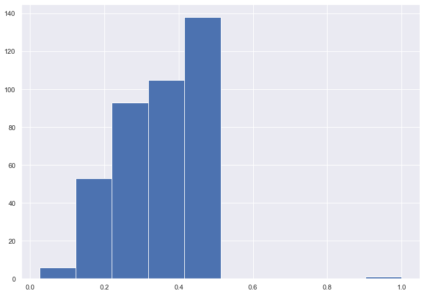
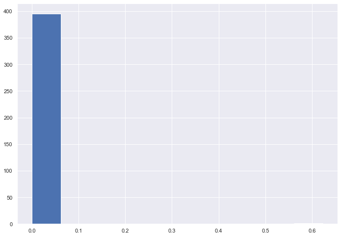
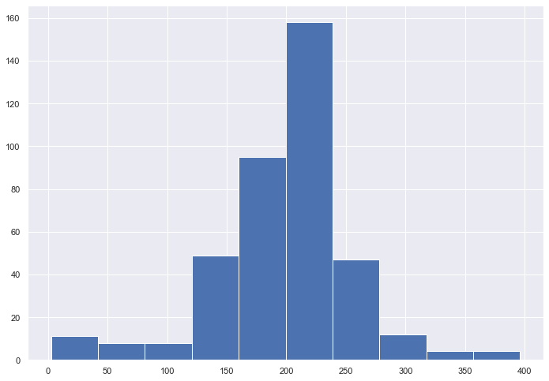
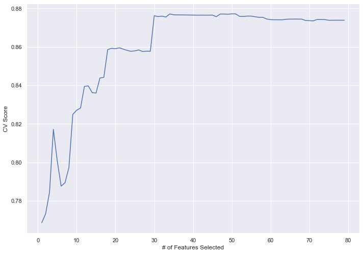
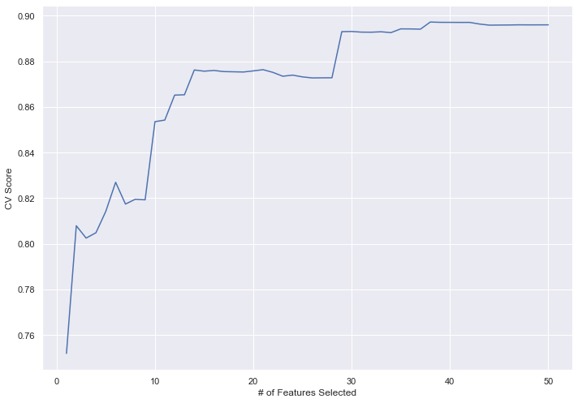

```python
import random
import pandas as pd
import numpy as np
import scipy.stats as stats
import matplotlib.pyplot as plt
import seaborn as sns
from sklearn.feature_selection import RFECV
from sklearn.linear_model import LogisticRegression

np.random.seed(1234)
sns.set(rc={'figure.figsize': (11.7, 8.27)})
```


```python
def KS_plot(dat, col, idx=False):
    if idx:
        sns.distplot(dat[dat['target']==0].iloc[:, col], hist=False, color='green', label='Good')
        sns.distplot(dat[dat['target']==1].iloc[:, col], hist=False, color='red', label='Bad')
    else:
        sns.distplot(dat[dat['target']==0][col], hist=False, color='green', label='Good')
        sns.distplot(dat[dat['target']==1][col], hist=False, color='red', label='Bad')
    plt.legend()
    plt.show()
```


```python
dat = pd.read_csv('../data/card_transactions_features.csv')
```

## Z scale feature columns


```python
features_z = dat.iloc[:, 9:]

cols = features_z.columns
```


```python
features_z = pd.DataFrame(list(features_z.iloc[:, 1:].apply(stats.zscore, axis=1)), columns=cols[1:])

features_z.insert(0, 'target', dat['Fraud'].values)
```

### Split into OOT and modeling


```python
model_dat = dat[(dat['Date']>'2010-01-15')&(dat['Date']<'2010-11-01')].index
oot = dat[(dat['Date']>='2010-11-01')].index
```


```python
model_z = features_z.loc[model_dat, :]
```


```python
rand = []
for x in range(len(model_z)):
    rand.append(random.randint(0, 10))
model_z['rand'] = rand
```

## KS Score and KS P-Value for feature columns


```python
ks_df = pd.DataFrame()

for col in model_z.columns:
    x = model_z[model_z['target']==0][col].values
    y = model_z[model_z['target']==1][col].values
    ks_df.loc['ks_score', col] = stats.ks_2samp(x, y)[0]
    ks_df.loc['ks_pval', col] = stats.ks_2samp(x, y)[1]
```


```python
ks_df_keep = ks_df.T

print('Mean KS score is {}'.format(ks_df_keep['ks_score'].mean()))
ks_df_keep['ks_score'].hist()
plt.show()
```

    Mean KS score is 0.3388088560376055


    

    


```python
print('Mean KS P-Value is {}'.format(ks_df_keep['ks_pval'].mean()))
ks_df_keep['ks_pval'].hist()
plt.show()
```

    Mean KS P-Value is 0.0015738666149323628


    

    


```python
topRows = int(round(len(model_z)*0.03))
j = 0
for col in model_z.columns:
    temp = model_z.sort_values(col, ascending=False)
    temp1 = temp.head(topRows)
    temp2 = temp.tail(topRows)
    needed1 = temp1.loc[:, 'target']
    needed2 = temp2.loc[:, 'target']
    FDR1 = sum(needed1)/model_z['target'].sum()
    FDR2 = sum(needed2)/model_z['target'].sum()
    FDRate = np.maximum(FDR1, FDR2)
    ks_df.loc['FDR', col] = FDRate
    j += 1
```


```python
ks_df_keep = ks_df.T
ks_df_keep['rank_ks'] = ks_df_keep['ks_score'].rank(ascending=True)
ks_df_keep['rank_FDR'] = ks_df_keep['FDR'].rank(ascending=True)
ks_df_keep['average_rank'] = (ks_df_keep['rank_ks'] + ks_df_keep['rank_FDR']) / 2
ks_df_keep.sort_values('average_rank', ascending=False, inplace=True)
```


```python
print('Average rank is {}'.format(ks_df_keep['average_rank'].mean()))

ks_df_keep['average_rank'].hist()
```

    Average rank is 198.5


    <matplotlib.axes._subplots.AxesSubplot at 0x2097a647e20>


    

    


## Save KS and FDR df


```python
ks_df_keep.to_csv('../data/card_ks_fdr.csv')
```

## Recursive Feature Elimination


```python
ks_df_keep = pd.read_csv('../data/card_ks_fdr.csv').rename(columns={'Unnamed: 0': 'column'}).set_index('column')
```


```python
ks_df_keep
```


<div>
<style scoped>
    .dataframe tbody tr th:only-of-type {
        vertical-align: middle;
    }

    .dataframe tbody tr th {
        vertical-align: top;
    }

    .dataframe thead th {
        text-align: right;
    }
</style>
<table border="1" class="dataframe">
  <thead>
    <tr style="text-align: right;">
      <th></th>
      <th>ks_score</th>
      <th>ks_pval</th>
      <th>FDR</th>
      <th>rank_ks</th>
      <th>rank_FDR</th>
      <th>average_rank</th>
    </tr>
    <tr>
      <th>column</th>
      <th></th>
      <th></th>
      <th></th>
      <th></th>
      <th></th>
      <th></th>
    </tr>
  </thead>
  <tbody>
    <tr>
      <th>target</th>
      <td>1.000000</td>
      <td>0.000000e+00</td>
      <td>1.000000</td>
      <td>396.0</td>
      <td>396.0</td>
      <td>396.00</td>
    </tr>
    <tr>
      <th>total_Cardnum_Merchnum_amount_over_14days</th>
      <td>0.432189</td>
      <td>1.422773e-139</td>
      <td>0.386390</td>
      <td>386.0</td>
      <td>395.0</td>
      <td>390.50</td>
    </tr>
    <tr>
      <th>total_Cardnum_Merch zip_amount_over_14days</th>
      <td>0.424384</td>
      <td>1.358886e-134</td>
      <td>0.373702</td>
      <td>384.0</td>
      <td>393.0</td>
      <td>388.50</td>
    </tr>
    <tr>
      <th>avg_Cardnum_amount_over_30days</th>
      <td>0.450225</td>
      <td>1.980550e-151</td>
      <td>0.204152</td>
      <td>388.0</td>
      <td>328.0</td>
      <td>358.00</td>
    </tr>
    <tr>
      <th>max_Cardnum_amount_over_30days</th>
      <td>0.511229</td>
      <td>4.007523e-195</td>
      <td>0.089965</td>
      <td>395.0</td>
      <td>304.0</td>
      <td>349.50</td>
    </tr>
    <tr>
      <th>...</th>
      <td>...</td>
      <td>...</td>
      <td>...</td>
      <td>...</td>
      <td>...</td>
      <td>...</td>
    </tr>
    <tr>
      <th>trans_amount_minus_last_with_Cardnum_Merch zip</th>
      <td>0.159865</td>
      <td>1.829358e-19</td>
      <td>0.005767</td>
      <td>27.0</td>
      <td>8.0</td>
      <td>17.50</td>
    </tr>
    <tr>
      <th>trans_amount_minus_last_with_Cardnum_Merch state</th>
      <td>0.123024</td>
      <td>1.062128e-11</td>
      <td>0.005767</td>
      <td>6.0</td>
      <td>8.0</td>
      <td>7.00</td>
    </tr>
    <tr>
      <th>trans_amount_minus_last_with_Merchnum</th>
      <td>0.105812</td>
      <td>9.128848e-09</td>
      <td>0.006920</td>
      <td>2.0</td>
      <td>11.0</td>
      <td>6.50</td>
    </tr>
    <tr>
      <th>trans_amount_minus_max_Merchnum3</th>
      <td>0.137096</td>
      <td>1.991984e-14</td>
      <td>0.003460</td>
      <td>11.0</td>
      <td>1.5</td>
      <td>6.25</td>
    </tr>
    <tr>
      <th>trans_amount_minus_max_Merchnum7</th>
      <td>0.118260</td>
      <td>7.628834e-11</td>
      <td>0.003460</td>
      <td>4.0</td>
      <td>1.5</td>
      <td>2.75</td>
    </tr>
  </tbody>
</table>
<p>396 rows × 6 columns</p>
</div>


```python
filt = list(ks_df_keep.iloc[:80, ].index)
```


```python
model_z = features_z.loc[model_dat, filt]
```


```python
model = LogisticRegression(max_iter=1000)

rfecv = RFECV(estimator=model, step=1, cv=2, verbose=0, n_jobs=-1,
              scoring='roc_auc')
rfecv.fit(model_z.iloc[:, 1:], model_z.iloc[:, 0])
```


    RFECV(cv=2, estimator=LogisticRegression(max_iter=1000), n_jobs=-1,
          scoring='roc_auc')


```python
var_keep = pd.DataFrame(sorted(zip(map(lambda x: round(x), rfecv.ranking_), model_z.iloc[:, 1:].columns)),
                        columns=['ranking', 'variable'])
```


```python
pd.set_option('display.max_rows', 80)
var_keep
```


<div>
<style scoped>
    .dataframe tbody tr th:only-of-type {
        vertical-align: middle;
    }

    .dataframe tbody tr th {
        vertical-align: top;
    }

    .dataframe thead th {
        text-align: right;
    }
</style>
<table border="1" class="dataframe">
  <thead>
    <tr style="text-align: right;">
      <th></th>
      <th>ranking</th>
      <th>variable</th>
    </tr>
  </thead>
  <tbody>
    <tr>
      <th>0</th>
      <td>1</td>
      <td>actual_median_Cardnum_Merch zip_amount_over_3days</td>
    </tr>
    <tr>
      <th>1</th>
      <td>1</td>
      <td>actual_median_Cardnum_Merch zip_amount_over_7days</td>
    </tr>
    <tr>
      <th>2</th>
      <td>1</td>
      <td>actual_norm_Cardnum_Merch state_amount_over_14...</td>
    </tr>
    <tr>
      <th>3</th>
      <td>1</td>
      <td>actual_norm_Cardnum_Merch state_amount_over_3days</td>
    </tr>
    <tr>
      <th>4</th>
      <td>1</td>
      <td>actual_norm_Cardnum_Merch state_amount_over_7days</td>
    </tr>
    <tr>
      <th>5</th>
      <td>1</td>
      <td>actual_norm_Cardnum_amount_over_0days</td>
    </tr>
    <tr>
      <th>6</th>
      <td>1</td>
      <td>actual_norm_Cardnum_amount_over_1days</td>
    </tr>
    <tr>
      <th>7</th>
      <td>1</td>
      <td>actual_norm_Cardnum_amount_over_3days</td>
    </tr>
    <tr>
      <th>8</th>
      <td>1</td>
      <td>actual_total_Cardnum_Merch zip_amount_over_14days</td>
    </tr>
    <tr>
      <th>9</th>
      <td>1</td>
      <td>actual_total_Cardnum_Merch zip_amount_over_30days</td>
    </tr>
    <tr>
      <th>10</th>
      <td>1</td>
      <td>actual_total_Cardnum_Merchnum_amount_over_14days</td>
    </tr>
    <tr>
      <th>11</th>
      <td>1</td>
      <td>actual_total_Cardnum_Merchnum_amount_over_30days</td>
    </tr>
    <tr>
      <th>12</th>
      <td>1</td>
      <td>avg_Cardnum_amount_over_30days</td>
    </tr>
    <tr>
      <th>13</th>
      <td>1</td>
      <td>avg_Cardnum_amount_over_3days</td>
    </tr>
    <tr>
      <th>14</th>
      <td>1</td>
      <td>avg_Cardnum_amount_over_7days</td>
    </tr>
    <tr>
      <th>15</th>
      <td>1</td>
      <td>avg_Merchnum_amount_over_14days</td>
    </tr>
    <tr>
      <th>16</th>
      <td>1</td>
      <td>avg_Merchnum_amount_over_1days</td>
    </tr>
    <tr>
      <th>17</th>
      <td>1</td>
      <td>avg_Merchnum_amount_over_30days</td>
    </tr>
    <tr>
      <th>18</th>
      <td>1</td>
      <td>avg_Merchnum_amount_over_3days</td>
    </tr>
    <tr>
      <th>19</th>
      <td>1</td>
      <td>avg_Merchnum_amount_over_7days</td>
    </tr>
    <tr>
      <th>20</th>
      <td>1</td>
      <td>avg_trans_amount_with_Cardnum_over_0_norm_by_30</td>
    </tr>
    <tr>
      <th>21</th>
      <td>1</td>
      <td>avg_trans_amount_with_Cardnum_over_1_norm_by_30</td>
    </tr>
    <tr>
      <th>22</th>
      <td>1</td>
      <td>days_since_last_with_Cardnum</td>
    </tr>
    <tr>
      <th>23</th>
      <td>1</td>
      <td>max_Cardnum_amount_over_30days</td>
    </tr>
    <tr>
      <th>24</th>
      <td>1</td>
      <td>median_Cardnum_Merchnum_amount_over_14days</td>
    </tr>
    <tr>
      <th>25</th>
      <td>1</td>
      <td>median_Cardnum_Merchnum_amount_over_30days</td>
    </tr>
    <tr>
      <th>26</th>
      <td>1</td>
      <td>median_Cardnum_Merchnum_amount_over_7days</td>
    </tr>
    <tr>
      <th>27</th>
      <td>1</td>
      <td>median_Merchnum_amount_over_0days</td>
    </tr>
    <tr>
      <th>28</th>
      <td>1</td>
      <td>median_Merchnum_amount_over_14days</td>
    </tr>
    <tr>
      <th>29</th>
      <td>1</td>
      <td>median_Merchnum_amount_over_3days</td>
    </tr>
    <tr>
      <th>30</th>
      <td>1</td>
      <td>median_Merchnum_amount_over_7days</td>
    </tr>
    <tr>
      <th>31</th>
      <td>1</td>
      <td>total_Cardnum_Merch state_amount_over_14days</td>
    </tr>
    <tr>
      <th>32</th>
      <td>1</td>
      <td>total_Cardnum_Merch state_amount_over_1days</td>
    </tr>
    <tr>
      <th>33</th>
      <td>1</td>
      <td>total_Cardnum_Merch zip_amount_over_14days</td>
    </tr>
    <tr>
      <th>34</th>
      <td>1</td>
      <td>total_Cardnum_Merch zip_amount_over_30days</td>
    </tr>
    <tr>
      <th>35</th>
      <td>1</td>
      <td>total_Cardnum_Merch zip_amount_over_7days</td>
    </tr>
    <tr>
      <th>36</th>
      <td>1</td>
      <td>total_Cardnum_Merchnum_amount_over_0days</td>
    </tr>
    <tr>
      <th>37</th>
      <td>1</td>
      <td>total_Cardnum_Merchnum_amount_over_14days</td>
    </tr>
    <tr>
      <th>38</th>
      <td>1</td>
      <td>total_Cardnum_Merchnum_amount_over_1days</td>
    </tr>
    <tr>
      <th>39</th>
      <td>1</td>
      <td>total_Cardnum_Merchnum_amount_over_30days</td>
    </tr>
    <tr>
      <th>40</th>
      <td>1</td>
      <td>total_Cardnum_amount_over_0days</td>
    </tr>
    <tr>
      <th>41</th>
      <td>1</td>
      <td>total_Cardnum_amount_over_1days</td>
    </tr>
    <tr>
      <th>42</th>
      <td>1</td>
      <td>total_Merchnum_amount_over_1days</td>
    </tr>
    <tr>
      <th>43</th>
      <td>1</td>
      <td>trans_amount_minus_max_Cardnum_Merch zip7</td>
    </tr>
    <tr>
      <th>44</th>
      <td>1</td>
      <td>trans_amount_minus_max_Cardnum_Merchnum1</td>
    </tr>
    <tr>
      <th>45</th>
      <td>1</td>
      <td>trans_amount_minus_max_Cardnum_Merchnum3</td>
    </tr>
    <tr>
      <th>46</th>
      <td>1</td>
      <td>trans_amount_with_Cardnum_over_1_norm_by_14</td>
    </tr>
    <tr>
      <th>47</th>
      <td>1</td>
      <td>trans_amount_with_Cardnum_over_1_norm_by_30</td>
    </tr>
    <tr>
      <th>48</th>
      <td>1</td>
      <td>trans_amount_with_Cardnum_over_1_norm_by_7</td>
    </tr>
    <tr>
      <th>49</th>
      <td>1</td>
      <td>trans_amount_with_Merchnum_over_0_norm_by_30</td>
    </tr>
    <tr>
      <th>50</th>
      <td>2</td>
      <td>trans_amount_minus_max_Cardnum_Merchnum0</td>
    </tr>
    <tr>
      <th>51</th>
      <td>3</td>
      <td>total_Cardnum_amount_over_3days</td>
    </tr>
    <tr>
      <th>52</th>
      <td>4</td>
      <td>actual_median_Cardnum_Merch state_amount_over_...</td>
    </tr>
    <tr>
      <th>53</th>
      <td>5</td>
      <td>trans_amount_minus_max_Cardnum_Merch zip1</td>
    </tr>
    <tr>
      <th>54</th>
      <td>6</td>
      <td>actual_median_Cardnum_Merch zip_amount_over_30...</td>
    </tr>
    <tr>
      <th>55</th>
      <td>7</td>
      <td>actual_median_Cardnum_Merch state_amount_over_...</td>
    </tr>
    <tr>
      <th>56</th>
      <td>8</td>
      <td>max_Merchnum_amount_over_30days</td>
    </tr>
    <tr>
      <th>57</th>
      <td>9</td>
      <td>actual_median_Cardnum_Merch state_amount_over_...</td>
    </tr>
    <tr>
      <th>58</th>
      <td>10</td>
      <td>trans_amount_minus_max_Cardnum_Merch zip0</td>
    </tr>
    <tr>
      <th>59</th>
      <td>11</td>
      <td>trans_amount_minus_max_Cardnum_Merch state0</td>
    </tr>
    <tr>
      <th>60</th>
      <td>12</td>
      <td>total_Cardnum_Merch zip_amount_over_1days</td>
    </tr>
    <tr>
      <th>61</th>
      <td>13</td>
      <td>actual_median_Cardnum_amount_over_0days</td>
    </tr>
    <tr>
      <th>62</th>
      <td>14</td>
      <td>actual_median_Cardnum_Merch zip_amount_over_14...</td>
    </tr>
    <tr>
      <th>63</th>
      <td>15</td>
      <td>total_Cardnum_Merchnum_amount_over_3days</td>
    </tr>
    <tr>
      <th>64</th>
      <td>16</td>
      <td>total_Cardnum_Merch state_amount_over_3days</td>
    </tr>
    <tr>
      <th>65</th>
      <td>17</td>
      <td>median_Merchnum_amount_over_1days</td>
    </tr>
    <tr>
      <th>66</th>
      <td>18</td>
      <td>actual_median_Cardnum_Merch state_amount_over_...</td>
    </tr>
    <tr>
      <th>67</th>
      <td>19</td>
      <td>actual_median_Cardnum_amount_over_3days</td>
    </tr>
    <tr>
      <th>68</th>
      <td>20</td>
      <td>actual_median_Cardnum_amount_over_1days</td>
    </tr>
    <tr>
      <th>69</th>
      <td>21</td>
      <td>total_Cardnum_Merch zip_amount_over_3days</td>
    </tr>
    <tr>
      <th>70</th>
      <td>22</td>
      <td>total_Cardnum_Merch state_amount_over_7days</td>
    </tr>
    <tr>
      <th>71</th>
      <td>23</td>
      <td>max_Cardnum_amount_over_14days</td>
    </tr>
    <tr>
      <th>72</th>
      <td>24</td>
      <td>total_Merchnum_amount_over_3days</td>
    </tr>
    <tr>
      <th>73</th>
      <td>25</td>
      <td>trans_amount_minus_max_Cardnum_Merchnum7</td>
    </tr>
    <tr>
      <th>74</th>
      <td>26</td>
      <td>total_Cardnum_Merchnum_amount_over_7days</td>
    </tr>
    <tr>
      <th>75</th>
      <td>27</td>
      <td>avg_Cardnum_amount_over_14days</td>
    </tr>
    <tr>
      <th>76</th>
      <td>28</td>
      <td>median_Merchnum_amount_over_30days</td>
    </tr>
    <tr>
      <th>77</th>
      <td>29</td>
      <td>total_Merchnum_amount_over_0days</td>
    </tr>
    <tr>
      <th>78</th>
      <td>30</td>
      <td>trans_amount_minus_max_Cardnum_Merch zip3</td>
    </tr>
  </tbody>
</table>
</div>


```python
plt.plot(range(1, len(rfecv.grid_scores_)+1), rfecv.grid_scores_)
plt.xlabel('# of Features Selected')
plt.ylabel('CV Score')
plt.show()
```


    

    


```python
filt1 = list(var_keep[var_keep['ranking']==1]['variable'].values)
filt1.insert(0, 'target')
```


```python
features_rfe2 = model_z.loc[:, filt1]
```


```python
model2 = LogisticRegression(max_iter=5000)

rfecv2 = RFECV(estimator=model2, step=1, cv=2, verbose=0, n_jobs=-1,
               scoring='roc_auc')
rfecv2.fit(features_rfe2.iloc[:, 1:], features_rfe2.iloc[:, 0])
```


    RFECV(cv=2, estimator=LogisticRegression(max_iter=5000), n_jobs=-1,
          scoring='roc_auc')


```python
var_keep2 = pd.DataFrame(sorted(zip(map(lambda x: round(x), rfecv2.ranking_), features_rfe2.iloc[:, 1:].columns)),
                         columns=['ranking', 'variable'])
```


```python
pd.set_option('display.max_rows', 80)
var_keep2
```


<div>
<style scoped>
    .dataframe tbody tr th:only-of-type {
        vertical-align: middle;
    }

    .dataframe tbody tr th {
        vertical-align: top;
    }

    .dataframe thead th {
        text-align: right;
    }
</style>
<table border="1" class="dataframe">
  <thead>
    <tr style="text-align: right;">
      <th></th>
      <th>ranking</th>
      <th>variable</th>
    </tr>
  </thead>
  <tbody>
    <tr>
      <th>0</th>
      <td>1</td>
      <td>actual_norm_Cardnum_Merch state_amount_over_14...</td>
    </tr>
    <tr>
      <th>1</th>
      <td>1</td>
      <td>actual_norm_Cardnum_Merch state_amount_over_7days</td>
    </tr>
    <tr>
      <th>2</th>
      <td>1</td>
      <td>actual_norm_Cardnum_amount_over_0days</td>
    </tr>
    <tr>
      <th>3</th>
      <td>1</td>
      <td>actual_norm_Cardnum_amount_over_1days</td>
    </tr>
    <tr>
      <th>4</th>
      <td>1</td>
      <td>actual_norm_Cardnum_amount_over_3days</td>
    </tr>
    <tr>
      <th>5</th>
      <td>1</td>
      <td>actual_total_Cardnum_Merch zip_amount_over_14days</td>
    </tr>
    <tr>
      <th>6</th>
      <td>1</td>
      <td>actual_total_Cardnum_Merch zip_amount_over_30days</td>
    </tr>
    <tr>
      <th>7</th>
      <td>1</td>
      <td>actual_total_Cardnum_Merchnum_amount_over_14days</td>
    </tr>
    <tr>
      <th>8</th>
      <td>1</td>
      <td>actual_total_Cardnum_Merchnum_amount_over_30days</td>
    </tr>
    <tr>
      <th>9</th>
      <td>1</td>
      <td>avg_Cardnum_amount_over_30days</td>
    </tr>
    <tr>
      <th>10</th>
      <td>1</td>
      <td>avg_Cardnum_amount_over_3days</td>
    </tr>
    <tr>
      <th>11</th>
      <td>1</td>
      <td>avg_Cardnum_amount_over_7days</td>
    </tr>
    <tr>
      <th>12</th>
      <td>1</td>
      <td>avg_Merchnum_amount_over_14days</td>
    </tr>
    <tr>
      <th>13</th>
      <td>1</td>
      <td>avg_Merchnum_amount_over_30days</td>
    </tr>
    <tr>
      <th>14</th>
      <td>1</td>
      <td>days_since_last_with_Cardnum</td>
    </tr>
    <tr>
      <th>15</th>
      <td>1</td>
      <td>max_Cardnum_amount_over_30days</td>
    </tr>
    <tr>
      <th>16</th>
      <td>1</td>
      <td>median_Cardnum_Merchnum_amount_over_14days</td>
    </tr>
    <tr>
      <th>17</th>
      <td>1</td>
      <td>median_Cardnum_Merchnum_amount_over_30days</td>
    </tr>
    <tr>
      <th>18</th>
      <td>1</td>
      <td>median_Cardnum_Merchnum_amount_over_7days</td>
    </tr>
    <tr>
      <th>19</th>
      <td>1</td>
      <td>median_Merchnum_amount_over_0days</td>
    </tr>
    <tr>
      <th>20</th>
      <td>1</td>
      <td>median_Merchnum_amount_over_14days</td>
    </tr>
    <tr>
      <th>21</th>
      <td>1</td>
      <td>median_Merchnum_amount_over_3days</td>
    </tr>
    <tr>
      <th>22</th>
      <td>1</td>
      <td>total_Cardnum_Merch state_amount_over_14days</td>
    </tr>
    <tr>
      <th>23</th>
      <td>1</td>
      <td>total_Cardnum_Merch state_amount_over_1days</td>
    </tr>
    <tr>
      <th>24</th>
      <td>1</td>
      <td>total_Cardnum_Merch zip_amount_over_14days</td>
    </tr>
    <tr>
      <th>25</th>
      <td>1</td>
      <td>total_Cardnum_Merch zip_amount_over_30days</td>
    </tr>
    <tr>
      <th>26</th>
      <td>1</td>
      <td>total_Cardnum_Merch zip_amount_over_7days</td>
    </tr>
    <tr>
      <th>27</th>
      <td>1</td>
      <td>total_Cardnum_Merchnum_amount_over_0days</td>
    </tr>
    <tr>
      <th>28</th>
      <td>1</td>
      <td>total_Cardnum_Merchnum_amount_over_14days</td>
    </tr>
    <tr>
      <th>29</th>
      <td>1</td>
      <td>total_Cardnum_Merchnum_amount_over_30days</td>
    </tr>
    <tr>
      <th>30</th>
      <td>1</td>
      <td>total_Cardnum_amount_over_1days</td>
    </tr>
    <tr>
      <th>31</th>
      <td>1</td>
      <td>total_Merchnum_amount_over_1days</td>
    </tr>
    <tr>
      <th>32</th>
      <td>1</td>
      <td>trans_amount_minus_max_Cardnum_Merchnum1</td>
    </tr>
    <tr>
      <th>33</th>
      <td>1</td>
      <td>trans_amount_minus_max_Cardnum_Merchnum3</td>
    </tr>
    <tr>
      <th>34</th>
      <td>1</td>
      <td>trans_amount_with_Cardnum_over_1_norm_by_14</td>
    </tr>
    <tr>
      <th>35</th>
      <td>1</td>
      <td>trans_amount_with_Cardnum_over_1_norm_by_30</td>
    </tr>
    <tr>
      <th>36</th>
      <td>1</td>
      <td>trans_amount_with_Cardnum_over_1_norm_by_7</td>
    </tr>
    <tr>
      <th>37</th>
      <td>1</td>
      <td>trans_amount_with_Merchnum_over_0_norm_by_30</td>
    </tr>
    <tr>
      <th>38</th>
      <td>2</td>
      <td>avg_Merchnum_amount_over_3days</td>
    </tr>
    <tr>
      <th>39</th>
      <td>3</td>
      <td>actual_norm_Cardnum_Merch state_amount_over_3days</td>
    </tr>
    <tr>
      <th>40</th>
      <td>4</td>
      <td>total_Cardnum_Merchnum_amount_over_1days</td>
    </tr>
    <tr>
      <th>41</th>
      <td>5</td>
      <td>median_Merchnum_amount_over_7days</td>
    </tr>
    <tr>
      <th>42</th>
      <td>6</td>
      <td>avg_trans_amount_with_Cardnum_over_1_norm_by_30</td>
    </tr>
    <tr>
      <th>43</th>
      <td>7</td>
      <td>avg_trans_amount_with_Cardnum_over_0_norm_by_30</td>
    </tr>
    <tr>
      <th>44</th>
      <td>8</td>
      <td>trans_amount_minus_max_Cardnum_Merch zip7</td>
    </tr>
    <tr>
      <th>45</th>
      <td>9</td>
      <td>avg_Merchnum_amount_over_1days</td>
    </tr>
    <tr>
      <th>46</th>
      <td>10</td>
      <td>avg_Merchnum_amount_over_7days</td>
    </tr>
    <tr>
      <th>47</th>
      <td>11</td>
      <td>actual_median_Cardnum_Merch zip_amount_over_3days</td>
    </tr>
    <tr>
      <th>48</th>
      <td>12</td>
      <td>total_Cardnum_amount_over_0days</td>
    </tr>
    <tr>
      <th>49</th>
      <td>13</td>
      <td>actual_median_Cardnum_Merch zip_amount_over_7days</td>
    </tr>
  </tbody>
</table>
</div>


```python
plt.plot(range(1, len(rfecv2.grid_scores_)+1), rfecv2.grid_scores_)
plt.xlabel('# of Features Selected')
plt.ylabel('CV Score')
plt.show()
```


    

    


```python
final_keep = var_keep2[var_keep2['ranking']==1]['variable'].values
```


```python
final_keep = list(final_keep)
final_keep.insert(0, 'target')
```


```python
features_z.loc[model_dat, final_keep].to_csv('../data/train.csv', index=False)
features_z.loc[oot, final_keep].to_csv('../data/oot.csv', index=False)
pd.DataFrame(final_keep, columns=['column']).to_csv('../data/final_vars.csv', index=False)
```


```python

```
